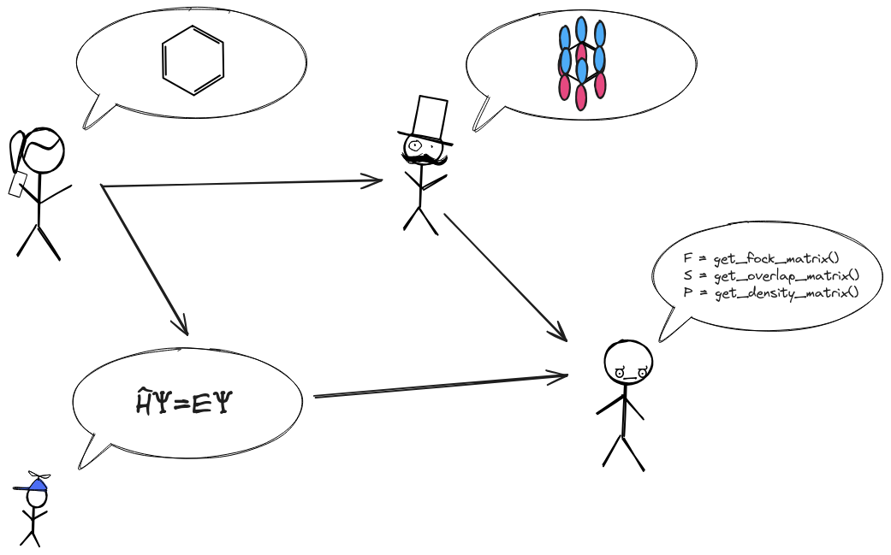

.. Copyright 2024 NWChemEx-Project
..
.. Licensed under the Apache License, Version 2.0 (the "License");
.. you may not use this file except in compliance with the License.
.. You may obtain a copy of the License at
..
.. http://www.apache.org/licenses/LICENSE-2.0
..
.. Unless required by applicable law or agreed to in writing, software
.. distributed under the License is distributed on an "AS IS" BASIS,
.. WITHOUT WARRANTIES OR CONDITIONS OF ANY KIND, either express or implied.
.. See the License for the specific language governing permissions and
.. limitations under the License.

###################
Overview of Chemist
###################

As discussed in :ref:`statement_of_need` the ultimate goal of Chemist can be
summarized as a performant :term:`DSL` for expressing computational chemistry
calculations. This page summarizes how this goal is achieved in Chemist.

.. note::

   For simplicity version 1.0 of Chemist will limit its focus to Gaussian-based
   quantum chemistry (including :term:`DFT`). That said, care has been taken in
   designing Chemist to ensure that it can be expanded to other computational
   chemistry techniques down the road.

*****
TL;DR
*****

Chemist provides performant classes which make it easy to express and compose 
computational chemistry calculations. This is done with unprecedented fine-
grained control and without compromising performance. Custom operator 
partitions, remove/delete operator terms, freeze wavefunction parameters --- all
possible without needing to modify algorithm code (assuming the consuming code
supports the request). Downstream codes can avoid the need for a large number 
of logic branches by just looping over the provided terms. This makes it 
particularly easy to mix and match pieces of different methods without having
to introduce downstream logic.

*************
Input vs. DSL
*************

If you already have experience with other computational chemistry packages you
are probably used to thinking of the input to a computational chemistry
package as specifying:

- the chemical system of interest (e.g., the Cartesian coordinates),
- the level of theory (i.e., method and atomic basis set), and
- a series of options (usually key/value pairs).

Most legacy codes require the user to specify the above in a text file which
then gets parsed. More modern codes usually provide mechanisms for specifying
the above programatically (such as in a Python script), but it's still usually
specified as string-based input. Regardless of the actual input mechanism, what
we just described is the :term:`UI` of the software package.

UIs are designed to ensure that the user can easily specify their intent. In
practice, this usually is accomplished by relying on implicit state. More
specifically, many packages rely on small amounts of human-readable text to
convey very complicated ideas. A familiar example is specifying the atomic basis
set; typically this is done by providing a string like ``cc-pVDZ``. The
implicit state stems from the fact that the code must know how to convert from
the user's input string to the actual exponents and coefficients comprising the
molecular basis set. In other words, the literal string ``cc-pVDZ`` does NOT
contain the explicit information the code needs.

Compared to the UI just described, the DSL contained in Chemist is much more
explicit. This is because classes comprising the DSL, like ``AOBasisSet``,
actually contain the parameters for the concepts they represent. In turn,
developers can simply prepare objects in whatever state they want (as opposed
to for example requiring extensions to the UI to handle say assigning different
atomic basis sets to different atoms). The real power of a DSL like Chemist is
in that routines which work with Chemist objects don't need to understand
strings like ``cc-pVDZ`` they just work with the data provided.

***********************************
What can you do with Chemist's DSL?
***********************************

Admittedly basis set manipulations can be done through the UI of many existing
computational chemistry packages, and are thus not a compelling proof of the
Chemist DSL's power. Rather we note that the Chemist DSL enables:

- Custom Hamiltonian/Fock operators. Want extra terms? Just add them. Neglect
  the interactions between two atoms? Delete them.
- Custom operator partitionings. Want to know the total kinetic energy from a
  subset of the system? Split the total kinetic energy operator in two.
- Fine-grained control of wavefunction parameters. Want to freeze some? Just 
  partition the wavefunction object.
- Want to support the above features? Rely on the Chemist DSL as input instead
  of a combinatorial number of "Enable feature X" options.

Keep in mind, all of the above is possible without compromising performance
because:

- Chemist is simply a series of data structures. Computations access the data
  from the data structures however they need to for performance.
- Chemist facilitates use of data in native formats. No need for copying,
  or serializing. Just create a "view" of your existing data structure.
- Chemist is written in modern C++17 which allows many low-level optimizations
  that are not possible in interpreted languages.
- Chemist has Python bindings. All the rapid-prototyping Python workflows 
  developer have come to love are now actually done with production-quality
  operators. 

Two disclaimers. First, many of the above features are experimental. Second,
Chemist is just a DSL, i.e., it allows you to express intent and you still
need to actually write algorithms to carry out the expressed calculations. For
example just because you turned relativity on for a particular atom, doesn't
mean the software package automatically now knows how to solve the Dirac
equation. That said, many codes out there already contain kernels capable of
performantly computing each term, but they lack a mechanism for easily composing
those terms. That's where Chemist's DSL shines: by allowing the developer to
compose existing kernels as they see fit.

*****************************************************
What does the software stack look like using Chemist?
*****************************************************

In short, for most computational chemistry activities users will continue to
use UIs. The UI input will then be mapped to the Chemist DSL, and then the 
Chemist DSL will be mapped to the underlying kernels. Most legacy computational
chemistry packages forego the intermediate DSL layer. The problem with such an
approach is that the DSL is exactly the interface power users/developers are
looking for. Without the DSL, said users are forced to modify the existing code
or complicate the UI.

***********************************
What is a typical Chemist workflow?
***********************************

.. _fig_gaussian_input:

   Traditional workflow of a Gaussian-based quantum chemistry method.

The typical Chemist workflow is pictorially given in 
:figref:`fig_guassian_input` (in the context of Gaussian-based quantum 
chemistry). The first step is to create a ``ChemicalSystem`` class (TODO: link).
For the example workflow shown in :figref:`fig_gaussian_input` this step is
depicted by the benzene molecule. The ``ChemicalSystem`` class describes the
nuclei, electrons, molecules, boundary conditions (periodic, vacuum, solvent, 
etc.), and fields that represent the :term:`chemical system` of interest. The 
``ChemicalSystem`` is the chemist's view of the problem.

Given a ``ChemicalSystem`` the next step is to create a physical model of the
system. For Gaussian-based quantum chemistry this has two parts creating a
molecular basis set (pictorially represented in :figref:`fig_gaussian_input`
by the *p*-orbitals superimposed on benzene) and specifying an approximation
to the Schroedinger equation (pictorially represented in 
:figref:`fig_guassian_input` by the time-independent Schroedinger equation). In
Chemist we rely on the ``AOBasisSet`` class for describing molecular basis sets
and a combination of ``Operator`` and ``Wavefunction`` objects to express the
physical approximations (disclaimer ``Operator`` and ``Wavefunction`` are
still experimental).

Together the ``ChemicalSystem``, ``Operator``, and ``Wavefunction`` objects
provide an explicit representation of what the user wants to do. The last step
shown in :figref:`fig_gaussian_input` is the actual computation of the user's
requested quantity depicted as pseudocode. Ideally, the computations will 
leverage Chemists's data structures directly to avoid expensive data 
transformations, but Chemist also provides mechanisms for accessing the 
underlying data in a variety of formats.

While Chemist is a standalone library providing a computational chemistry DSL,
the developers of Chemist feel that it particularly shines when it used to
define interfaces for modular software. The workflow in this section assumes
such a use case by relying on opaque modular functions. In the NWChemEx stack
these modular functions are actually 
`PluginPlay <https://github.com/NWChemEx/PluginPlay>`__ modules; however, 
Chemist is independent of PluginPlay and any function satisfying the APIs used 
here will work. Pseudocode for the above workflow is:

.. code-block:: c++

   // N.B. all opaque functions would need more user input to work
   ChemicalSystem benzene = create_molecule_from_ui();
   AOBasisSet aos         = form_molecular_basis_set(benzene);
   auto H                 = form_hamiltonian(benzene, aos);
   auto Psi               = compute_wavefunction(H, aos);
   double E               = compute_energy(H, Psi);

Of note, see how data is passed explicitly. This avoids coupling to global state
or implicit definitions of things like "Hartree-Fock". With this code we don't
have to wonder "what the user things Hartree-Fock is?" because we're given an
explicit Hamiltonian (as a slight aside many developers may not be used to
thinking of Hartree-Fock in terms of Hamiltonians, but rather Fock operators;
however, Hartree-Fock can be viewed as approximating the Hamiltonian as the core
Hamiltonian plus the converged Fock operator). It's also important to note that
the DSL does not actually do any computations, it just describes what the user
wants to do. The point being it is not actually possible to talk to the
efficiency of the above code because the bottleneck computations are wrapped in 
the opaque functions, e.g., while many developers may immediately say the 
iterative nature of Hartree-Fock means that the above code would need to solve 
the Hartree-Fock equations 3 times (once in ``form_hamiltonian``, once in 
``compute_wavefunction``, and once in ``compute_energy``); we argue (and the
experimental NWChemEx SCF implementation proves) this need not be the case.