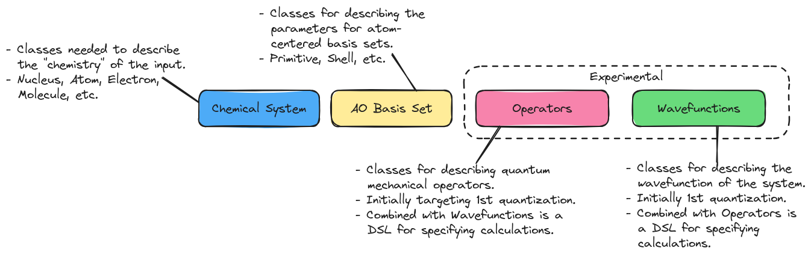

.. Copyright 2023 NWChemEx-Project
..
.. Licensed under the Apache License, Version 2.0 (the "License");
.. you may not use this file except in compliance with the License.
.. You may obtain a copy of the License at
..
.. http://www.apache.org/licenses/LICENSE-2.0
..
.. Unless required by applicable law or agreed to in writing, software
.. distributed under the License is distributed on an "AS IS" BASIS,
.. WITHOUT WARRANTIES OR CONDITIONS OF ANY KIND, either express or implied.
.. See the License for the specific language governing permissions and
.. limitations under the License.

.. _architecture_of_chemist:

#######################
Architecture of Chemist
#######################

:ref:`statement_of_need` summarizes what Chemist needs to do. The point of this
page is to use these needs to motivate the architecture of Chemist.

.. _architecture_considerations:

***************************
Architecture Considerations
***************************

The Chemist library will include abstractions used to define a :term:`DSL` for
describing the inputs and outputs of computational chemistry routines. In
designing Chemist we have grouped the needed abstractions into the following
categories:

Chemical system.
   It is natural to express the phenomena we want to describe using chemistry
   concepts (think nuclei, atoms, molecules, etc.). Hence many users will feel
   most comfortable specifying their problem in terms of these chemical
   concepts.

   - This component is responsible for describing how the user wants to model
     the system. For example: Are the atoms being treated classically (i.e.,
     a composite particle with an overall charge)? Is the molecule subjected to
     the Born-Oppenheimer approximation (i.e., do the electrons move about in
     the field of the nuclei)?
   - Different representations should have different classes. The shear number
     of possible classes justifies the existence of a component.

Atomic orbital (AO) basis set.
   Gaussian-based quantum chemistry relies on AO basis sets. This component
   provides the abstractions necessary to represent AO basis sets.

   - A traditional AO basis set has many levels (primitive, contracted Gaussian,
     etc.) which in turn requires many classes, justifying the existence of a
     component.
   - N.b. many methods which don't use Gaussian basis sets still need chemical
     system objects, which is the motivation for decoupling this from the
     chemical system component.

Fragmenting
   There are a variety of computational chemistry methods which rely on
   selecting or partitioning the chemical system and/or the basis set. The
   pieces of the chemical system are usually called fragments, which gives rise
   to the name of this component.

   - While say a ``std::vector<ChemicalSystem>`` representation seems reasonable
     at first, there are performance implications with such a choice,
     particularly when there are a lot of fragments. We need specialized
     containers to hold the pieces performantly.
   - Fragmenting gives rise to other considerations such as needing to cap
     severed bonds. Such considerations can be decoupled from the chemical
     system component.

Quantum mechanics.
   The heart of quantum chemistry is that chemistry is fully described by
   quantum mechanics. Thus whatever chemical question we have, quantum
   mechanics should be able to answer. Since we want to get an answer from
   quantum mechanics, it's best to phrase the question using quantum mechanics,
   and we thus also need a software representation of quantum mechanical
   concepts. (TODO: this is supposed to motivate operator/wavefunction
   components).

Classical mechanics.
   Quantum is expensive some mix of QM and classical mechanics is likely to be
   inevitable for the foreseeable future. We need the ability to seamlessly
   transition between domains. (TODO: this is supposed to motivate force-field
   like classes)

*********************
Architecture Overview
*********************

.. _fig_architecture:

   High-level architecture of the Chemist library indicating the major
   components and dependencies.

The overall architecture of Chemist is depicted in :numref:`fig_architecture`
and the individual components are summarized below.

Chemical system component
-------------------------

Main Discussion: :ref:`design_of_the_chemical_system_component`.

As summarized in :ref:`architecture_considerations`, users of computational
chemistry software typically come to the software with questions like:

- What is the energy of this system vs. this other system?
- What is the minimum energy geometry of this system?
- What does the Raman spectrum of this system look like?
- How strongly does this system interact with this other system?

The key point is these questions revolve around computing the properties of one
or more ":term:`chemical systems <chemical system>`." The point of the chemical
system component is to provide the user with the abstractions necessary to
fully describe the system they want to compute properties of.

AO basis set component
----------------------

Main Discussion: :ref:`design_of_the_ao_basis_set_component`.

TODO: Write me!!!

Fragmenting component
---------------------

Main Discussion: :ref:`design_of_the_fragmenting_component`.

Quantum chemistry is computationally expensive. There are a number of
approximations (e.g., :term:`QM/MM`, :term:`ONIOM`, and methods based on the
:term:`MBE`) which seek to circumvent this expense by breaking the system into
"fragments." There are also methods such as :term:`SAPT` and density embedding
which require partitioning the chemical system. The point is we need the ability
to decompose members of the chemical system component (and potentially other
components as well).

The fragmenting component contains abstractions which facilitate working with
subsets of chemical system objects. For example ``Fragmented<Nuclei>``
represents the relationship among a superset ``Nuclei`` object and subsets of
that object. The fragmenting component also contains classes like ``Cap`` which
arise because fragmenting can "break" covalent bonds.

Operator component
-------------------

Main Discussion: :ref:`design_of_the_operator_component`.

Wavefunction component
----------------------

Main Discussion: :ref:`design_of_the_wavefunction_component`.
