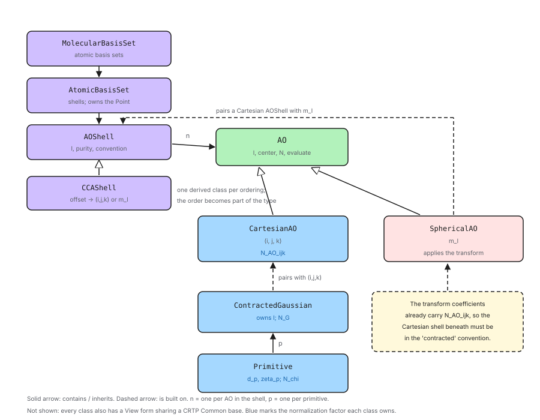

.. Copyright 2026 NWChemEx-Project
..
.. Licensed under the Apache License, Version 2.0 (the "License");
.. you may not use this file except in compliance with the License.
.. You may obtain a copy of the License at
..
.. http://www.apache.org/licenses/LICENSE-2.0
..
.. Unless required by applicable law or agreed to in writing, software
.. distributed under the License is distributed on an "AS IS" BASIS,
.. WITHOUT WARRANTIES OR CONDITIONS OF ANY KIND, either express or implied.
.. See the License for the specific language governing permissions and
.. limitations under the License.

.. _designing_the_ao_class_hierarchy:

################################
Designing the AO Class Hierarchy
################################

This section contains notes on the classes which represent an AO basis set.

*************************
What are we representing?
*************************

:ref:`ao_basis_set_background` describes an AO as a layered object: primitive
Gaussians :math:`\chi_p` combine into a contracted Gaussian :math:`G`, which is
combined with a Cartesian polynomial to give a Cartesian AO. Optionally, a
spherical AO can be formed by taking a linear combination of Cartesian AOs.
AOs (Cartesian or spherical) sharing a contracted Gaussian and a total angular
momentum form a shell, shells sharing a center are an atomic basis set, and the
collection of all atomic basis sets is the molecular basis set.

The classes in this component mirror that structure one-for-one, so that each
concept in the background page has a class and each relationship between
concepts is a relationship between classes.

**************************
Why make the AOs explicit?
**************************

Historically the AOs in a shell have been stored implicitly. A shell records a
total angular momentum, a purity flag, and the parameters for the contracted
Gaussian.

This leads to several problems:

First, it leaves the count of AOs and the identity of AOs in two different
places. A shell can say how many AOs it has, but not what the third one *is*.
Every consumer which cares about individual AOs --- and real-space evaluation,
property calculations, and anything reporting per-orbital quantities all care
--- ends up reimplementing the mapping from offset to angular momentum, and
each implementation is an opportunity to order them differently.

Second, it makes normalization inexpressible. As
:ref:`designing_basis_set_normalization` shows, one of the three factors
depends on the individual Cartesian powers, so it differs between the AOs of a
single shell. With no object per AO there is nowhere to put that factor, which
is precisely why the prevailing convention drops it.

.. _ao_hierarchy_considerations:

*********************************
AO Class Hierarchy Considerations
*********************************

Topics in this section were considered in designing the class hierarchy and
ultimately were addressed by the design.

.. _aoh_explicit_aos:

Explicit AOs
   An AO should be an object, not an offset.

   - It should be possible to obtain the :math:`n`-th AO of a shell, of an
     atomic basis set, or of a molecular basis set, and to ask that object
     about itself.
   - An AO should be able to report its own angular momentum: the Cartesian
     powers :math:`(i,j,k)` if it is Cartesian, the component :math:`m_\ell`
     if it is spherical.

.. _aoh_two_kinds_of_ao:

Two kinds of AO, one interface
   Following from :ref:`aoh_explicit_aos`, Cartesian and spherical AOs are not
   the same kind of object, but most code does not care which it has.

   - A Cartesian AO is a contracted Gaussian paired with a monomial. A
     spherical AO is a linear combination of the Cartesian AOs of its shell.
     They are built differently and carry different state.
   - Nevertheless both are AOs: both have a center, a total angular momentum, a
     normalization constant, and a value at a point. Code wanting only those
     should not have to know which kind it holds.
   - So the two need a common base, with the differences confined to the
     derived types.

.. _aoh_composition:

An AO is built by composition
   Following from :ref:`aoh_two_kinds_of_ao`, each kind of AO is built by
   pairing something shared with an index that selects one function out of it.

   - A Cartesian AO pairs a contracted Gaussian with the powers
     :math:`(i,j,k)`.
   - A spherical AO pairs the Cartesian shell of its angular momentum with the
     component :math:`m_\ell`.
   - Both pairings are constrained to agree on :math:`\ell`.

.. _aoh_shared_radial:

The shared part is shared, not copied
   Following from :ref:`aoh_composition`, the first half of each pairing is
   common to a whole shell of AOs.

   - Materializing the AOs must not copy it once per AO. A shell of :math:`f`
     functions would otherwise hold ten copies of the same exponents, and a
     spherical shell would hold seven copies of the same Cartesian shell.
   - More importantly, the copies could drift. Editing a shell's exponents must
     change every AO built on it, because physically they are one function.

.. _aoh_transform_coupling:

The spherical transform assumes a convention
   Following from :ref:`aoh_composition`, a spherical AO is defined by
   coefficients multiplying Cartesian AOs, and those coefficients are not
   convention-free.

   - The standard transformation coefficients :cite:`schlegel1995transformation`
     have :math:`N^{AO}_{ijk}` built into them, so they assume the Cartesian AOs
     they multiply are normalized only up to :math:`N^{G}`.
   - Handing them Cartesian AOs which are individually normalized applies
     :math:`N^{AO}_{ijk}` twice, which is silent and wrong.
   - Whatever owns the transform must therefore also know, and be able to
     guarantee, the convention of the Cartesian AOs it is transforming.

.. _aoh_angular_momentum_storage:

Angular momentum is stored once
   :ref:`angular_momentum_in_primitive` establishes that a primitive needs
   :math:`\ell` in order to normalize itself. Every primitive in a contraction
   shares that :math:`\ell`.

   - Storing :math:`\ell` in each primitive would duplicate it, with the usual
     risk of the copies disagreeing.
   - It should be stored once per contraction, with primitives reaching it
     rather than owning it. A primitive which is not part of a contraction has
     nothing to reach, and must own its own.

.. _aoh_center_ownership:

The center is stored once
   All the AOs on a center are centered on the same point, and that point
   moves when the atom does.

   - The center should be stored once per center, not once per primitive.
   - Lower levels of the hierarchy should see it rather than own it, so that
     moving the center moves everything built on it.

.. _aoh_ordering:

AO ordering is part of the design
   Tensors in an AO basis inherit their index ordering from the basis set, so
   two tensors are only compatible if their bases agree on the order of the
   AOs.

   - The order in which a shell enumerates its AOs must be defined, documented,
     and stable.
   - It must match what the integral libraries expect, since a reordering
     applied to only one of the two would be silent.
   - There is no single right answer. Codes disagree, and libint alone can be
     built against several mutually incompatible choices, so the design must
     accommodate more than one rather than picking one and hard-coding it.
   - Because a mismatch is silent, the ordering is worth making visible to the
     type system rather than leaving it as a runtime property to be checked, or
     not checked, by each consumer.

.. _aoh_normalization_placement:

Each level owns its normalization factor
   :ref:`designing_basis_set_normalization` factors the normalization constant
   into one term per layer of the hierarchy.

   - Each class should own the factor its layer introduces, so that the
     factorization and the class structure agree.
   - The convention in force is a property of a shell, since a shell is the
     smallest object owning a complete set of AOs sharing a radial part.

.. _aoh_value_view:

Value and view semantics
   Following from :ref:`aoh_shared_radial`, most of what a caller handles will
   be an alias into something larger rather than an independent object.

   - Every class in the hierarchy needs both an owning form and an aliasing
     form, with the same API.
   - The shared API should be written once rather than once per form, and
     should not cost a virtual call, since which form a caller holds is always
     known at compile time.

   This is the same pattern, and the same reasoning, as
   :ref:`designing_the_point_component`.

.. _aoh_flattening:

Flattening
   Much of the infrastructure which consumes basis sets is function-based and
   operates on flat arrays of primitives.

   - Each level of the hierarchy should be able to present the primitives
     beneath it as a flat sequence, regardless of the nesting.

Out of Scope
============

Topics in this section were considered, but do not play a role in the current
design.

General contractions
   The design assumes segmented contractions: each contracted Gaussian owns its
   primitives, and shells do not share them. General contractions would need a
   class parallel to ``AOShell`` which is keyed into the sharing.

Mixed purity within a shell
   A shell is either Cartesian or spherical. Shells which mix the two are not
   represented.

Effective core potentials
   ECPs are basis-set-specific state which would most naturally attach to
   ``AtomicBasisSet``, but are not represented.

Non-Gaussian AOs
   The hierarchy is specific to Gaussians. Slater or numerical orbitals would
   need their own radial types, though the radial/angular split and the AO
   layer above it would carry over.

Vector space behavior
   These classes will also participate in the ``quantum_mechanics`` component,
   so that matrix elements can be requested over them. That is the subject of a
   separate page and is not designed here.

*****************************
AO Class Hierarchy Design
*****************************

.. _fig_ao_hierarchy_design:

   Classes comprising the AO basis set component, and how a shell shares one
   contracted Gaussian across its AOs.

:numref:`fig_ao_hierarchy_design` shows the classes and their relationships.

The radial classes
==================

``Primitive`` holds a contraction coefficient :math:`d_p`, an exponent
:math:`\zeta_p`, a center, and the angular momentum :math:`\ell` it is to be
paired with. It owns the factor :math:`N^{\chi}(\zeta_p; \ell)`.

``ContractedGaussian`` is a container of ``Primitive`` objects sharing a center
and an :math:`\ell`. It owns the factor :math:`N^{G}(d, \zeta; \ell)`, which
per :ref:`designing_basis_set_normalization` depends on the whole contraction
at once and so could not belong to any one primitive.

Per :ref:`aoh_angular_momentum_storage`, :math:`\ell` is stored by the
contracted Gaussian, and the ``Primitive`` objects a contracted Gaussian hands
out are views which reach it. A standalone ``Primitive`` value owns its own
:math:`\ell`. The same applies to the center, per
:ref:`aoh_center_ownership`: it is owned at the ``AtomicBasisSet`` level and
seen by everything below.

The AO classes
==============

Per :ref:`aoh_two_kinds_of_ao`, ``AO`` is an abstract base with two concrete
derived classes. The base provides what every AO has regardless of kind:

- the total angular momentum :math:`\ell`,
- the center,
- the contracted Gaussian it is ultimately built on,
- its normalization constant,
- its value at a point,

together with the usual ``clone`` and comparison, matching the idiom already
used by ``VectorSpace`` and ``OperatorBase`` elsewhere in Chemist. Code which
only needs those never learns which kind it holds.

``CartesianAO`` pairs a ``ContractedGaussian`` with the powers
:math:`(i,j,k)`, which is the pairing of :ref:`aoh_composition`. It reports
those powers, and it owns the factor :math:`N^{AO}_{ijk}`, which per
:ref:`designing_basis_set_normalization` is the only factor distinguishing the
members of a shell.

``SphericalAO`` pairs a Cartesian ``AOShell`` with a component
:math:`m_\ell`. It reports :math:`m_\ell`, and its value is the linear
combination

.. math::

    \mu_{\ell m}(r; d,\zeta) = \sum_{i+j+k=\ell}
        c^{(ijk)}_{\ell m}\, \mu_{ijk}(r; d, \zeta)

from :ref:`ao_basis_set_background`, taken over the Cartesian AOs of that
shell. The coefficients :math:`c^{(ijk)}_{\ell m}` are a fixed function of
:math:`(\ell, m_\ell, i, j, k)` and are computed rather than stored, so a
``SphericalAO`` adds only :math:`m_\ell` to the shell it references.

The two derived classes are therefore the same shape: something shared, plus an
index selecting one function out of it. What differs is what is shared --- a
contracted Gaussian in one case, a Cartesian shell in the other.

Per :ref:`aoh_transform_coupling`, a ``SphericalAO`` is only meaningful if the
Cartesian shell beneath it is in the ``contracted`` convention, since the
coefficients it applies already carry :math:`N^{AO}_{ijk}`. Because
``SphericalAO`` holds that shell and the shell records its convention, this is
checkable rather than assumed, and is checked on construction.

Note this also means a ``SphericalAO`` reaches its contracted Gaussian through
its Cartesian shell, all of whose AOs share one. The base class accessor is
therefore well defined for both kinds.

The container classes
=====================

``AOShell`` is a container of ``AO`` sharing a total angular momentum and a
purity. The purity determines both what it contains and what it is built on:

- A Cartesian shell holds one ``ContractedGaussian`` and contains the
  :math:`(\ell+1)(\ell+2)/2` ``CartesianAO`` objects built from it.
- A spherical shell holds one Cartesian ``AOShell`` and contains the
  :math:`2\ell+1` ``SphericalAO`` objects built from it.

The second case nests: a spherical shell owns the Cartesian shell its AOs
transform, and that Cartesian shell owns the contracted Gaussian. So there is
still exactly one contracted Gaussian per shell however deep it sits.

Per :ref:`aoh_shared_radial`, neither level copies what it shares. Indexing a
Cartesian shell returns a ``CartesianAOView`` whose contracted Gaussian is a
``ContractedGaussianView`` aliasing the shell's one copy; indexing a spherical
shell returns a ``SphericalAOView`` aliasing the one Cartesian shell. Editing
the exponents once is visible through every AO above them.

``AOShell`` also carries the normalization convention in force, per
:ref:`aoh_normalization_placement`, and can report the product
:math:`N^{\chi} N^{G}` which integral libraries expect. For a spherical shell
this is also what :ref:`aoh_transform_coupling` requires of the Cartesian shell
underneath it.

Ordering as a type
==================

Per :ref:`aoh_ordering`, ``AOShell`` is itself abstract, and its derived
classes are the orderings. The base owns all of the state described above and
all of the behavior which does not depend on the order; what a derived class
supplies is one thing only: the map from an offset within the shell to the
angular index at that offset. For a Cartesian shell that is the powers
:math:`(i,j,k)`; for a spherical shell it is the component :math:`m_\ell`.

``CCAShell`` implements the Common Component Architecture ordering, which is
what libint calls its *standard* ordering. Its Cartesian order is generated by
letting :math:`i` run from :math:`\ell` down to zero and, within each
:math:`i`, letting :math:`j` run from :math:`\ell - i` down to zero:

.. math::

   \ell = 1:&\quad x,\; y,\; z \\
   \ell = 2:&\quad xx,\; xy,\; xz,\; yy,\; yz,\; zz \\
   \ell = 3:&\quad xxx,\; xxy,\; xxz,\; xyy,\; xyz,\; xzz,\;
                   yyy,\; yyz,\; yzz,\; zzz

and its spherical order runs :math:`m_\ell` from :math:`-\ell` to
:math:`+\ell`.

Other orderings become other derived classes. Libint alone can be built against
several --- its GAMESS, ORCA, and BAGEL Cartesian orderings, and its Gaussian
solid harmonic ordering, which runs :math:`m_\ell` as :math:`0, +1, -1, +2,
-2, \ldots` rather than monotonically --- and each is a candidate for a class
alongside ``CCAShell``.

Making the ordering a type rather than a stored enumerator is deliberate. Per
:ref:`aoh_ordering` a disagreement about order is silent, and the whole point
of encoding it in the type is that a function which requires one ordering
cannot be handed another. A tensor built over a ``CCAShell`` basis and one
built over a GAMESS-ordered basis are not interchangeable, and that is
something the compiler can enforce rather than something each consumer must
remember to check.

The cost is that a container of ``AOShell`` can, in principle, hold shells of
different orderings. That is not meaningful, and ``MolecularBasisSet`` treats
it the same way it treats a mixture of normalization conventions: it can be
asked whether all of its shells agree, and the answer is part of what makes a
basis set usable with a given integral library.

``AtomicBasisSet`` is a container of ``AOShell`` sharing one center, and owns
the ``Point`` per :ref:`aoh_center_ownership`. It also carries the basis set
name and atomic number, which are per-center rather than per-shell because
mixing basis sets across centers is not unusual.

``MolecularBasisSet`` is a container of ``AtomicBasisSet``. It reports totals
--- numbers of AOs, shells, and primitives --- and can be asked whether all of
its shells agree on a normalization convention.

Every container also offers a flattened view of the primitives beneath it, per
:ref:`aoh_flattening`.

Factoring the API
=================

Per :ref:`aoh_value_view`, every class above comes as a value/view pair whose
shared API is written once in a CRTP base, exactly as described in
:ref:`designing_the_point_component`. ``PrimitiveCommon<DerivedType>``,
``ContractedGaussianCommon<DerivedType>``, and so on implement the API in terms
of whatever the derived class provides for reaching its state; the value class
reaches into storage it owns and the view class into storage it does not.

Two kinds of polymorphism are therefore in play, and it is worth being explicit
that they are orthogonal.

The value/view distinction is resolved at compile time through the CRTP bases,
because which of the two a caller holds is always known statically and a
virtual call there would be pure overhead.

The kind distinctions --- Cartesian versus spherical at the AO layer, and which
ordering at the shell layer --- are resolved through abstract bases. So
``CartesianAO`` and ``CartesianAOView`` share one
``CartesianAOCommon<DerivedType>`` and both derive from ``AO``, and
``CCAShell`` and ``CCAShellView`` share one ``CCAShellCommon<DerivedType>`` and
both derive from ``AOShell``. In each case the CRTP base carries the API and
the abstract base carries the kind.

The two abstract bases are there for different reasons, though. ``AO`` is
polymorphic because a shell genuinely does not know which kind of AO it holds
until it is built. ``AOShell`` is polymorphic so that the ordering reaches the
type system, per :ref:`aoh_ordering`; code which knows statically that it wants
CCA ordering can say ``CCAShell`` and never pay for dispatch at all.

The views compose. A ``ContractedGaussianView`` obtained from a
``CartesianAOView`` obtained from an ``AOShellView`` still aliases the one
contracted Gaussian in the original shell, and for a spherical shell the chain
simply has one more link in it.

*******
Summary
*******

:ref:`aoh_explicit_aos`
   AOs are real objects, obtainable by indexing a shell, an atomic basis set,
   or a molecular basis set, and able to report their own angular momentum:
   ``CartesianAO`` reports :math:`(i,j,k)` and ``SphericalAO`` reports
   :math:`m_\ell`.

:ref:`aoh_two_kinds_of_ao`
   ``AO`` is an abstract base providing :math:`\ell`, the center, the
   contracted Gaussian, the normalization constant, and the value at a point.
   ``CartesianAO`` and ``SphericalAO`` derive from it, so code needing only the
   common interface never learns which kind it holds.

:ref:`aoh_composition`
   ``CartesianAO`` pairs a ``ContractedGaussian`` with :math:`(i,j,k)`;
   ``SphericalAO`` pairs a Cartesian ``AOShell`` with :math:`m_\ell`. Both
   check that the two halves agree on :math:`\ell`.

:ref:`aoh_shared_radial`
   A Cartesian shell stores one ``ContractedGaussian`` and a spherical shell
   stores one Cartesian shell; the AOs above them hold views, so no copies
   exist to drift.

:ref:`aoh_transform_coupling`
   ``SphericalAO`` holds the Cartesian shell it transforms, and that shell
   records its normalization convention, so the requirement that it be
   ``contracted`` is checked on construction rather than assumed.

:ref:`aoh_angular_momentum_storage`
   :math:`\ell` is stored once per contracted Gaussian; the primitives it
   contains reach it rather than owning it.

:ref:`aoh_center_ownership`
   The center is owned by ``AtomicBasisSet``; everything below sees it as a view.

:ref:`aoh_ordering`
   ``AOShell`` is abstract and its derived classes are the orderings, so the
   order a shell enumerates its AOs in is part of its type. ``CCAShell``
   implements the Common Component Architecture ordering; other conventions
   become sibling classes. ``MolecularBasisSet`` can be asked whether all of
   its shells agree.

:ref:`aoh_normalization_placement`
   ``Primitive`` owns :math:`N^{\chi}`, ``ContractedGaussian`` owns
   :math:`N^{G}`, ``CartesianAO`` owns :math:`N^{AO}_{ijk}`, and every ``AO``
   reports its full constant. ``AOShell`` carries the convention.

:ref:`aoh_value_view`
   Every class is a value/view pair sharing one CRTP-implemented API, following
   :ref:`designing_the_point_component`.

:ref:`aoh_flattening`
   Every container can present the primitives beneath it as a flat sequence.
