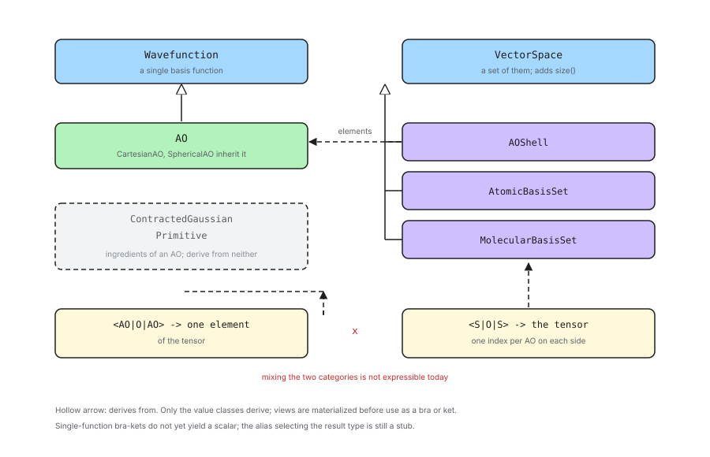

.. Copyright 2026 NWChemEx-Project
..
.. Licensed under the Apache License, Version 2.0 (the "License");
.. you may not use this file except in compliance with the License.
.. You may obtain a copy of the License at
..
.. http://www.apache.org/licenses/LICENSE-2.0
..
.. Unless required by applicable law or agreed to in writing, software
.. distributed under the License is distributed on an "AS IS" BASIS,
.. WITHOUT WARRANTIES OR CONDITIONS OF ANY KIND, either express or implied.
.. See the License for the specific language governing permissions and
.. limitations under the License.

.. _designing_basis_set_matrix_elements:

##############################################
Designing Matrix Elements over the Basis Set
##############################################

This section contains notes on how the classes of
:ref:`designing_the_ao_class_hierarchy` participate in Chemist's
``quantum_mechanics`` component, so that matrix elements can be requested over
them.

*****************************
What are we trying to enable?
*****************************

Chemist expresses a requested quantity in Dirac notation, as a ``BraKet``
object templated on the types of the bra, the operator, and the ket. Evaluating
such an object is somebody else's job; constructing one is a way of *saying*
what is wanted.

What we want is to be able to say it at every level at which it is meaningful.
The overlap of two AOs, of two shells, of two centers, or of two whole basis
sets are all things a caller might reasonably ask for, and they should all be
expressible the same way, without the caller first having to wrap anything.

******************************
Previous Solution: the Adapter
******************************

Historically the AO basis set classes were introduced before the
``quantum_mechanics`` component was designed, and the two were connected by
an adapter class, ``wavefunction::AOs``. In refactoring the AO basis set classes
we want to avoid the need for an adapter.

.. _matrix_element_considerations:

*****************************
Matrix Element Considerations
*****************************

Topics in this section were considered and ultimately were addressed by the
design.

.. _me_one_or_many:

One function or a set of them
   A class participates by being either a single basis function or a set of
   them, and which it is determines which base class it derives from.

   - An AO is a single basis function.
   - A shell, an atomic basis set, and a molecular basis set are each a set of
     functions.
   - The split is a property of the class, not a choice, so it should not be
     configurable.

.. _me_ao_is_the_floor:

The AO is the smallest unit
   Not everything in the hierarchy is a basis function. A primitive and a
   contracted Gaussian are ingredients of one.

   - Neither has an angular part, so neither denotes a particular function
     until it is paired with one. Admitting them as bras and kets would mean
     inventing a rule for which function they stand for, and that rule would be
     an artifact of the notation rather than anything physical.
   - The AO is also the smallest thing the rest of the library indexes by, as
     :ref:`designing_the_ao_class_hierarchy` argues, so it is the natural floor
     for a notation whose purpose is to name tensor elements.
   - So the radial classes take part in building AOs and nothing more.

.. _me_no_adapter:

No adapter class
   Following from :ref:`me_one_or_many`, the classes should derive from the
   base classes themselves.

   - A caller should be able to hand a shell, or an AO, straight to the
     notation.
   - Introducing a parallel set of wrapper types would double the number of
     classes and reintroduce the problem the adapter already has: the wrapper
     participates and the thing it wraps does not.

.. _me_ownership:

A bra-ket owns its state
   A ``BraKet`` is a value which can outlive the expression that produced it.

   - Whatever occupies the bra or ket slot must own what it describes.
   - Per :ref:`aoh_value_view` most of the hierarchy also has aliasing forms,
     and those are exactly the wrong thing to store in a long-lived object.

Out of Scope
============

Topics in this section were considered, but do not play a role in the current
design.

Matrix elements over the radial classes
   Per :ref:`me_ao_is_the_floor`, ``Primitive`` and ``ContractedGaussian`` do
   not participate. Should a use case appear which genuinely wants a bra-ket
   over one of them, the mechanism is the same as for ``AO`` --- derive from
   ``Wavefunction`` and supply the two hooks --- but it would also have to
   settle what function the object denotes, which is the reason it is excluded
   now rather than any technical obstacle.

Evaluating the matrix elements
   Constructing a ``BraKet`` states what is wanted. Producing a number is the
   business of whichever module claims the resulting property type, and is not
   designed here.

Mixing the two categories
   Chemist's existing traits admit a bra-ket only when the bra and the ket are
   both single functions or both sets. Asking for one AO against a whole basis
   set --- a row of a matrix --- is not expressible today, and making it so
   would mean changing the ``quantum_mechanics`` component rather than the
   basis set component.

The scalar result type
   As noted below, single-function bra-kets do not presently produce a scalar.
   Fixing that is a change to ``quantum_mechanics``.

*************************
Matrix Element Design
*************************

.. _fig_matrix_element_design:

   Which base class each level of the hierarchy derives from, and what the
   resulting bra-kets denote.

:numref:`fig_matrix_element_design` summarizes the design.

Which class derives from which base
===================================

Per :ref:`me_one_or_many` and :ref:`me_ao_is_the_floor`, the classes fall into
three groups rather than two.

``AO`` derives from ``Wavefunction``, and is the only class which does.

The sets derive from ``VectorSpace``:

- ``AOShell``, and hence ``CCAShell`` and its siblings
- ``AtomicBasisSet``
- ``MolecularBasisSet``

``Primitive`` and ``ContractedGaussian`` derive from neither. They remain what
:ref:`designing_the_ao_class_hierarchy` makes them: the parts an ``AO`` is
built from.

``VectorSpace`` requires a ``size``, which is the number of AOs: the AOs in the
shell, the AOs on the center, or the AOs in the basis set respectively. This is
the same quantity the existing adapter forwards, now supplied by the object
itself.

What the base classes ask for
=============================

Both base classes ask their derived classes for the same two things: a way to
copy themselves polymorphically, and a way to compare themselves to another
object of the same type. ``VectorSpace`` adds ``size``.

Chemist already factors those first two out. ``detail_::WavefunctionImpl`` is a
CRTP helper which implements both in terms of the derived class's copy
constructor and ``operator==``, and ``VectorSpace`` offers an equivalent
comparison helper. The basis set classes already have both a copy constructor
and an ``operator==``, so deriving through those helpers costs nothing beyond
the declaration.

Values, not views
=================

Per :ref:`me_ownership`, only the value classes derive from the base classes.
The view classes do not.

This is deliberate. A ``BraKet`` stores its bra and ket, and a view is a
handle to storage owned by something else; a bra-ket holding a view would be
valid only as long as whatever it aliases. Requiring a value in the bra and ket
slots makes that lifetime question disappear.

The cost is that using a view as a bra or ket means materializing it first,
which copies. That is the right default: the copy is explicit, it is local to
constructing the bra-ket, and the alternative is a dangling reference that
nothing would catch.

*******
Summary
*******

:ref:`me_one_or_many`
   ``AO`` derives from ``Wavefunction``; ``AOShell``, ``AtomicBasisSet``, and
   ``MolecularBasisSet`` derive from ``VectorSpace``, whose ``size`` is the
   number of AOs. An ``AOShell`` is therefore a ``VectorSpace`` whose elements
   are ``Wavefunction`` objects.

:ref:`me_ao_is_the_floor`
   ``Primitive`` and ``ContractedGaussian`` derive from neither. They are
   ingredients of a basis function rather than basis functions, and admitting
   them would require stipulating which function they stand for.

:ref:`me_no_adapter`
   The classes derive from the base classes directly, so the
   ``wavefunction::AOs`` adapter is removed rather than replaced, and a shell
   or an AO can be handed to the notation as-is.

:ref:`me_ownership`
   Only the value classes derive; views are materialized before being used as a
   bra or a ket, so a bra-ket never outlives what it describes.
