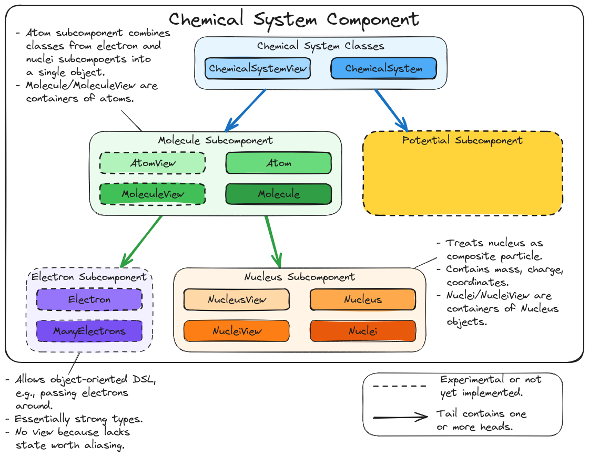

.. Copyright 2024 NWChemEx-Project
..
.. Licensed under the Apache License, Version 2.0 (the "License");
.. you may not use this file except in compliance with the License.
.. You may obtain a copy of the License at
..
.. http://www.apache.org/licenses/LICENSE-2.0
..
.. Unless required by applicable law or agreed to in writing, software
.. distributed under the License is distributed on an "AS IS" BASIS,
.. WITHOUT WARRANTIES OR CONDITIONS OF ANY KIND, either express or implied.
.. See the License for the specific language governing permissions and
.. limitations under the License.

.. _architecture_of_chemical_system:

#########################################
Architecture of Chemical System Component
#########################################

The need for the Chemical System component stemmed from the high-level
architecture details described :ref:`architecture_of_chemist`.

************************************************
Considerations for the Chemical System Component
************************************************

System building
   The overall point of the chemical system component is to provide an object-
   oriented DSL which the user can use to build up the :term:`chemical system`
   they want to model. The component is focused on specifying the system, not
   the specifics of the :term:`physics model`.

   - There is admittedly a fine-line between specifying the system and
     specifying the physics model. For example, one may reasonably argue that
     the specification of the :term:`atomic basis set` is a means of specifying
     the electrons on an atom. Ultimately the delimitation between chemical
     system and physics model is a convention and meant to parallel actual
     usage.

Fundamental particles
   An object-oriented DSL for building up a chemical system should enable the
   user to combine fundamental particles (for the moment defined as nuclei and
   electrons) to build up the system.

   - Requiring the user to say actually add say 92 ``Electron`` objects to an
     ``Atom`` object in order to create uranium is overkill. While conceptually
     this is what the user is doing, user-friendly APIs should exist.
   - Exactly what defines a fundamental particle should be allowed to change.
     For example, extensions which actually resolve the nucleon structure of
     the nucleus are conceivable. Similarly excitons

Fields
   Particularly when modeling chemical systems in condensed phase there is a
   tradition to think of parts of the system as being a field (usually an
   electrostatic field) rather than their true chemical identity. For example,
   one may replace the solvent with a field meant simulate the bulk.

   - Interactions with light could fall under this category two.

Quantum vs. classical
   The chemical system component should be capable of describing which parts of
   the system are treated classically and which are treated quantum
   mechanically.

   - Concepts like molecules look different depending on the physics used to
     model them. For example, many quantum chemistry methods assume a molecule
     is a set of nuclei (modeled as classical point charges) interacting with a
     set of quantum mechanical electrons; notably this means we can not uniquely
     associate any particular electron with a particular nucleus (as would be
     required to define atoms). Conversely, a classical molecule does assign
     electrons to nuclei (most force fields do this by assigning net charges).

Out of Scope
============

Basis Sets
   In an attempt to decouple how quantum mechanical objects are described from
   identifying which objects are quantum mechanical, we opt for the basis sets
   to be modeled separately.

*****************************************
Overview of the Chemical System Component
*****************************************

.. _fig_chemical_system_architecture:

   Major subcomponents and classes of the Chemist's Chemical System component.

Nucleus Subcomponent
====================

Main discussion: :ref:`designing_the_nucleus_component`.

Molecule Subcomponent
=====================

Main discussion: :ref:`md_molecule_design`.

Chemical System Classes
=======================

Main discussion: :ref:`csd_chemical_system_design`
