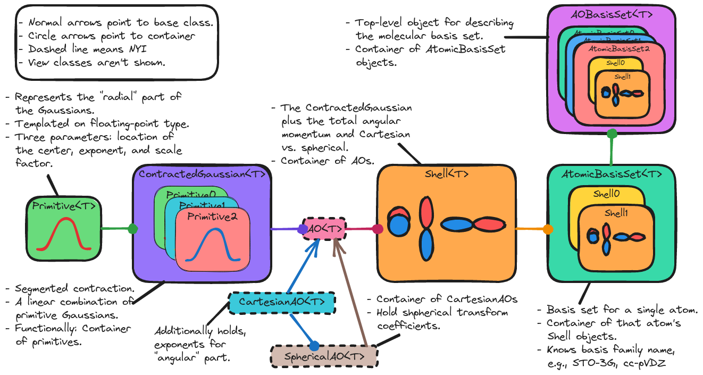

.. Copyright 2023 NWChemEx-Project
..
.. Licensed under the Apache License, Version 2.0 (the "License");
.. you may not use this file except in compliance with the License.
.. You may obtain a copy of the License at
..
.. http://www.apache.org/licenses/LICENSE-2.0
..
.. Unless required by applicable law or agreed to in writing, software
.. distributed under the License is distributed on an "AS IS" BASIS,
.. WITHOUT WARRANTIES OR CONDITIONS OF ANY KIND, either express or implied.
.. See the License for the specific language governing permissions and
.. limitations under the License.

.. _designing_the_ao_basis_set_component:

##################################
Designing the AOBasisSet Component
##################################

Following from :ref:`md_quantum_electrons`, the ``Atom``, ``Molecule``, and
``ChemicalSystem`` classes store their electrons implicitly. This usually
entails storing the number of electrons and the total spin. When it comes time
to model the actual electrons one needs to build wavefunctions (or densities).
The first step in this process is defining a basis set. For the purpose of this
page we assume that the basis set will be comprised of atom-centered atomic
orbitals (AOs).

**********************
What is an AOBasisSet?
**********************

AOs are the one-electron orbitals describing electrons within an atom. By an AO
basis set we mean a set of AOs used as a basis set for forming molecular
orbitals (MOs). The AO basis set is limited to representing the parameters
necessary to construct the set of AOs, *i.e.*, representing the space spanned
by the AOs is outside the scope of the ``AOBasisSet`` class (as detailed in
:ref:`vsd_design` representing this space falls to the ``AOSpace`` class).

*****************************
Why do we need an AOBasisSet?
*****************************

To compute integrals involving AOs we must be able to construct the AOs. This
requires us to know the parameters defining those AOs. The ``AOBasisSet`` class
is a one-stop shop for those parameters. Most users will construct an
``AOBasisSet`` (usually by specifying its name, *e.g.*, 6-31G*) and never need
to otherwise manipulate the AOBasisSet.

.. _ao_basis_set_considerations:

*************************
AOBasisSet Considerations
*************************

Topics in this section were considered in designing the AOBasisSet component
of Chemist and ultimately were addressed by the design.

.. _ao_bs_performance:

Performance
   Integrals involving AOs are some of the lowest-lying operations. The
   ``AOBasisSet`` needs to be interoperable with existing highly-optimized
   integral libraries. In particular:

   - Exponents, coefficients stored in a manner that is vectorizable.
   - float vs. double. Integrals are a performance critical piece of the code,
     being able to use floats, instead of doubles, leads to significant speed
     ups (when doing so does not compromise accuracy).

.. _ao_spherical_vs_cartesian:

Spherical vs. Cartesian
   Terming the :math:`e^{-\alpha r^2}` part of a Gaussian basis function the
   "radial" part, the angular part can take on one of two forms "spherical"
   (in which case the radial/angular labels actually work) or "Cartesian" (in
   which case the radial/angular labels are sloppy). We need to know this
   information to properly compute the integrals.

   - As a corollary, the distinction between spherical and Cartesian Gaussians
     primarily impacts the integrals library. Consumers of the integrals only
     care about the number of Gaussians. Point being, the design should adhere
     to established norms that spherical/Cartesian Gaussians can be used largely
     interchangeable.

.. _ao_tracking_order:

Tracking Order
   For tensors represented in an AO basis the order of the AOs will determine
   the ordering of the tensor elements. For tensors to be compatible they
   must have the same order. The AO basis set should be able to work out if
   this is the case or not.

   - This point is important to note because most other codes do NOT track this
     information.
   - This information can be stored implicitly and only generated when needed.

.. _ao_ao_to_center_mapping:

AO to Center Mapping
   We usually center multiple AOs on the same point. Since the overlap of AOs
   decays with the distance between them, the sparsity pattern tends to depend
   on where AOs are centered. It is thus helpful to collect AOs on the same
   center together.

.. _ao_atomic_basis_name:

Atomic Basis Name
   Most of the time users use pre-tabulated AO basis set parameters. Convention
   has established names for the various parameter sets, *e.g.*, STO-3G,
   cc-pVDZ, and 6-31G*. While the parameters often suffice, there are
   circumstances where we may need the name. Examples include: mapping to
   auxillary basis sets, and interfacing with codes which do not expose
   parameter-based APIs.

   - We note that mixing basis sets, say using cc-pVDZ on hydrogens and
     aug-cc-pVDZ on non-hydrogens, is not unheard of. Thus we may need to
     specify the basis name per center.

Out of Scope
============

Topics in this section were considered, but ultimately do not play a role in
the current implementation of the ``AOBasisSet`` class. Many of these
considerations may need to

Segmented vs general
   Contracted Gaussians can come in two forms: segmented and general. Both are
   linear combinations of primitive Gaussian functions. The difference is that
   each segmented contracted Gaussian is comprised of different primitive
   Gaussians, whereas with general contracted Gaussians multiple contractions
   share the same primitives.

   - The vast majority of existing infrastructure targets segmented
     contractions so we have prioritized segmented contractions. While very
     inefficient, one can use segmented basis infrastructure for general
     contractions by copying the primitives.
   - An efficient solution would likely require writing a class parallel to
     ``Shell`` which acts like a container of ``ContractedGaussians``, but is
     also keyed into the underlying general nature of the basis.

Effective core potentials
   For heavy atoms it is common to replace the core electrons with a potential.
   In practice ECPs are basis set specific and thus have repercussions for the
   basis set.

   - ECPs will be needed down the road. A potential place for storing the ECP
     is the ``AtomicBasisSet`` class.

Not Gaussian-Based
   AOs can be comprised of many types of functions. Atom-centered AOS are
   overwhelming created from Gaussian functions and our current design
   prioritizes Gaussian-based AOs.

   - With some modifications the current design could be adapted to other AO
     types, such as Slater orbitals. This would require introducing new classes
     for the parameters of the other functions. It also may void some naming
     conventions and would thus be API breaking.

*****************
AOBasisSet Design
*****************

.. _fig_ao_basis_set_design:

   Major classes involved in Chemist's basis set component.

:numref:`fig_ao_basis_set_design` pictorially describes the AOBasisSet
component of Chemist. The top-level class is the ``AOBasisSet`` class (located
in the top-right corner of the diagram). The
remaining classes in the diagram form the internal, hierarchical structure of
the ``AOBasisSet`` class. The ``AOBasisSet`` class itself is little more than a
container of ``AtomicBasisSet`` objects.

The ``AtomicBasisSet`` class groups AOs by center. This is
in response to consideration :ref:`ao_ao_to_center_mapping`. More specifically,
all members of the same ``AtomicBasisSet`` object are centered on the same
point.

The ``Shell`` class represents all the AOs with a given total angular momentum
which can be formed from a ``ContractedGaussian`` object. At present, the AOs
in the ``Shell`` class are implicit and can not be individually accessed.
Allowing the user to directly access the ``AO`` objects would satisfy
consideration :ref:`ao_tracking_order`. In practice, the ``Shell`` class adds
two pieces of state: the total angular momentum and whether the AOs are
Cartesian or spherical (in turn satisfying :ref:`ao_spherical_vs_cartesian`).

The ``ContractedGaussian`` class is a container around a set of ``Primitive``
objects. The ``Primitive`` class holds the exponent, where the ``Primitive``
is centered, and coefficient.

Not shown in :numref:`fig_ao_basis_set_design` are the respective view classes.
Associated with ``Primitive``, ``ContractedGaussian``, and ``Shell`` are
the classes ``PrimitiveView``, ``ContractedGaussianView``, and ``ShellView``.
Additional views could be added for the ``AO`` class and the ``AtomicBasisSet``
classes. Each view has the same API as its namesake class (*e.g.*,
``PrimitiveView`` has the same API as ``Primitive``), but different memory
ownership semantics. In particular, the view versions alias their state whereas
the non-views own it. The view versions are necessary to maintain an array-of-
structure API, while actually implementing a structure-of-arrays to be
consistent with :ref:`ao_bs_performance`.

*******
Summary
*******

Briefly, the design of the AOBasisSet component addresses the considerations
raised in :ref:`ao_basis_set_considerations` by:

:ref:`ao_bs_performance`
   Our design addresses performance primarily by a separation of the API from
   the implementation. More specifically, the containers behave like arrays of
   structures, but under the hood are implemented as structures of arrays. The
   trick

:ref:`ao_spherical_vs_cartesian`
   The design contains two provisions for spherical AOs vs. Cartesian AOs.
   The first is in the ``CartesianAO`` and ``SphericalAO`` classes which are
   envisioned as providing direct access to the parameters defining a
   particular AO. The second is the ``Shell`` class which knows if the AOs
   forming the shell are spherical or Cartesian.

:ref:`ao_tracking_order`
   The design calls for the ``AO``, ``CartesianAO``, and ``SphericalAO``
   classes, which can be used to iterate over the AOs in a ``Shell``.

:ref:`ao_ao_to_center_mapping`
   The ``AtomicBasisSet`` class stores all of the AOs (grouped into shells)
   which reside on the same center.

:ref:`ao_atomic_basis_name`
   The ``AtomicBasisSet`` class is capable of storing the name of the basis
   set.
