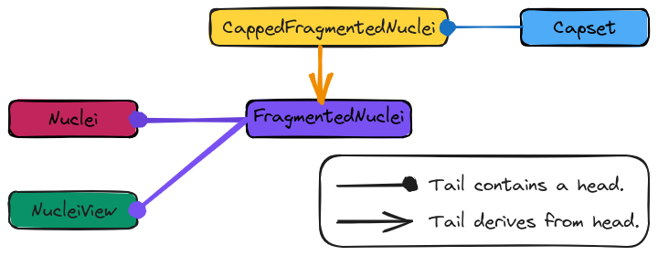

.. Copyright 2023 NWChemEx-Project
..
.. Licensed under the Apache License, Version 2.0 (the "License");
.. you may not use this file except in compliance with the License.
.. You may obtain a copy of the License at
..
.. http://www.apache.org/licenses/LICENSE-2.0
..
.. Unless required by applicable law or agreed to in writing, software
.. distributed under the License is distributed on an "AS IS" BASIS,
.. WITHOUT WARRANTIES OR CONDITIONS OF ANY KIND, either express or implied.
.. See the License for the specific language governing permissions and
.. limitations under the License.

.. _designing_fragmented_nuclei:

#####################################
Designing the Fragmented Nuclei Class
#####################################

:ref:`designing_fragmented_molecule_class` calls for the ``FragmentedMolecule``
class to be implemented in terms of a ``FragmentedNuclei`` class. This page
describes the design of the ``FragmentedNuclei`` class.

****************************
What is a fragmented nuclei?
****************************

Here, "nuclei" specifically refers to the ``Nuclei`` class. The ``Nuclei``
class holds a set of ``Nucleus`` objects. A ``FragmentedNuclei`` object
holds subsets of a ``Nuclei`` objects.

*********************************
Why do we need fragmented nuclei?
*********************************

When we break molecules up into fragments, we usually do this by assigning
atoms to fragments (atoms here implying nucleus plus electrons). In practice,
once the atoms have combined to form molecular systems, we get a ``Nuclei``
object and the overall electronic properties (charge and multiplicity) of the
system.

********************************
Fragmented Nuclei Considerations
********************************

.. _fn_non_disjoint:

Non-disjoint.
   While many initial fragment-based techniques relied on disjoint fragments,
   more modern techniques relax this requirement. The ``FragmentedNuclei``
   class needs to be able to handle multiple fragments, even if those fragments
   are non-disjoint.

.. _fn_container:

Container.
   As described above, the ``FragmentedNuclei`` class is envisioned as being
   filled with subsets of a ``Nuclei`` object. The container should be set-like
   but also support indexing.

.. _fn_immutable_superset:

Immutable superset.
   For the purposes of the super-/sub-set relation we assume that the
   ``Nuclei`` superset has been fully initialized and will not change.

   - If the ``Nuclei`` object changes it likely will invalidate the elements of
     the ``FragmentedNuclei``.

.. _fn_immutable_subsets:

Immutable subsets.
   Each subset is thought of as a literal. So while you can add new subsets to
   the ``FragmentedNuclei``, but can't modify the subset once it's added.

   - Subsets are guaranteed to be unique and are sorted. Allowing subset
     modifications would get tricky since in the process of adding/removing
     elements of the subset one may clobber other subsets and/or cause a need
     for resorting.

.. _fn_empty_states:

Empty states.
   The default constructed object should represent a truly empty state, such a
   state does not even have a supersystem set. There is also an empty state
   where the supersystem is set, but the object may not contain any fragments.

.. _fn_caps:

Caps.
   As a direct result of the :ref:`fs_generality` consideration raised for the
   ``FragmentedSystem`` class, the  ``FragmenteNuclei`` object may contain
   caps. Most caps contain a nucleus and one or more electrons. The
   ``FragmentedNuclei`` class is responsible for the nucleus of the cap.

   - Determining cap placement requires a ``FragmentedNuclei`` object so we
     know which nuclei are in which sets. The caps must thus be in addition to
     the ``FragmentedNuclei`` class.

***********************
FragmentedNuclei Design
***********************

.. _fig_fragmented_nuclei_design:

   The classes involved in implementing the ``FragmentedNuclei`` component.

To a large extent the ``FragmentedNuclei`` class parallels the ``Nuclei``
class. More specifically it is the base of the ``FragmentedSystem`` hierarchy
and worries about how the ``Nuclei`` object of the original system is
fragmented.

Capping requires a ``FragmentedNuclei`` object to cap. For this reason, we
put the ``CapSet`` in a class derived from ``FragmentedNuclei``, 
``CappedFragmentedNuclei``.

*************
Proposed APIs
*************

The next code block summarizes how we expect users to fill in a 
``FragmentedNuclei`` and a ``CappedFragmentedNuclei`` object.

.. code-block:: c++

   Nuclei nukes           = get_nuclei(); //Usually defined by the end-user
   FragmentedNuclei frags = fragment_nuclei_object(nukes);  
   CapSet caps            = cap_fragmented_nuclei(frags);
   CappedFragmentedNuclei capped_frags(frags, caps);

************************
FragmentedNuclei Summary
************************

:ref:`fn_caps`
   The ``FragmentedNuclei`` class will contain a ``Caps`` object which
   represents the broken bonds and what they are replaced with. Discussion of
   the design of the ``Caps`` class can be found 
   :ref:`designing_the_caps_class`.