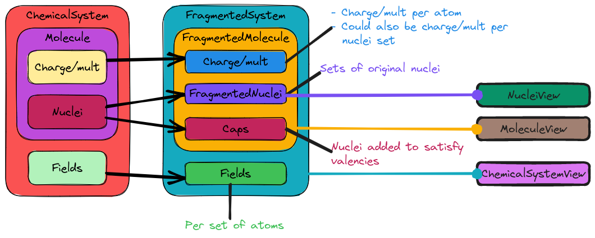

#########################################
Designing the Fragmented System Component
#########################################

The point of this page is to record the design process of the 
``FragmentedSystem`` and affiliated classes.

****************************
What is a Fragmented System?
****************************

The ``ChemicalSystem`` (main discussion: :ref:`csd_chemical_system_design`)
represents the physical system we are trying to model. For traditional
electronic structure calculations the ``ChemicalSystem`` is the part of the
input independent from the method/model specification. Many approximate
methods require breaking the target chemical system up into subsets. We term
those subsets fragments and a ``FragmentedSystem`` is a ``ChemicalSystem``
which has been decomposed into fragment/field pairs.

**********************************
Why do we need a FragmentedSystem?
**********************************

As mentioned, there are a number of approximate methods --- *e.g.*, QM/MM,
fragment based-methods, electronic embedding, and symmetry-adpated perturbation
theory --- which require fragmenting the physical system of interest into a
series of subsystems. The ``FragmentedSystem`` class allows us to represent
fragments of the original ``Molecule`` along with the field the fragment is
embedded in.

*******************************
FragmentedSystem Considerations
*******************************

Ultimately the ``FragmentedSystem`` class will end up paralleling the 
``ChemicalSystem`` class and thus many of the considerations in 
:ref:`csd_considerations` apply here too. In addition:

.. _fs_hierarchy:

Hierarchy
   While we have talked about a single ``FragmentedSystem`` class up until this
   point, the ``ChemicalSystem`` class we intend to fragment is itself a 
   hierarchy. It thus makes sense to parallel the ``ChemicalSystem``
   hierarchy with a "fragmented" system hierarchy.

.. _fs_fields:

Fields.
   Each fragment may have a different field associated with it. The 
   ``FragmentedSystem`` needs to know the field of each fragment.

   - Assigning fields to a fragment usually requires knowledge of the original
     ``ChemicalSystem`` and the ``FragmentedMolecule`` object.
   - Some fields are subsets of the field for the entire system.   

.. _fs_performance:

Performance
   It is expected that the implementation under the hood will need to be
   somewhat clever in how it stores data and preserves fragment mapping. Of
   note, for fragment-based methods the number of fragments often grows 
   exponetially with system size (many of those fragments need not be
   considered, but that's a different problem). Storing an exponential number
   of copies (even if those copies are only subsets) gets expensive quickly.

.. _fs_container:

Container
   ``FragmentedSystem`` and the like will be container-based, being a series
   of fragments, each fragment being a view of a ``ChemicalSystem``. 

   - Views allow array-of-structures API, while maintaining structure-of-array
     innards. Helps address :ref:`fs_performance`.

.. _fs_generality:

Generality
   Ideally the ``FragmentedSystem`` class should be applicable to as many
   methods which rely on fragments as possible. To this extent the class should
   be able to handle:

   - Disjoint and non-disjoint fragments.
   - Covalently-bonded fragments.

.. _fs_chemical_system_compatability:

ChemicalSystem compatability.
   Following from the :ref:`fs_container` consideration, ``FragmentedSystem``
   will conceptually be a container filled with ``ChemicalSystem`` objects. We
   anticipate that the primary usage of the ``FragmentedSystem`` class will be
   to pass elements of the container to algorithms which expect 
   ``ChemicqlSystem`` objects. 

Out of Scope
============

Expansion coefficients.
   Usually the properties of the fragments are combined as a linear combination.
   The weights of this linear expansion will be stored elsewhere. Part of the
   motivation for not including the weights here is that in many cases the
   weights depend on more than just the fragment/field, *e.g.*, they may also
   depend on the AO basis set (think basis set superposition error corrections)
   and/or level of theory (think QM/MM or other multi-layered theories).

AO Basis Sets.
   For the same reason we considered the AO Basis Set out of scope from the
   ``ChemicalSystem``, it is also out of scope here. See 
   :ref:`csd_considerations` for more details.

:math:`n`-mers.
   In fragment-based methods based off of the many-body expansion, one often
   starts with a set of fragments. Typically these fragments are chosen to 
   contain atoms residing proximal to one another. To capture many-body
   interactions among the fragments, one then forms unions of pairs, triples,
   up to :math:`n`-tuples of fragments. The resulting unions are termed 
   :math:`n`-mers. From the perspective of running calculations :math:`n`-mers
   are no different tha a non-disjoint use of ``FragmentedSystem``. That said,
   having a class which can express the :math:`n`-mer relationship is useful 
   for other purposes, e.g., screening the final set of :math:`n`-mers and 
   basis-set superposition corrections, and thus should exist. Here we simply
   advocate for that class being different than the ``FragmentedSystem`` class.

************************
Fragmented System Design
************************

.. _fig_fragmented_system_design:

   How the major pieces of the ``ChemicalSystem`` map to pieces of the 
   fragmented system.

As :numref:`fig_fragmented_system_design` shows, in satisfying 
:ref:`fs_hierarchy` we have opted to mirror the existing ``ChemicalSystem``
hierarchy. More specifically, what was the ``Nuclei`` in the original 
``ChemicalSystem`` becomes the ``FragmentedNuclei`` (subsets of the original
nuclei), what was the ``Molecule`` becomes the ``FragmentedMolecule`` (subsets
of the original atoms), and what was the ``ChemicalSystem`` becomes the
``FragmentedChemicalSystem``. These three major components are described briefly
in the following subsections.

FragmentedNuclei Class
======================

Most algorithms for fragmenting a molecular system focus on the nuclei. Given
a ``Nuclei`` object, a ``FragmentedNuclei`` is a container whose elements are
subsets of ``Nuclei``. As shown in :numref:`fig_fragmented_system_design` the
actual elements are ``NucleiView`` objects, which behave like a ``Nuclei``
object, but do not own their state. As users create fragments from the 
``Nuclei`` class they add them to the ``FragmentedNuclei`` object, which tracks
them.

FragmentedMolecule Class
========================

Main page: :ref:`designing_fragmented_molecule_class`.

As shown in :numref:`fig_fragmented_system_design` the ``FragmentedMolecule``
class has three components: a ``FragmentedNuclei`` object, the caps for each
element in the ``FragmentedNuclei`` object, and a mapping from
the elements of the ``FragmentedNuclei`` to their respective 
charge/multiplicities. The ``Caps`` object is needed to deal with severed
valencies.

FragmentedSystem Class
======================

As shown in :numref:`fig_fragmented_system_design`, the ``FragmentedSystem``
class has two pieces: a ``FragmentedMolecule`` object and a mapping from the
elements of the ``FragmentedMolecule`` object to their respective fields.