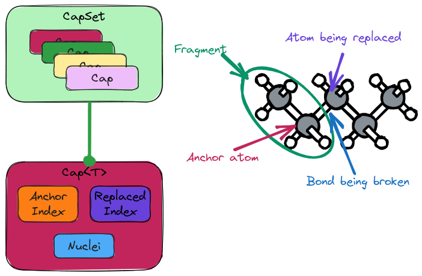

.. Copyright 2023 NWChemEx-Project
..
.. Licensed under the Apache License, Version 2.0 (the "License");
.. you may not use this file except in compliance with the License.
.. You may obtain a copy of the License at
..
.. http://www.apache.org/licenses/LICENSE-2.0
..
.. Unless required by applicable law or agreed to in writing, software
.. distributed under the License is distributed on an "AS IS" BASIS,
.. WITHOUT WARRANTIES OR CONDITIONS OF ANY KIND, either express or implied.
.. See the License for the specific language governing permissions and
.. limitations under the License.

.. _designing_the_caps_class:

#############################
Designing the Capping Classes
#############################

In :ref:`designing_fragmented_class` consideration :ref:`lc_caps`
gave rise to the need to represent caps. This page describes the design of
the ``Cap`` and ``CapSet`` classes.

**************
What is a Cap?
**************

.. |A| replace:: :math:`A`
.. |B| replace:: :math:`B`
.. |AB| replace:: :math:`A-B`

When fragmenting large covalently bonded systems it is usually the case that
there exists at least one bond between say atoms |A| and |B|,
such that there is a fragment which contains |A|, but not |B|.
In this case we say that in forming the fragments we have broken the
|AB| bond. The resulting fragments would be radicals (assuming the
electrons in the bond are split evenly). Treating the fragments as radicals
would lead to substantially different electronic structure, and we instead
usually prefer to instead approximate the severed bond as existing
between |A| and an added monovalent atom (usually hydrogen). The
monovalent atom (or sometimes group of atoms) is referred to as a "cap".

********************
Why Do We Need Caps?
********************

If we want to apply fragment-based methods to large covalently-bonded systems
then we will necessarily have to break covalent bonds. Since we will not want
to treat the resulting fragments as radicals, we will also need to cap the
fragments. Caps also show up in a number of other methods which partition
and/or break-up large covalently-bonded systems including QM/MM and ONIOM.

*******************
Caps considerations
*******************

.. |C| replace:: :math:`C`
.. |D| replace:: :math:`D`
.. |CB| replace:: :math:`C-B`
.. |AD| replace:: :math:`A-D`
.. |AC| replace:: :math:`A-C`

.. _cc_replaced_type:

replaced type
   When we fragment an object of type ``Nuclei`` we break bonds between
   ``Nucleus`` objects. The cap we add to fix this bond will have state 
   consistent with a ``Nucleus`` object (or more generally a ``Nuclei`` object,
   *vide infra*). Similarly fragmenting a ``Molecule`` or an ``AOBasisSet``
   leads to different considerations for the cap.

.. _cc_new_objects:

new objects
   Caps typically are placed in locations in space where no supersystem object
   resides (they usually are not placed directly where the replaced object
   resided). This means that the caps will have to be treated as new objects
   since they are not actually present in the target supersystem.

.. _cc_asymmetry:

asymmetry
   Given a severed bond |AB|, let caps |C| and |D| respectively replace |A|
   and |B|. It is generally the case that |CB| and |AD| will in general lead
   to two caps because |C| and |D| will not usually be equal.

.. _cc_bond_memory:

bond memory
   It is important for a cap to remember what object it replaced and what object
   it is bonded to.

.. _cc_multiple_caps:

multiple caps
   An object |A| may make bonds to several atoms which are not in the fragment.
   If |A| is bonded to |B| and |C|, and |B| and |C| are both not in the
   fragment we need caps to address fragmenting the |AB| bond, but also the
   |AC| bond

.. _cc_multiple_objects:
 
 multiple objects
    Caps are usually monovalent. They also are usually comprised of a single
    center; however, this is not always the case. In general the caps needed
    for breaking up objects of type ``T`` will also be of type ``T``.

.. _cc_container:

container
   The ``CapSet<T>`` class should be container-like with the elements being the
   individual caps. It is assumed that each cap is only added once (thus it
   is set-like), but is also indexable. The template type parameter ``T`` will
   be the type of the object being fragmented.

.. _cc_polymorphic_objects:

polymorphic objects
   The objects that ``Cap<T>`` and ``CapSet<T>`` are templated on are in general
   polymorphic. Assuming ``A`` derives from ``B`` it will not be
   the case that ``Cap<A>`` derives from ``Cap<B>``. In other words the 
   ``Cap<T>`` class does not mirror the class hierarchy of the objects.

   - This is the similar to using STL containers with polymorphic objects.

*************
CapSet Design
*************

.. _fig_caps_design:

   Overview of the ``Cap<T>`` and ``CapSet<T>`` classes as well as the purposed
   terminology.

The right side of :numref:`fig_caps_design` shows a typical capping scenario.
Assuming the molecule is pentane, we are forming a fragment which contains the
first two carbon atoms and their attached hydrogen atoms. Carbons three, four,
and five, as well as the hydrogen atoms attached to those carbons are not in
the fragment. In turn, this fragmentation choice results in breaking the bond
between carbons two and three. In this scenario we refer to carbon two as the
"anchor atom", since it is the atom the cap will be anchored to and carbon three
as the "replaced" atom.

Following the :ref:`cc_container` consideration, the ``CapSet<T>`` object is a
container-like object whose elements are instances of the ``Cap<T>`` class. Each
``Cap<T>`` object knows the identity of the anchor object, and the object(s) 
replaced by the cap(s). This satisfies the :ref:`cc_bond_memory`, 
:ref:`cc_multiple_caps`, and :ref:`cc_multiple_objects`` considerations. 
Consideration :ref:`cc_asymmetry` is handled by adding two ``Cap<T>`` instances 
to the ``CapSet<T>`` object, each having a different anchor atom. Finally, to 
satisfy :ref:`cc_new_objects` each ``Cap<T>`` holds a ``T`` object for the new 
object(s).

In practice the :ref:`cc_polymorphic_objects` consideration will not affect
users because the
``CapSet<T>`` objects will live inside of ``FragmentedPIMPL<T>`` objects
(see :ref:`designing_fragmented_class`). Since each ``FragmentedPIMPL<T>`` will
have different implementations for each ``T``, and thus each implementation can
be tailored to the level of the class hierarchy it implements.

*******************
Caps Design Summary
*******************

:ref:`cc_replaced_type`
   The ``Cap<T>`` class ``CapSet<T>`` class are both templated on the type of
   the object being fragmented.

:ref:`cc_new_objects`
   Each ``Cap<T>`` object holds the object(s) used to cap the broken bond.

:ref:`cc_asymmetry`
   The asymmetry of capping a bond is handled by adding multiple ``Cap<T>`` 
   objects to the ``CapSet<T>`` object.

:ref:`cc_bond_memory`
   The ``Cap<T>`` object holds the indices of the anchor and replaced objects 
   in addition to the literal state of the cap.

:ref:`cc_multiple_caps`
   ``Cap<T>`` objects can be created for each of the replaced atoms.

:ref:`cc_container`
   The ``CapSet<T>`` class is container-like.

:ref:`cc_polymorphic_objects`
   Since ``CapSet<T>`` objects will live inside ``FragmentedPIMPL<T>`` objects,
   each of which has a custom implementation, the ``FragmentedPIMPL<T>``
   implementation can manually managed polymorphic conversions if necessary.