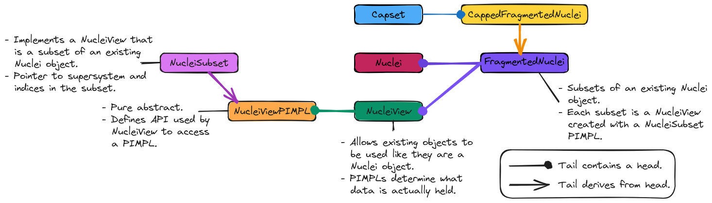

.. Copyright 2023 NWChemEx-Project
..
.. Licensed under the Apache License, Version 2.0 (the "License");
.. you may not use this file except in compliance with the License.
.. You may obtain a copy of the License at
..
.. http://www.apache.org/licenses/LICENSE-2.0
..
.. Unless required by applicable law or agreed to in writing, software
.. distributed under the License is distributed on an "AS IS" BASIS,
.. WITHOUT WARRANTIES OR CONDITIONS OF ANY KIND, either express or implied.
.. See the License for the specific language governing permissions and
.. limitations under the License.

.. _designing_fragmented_nuclei:

#####################################
Designing the Fragmented Nuclei Class
#####################################

This page describes the design of the ``FragmentedPIMPL<Nuclei>`` class.

****************************
What is a fragmented nuclei?
****************************

Here, "nuclei" specifically refers to the ``Nuclei`` class. The ``Nuclei``
class holds a set of ``Nucleus`` objects. A ``FragmentedPIMPL<Nuclei>`` object
implements a ``Fragmented<Nuclei>`` object so that it holds subsets of a 
``Nuclei`` objects.

*********************************
Why do we need fragmented nuclei?
*********************************

When we break molecules up into fragments, we usually do this by assigning
atoms to fragments (atoms here implying nucleus plus electrons). In practice,
once the atoms have combined to form molecular systems, we get a ``Nuclei``
object and the overall electronic properties (charge and multiplicity) of the
system. In order to disentangle the electrons we can first break the ``Nuclei``
into subsets. In the subsequent steps we will then assign electrons to the
nuclei in the subsets based on the atomic number of each nucleus and the charge
of the system.

********************************
Fragmented Nuclei Considerations
********************************

.. _fn_non_disjoint:

Non-disjoint.
   While many initial fragment-based techniques relied on disjoint fragments,
   more modern techniques relax this requirement. The 
   ``FragmentedPIMPL<Nuclei>`` class needs to be able to handle multiple 
   fragments, even if those fragments are non-disjoint.

.. _fn_container:

Container.
   As described above, the ``FragmentedPIMPL<Nuclei>`` class is envisioned as 
   implementing the container-like ``Fragmented<Nuclei>`` object. 

.. _fn_immutable_superset:

Immutable superset.
   For the purposes of the super-/sub-set relation we assume that the
   ``Nuclei`` superset has been fully initialized and will not change.

   - If the ``Nuclei`` object changes it likely will invalidate the elements of
     the ``FragmentedPIMPL<Nuclei>``.

.. _fn_immutable_subsets:

Immutable subsets.
   Each subset is thought of as a literal. So while you can add new subsets to
   the ``FragmentedPIMPL<Nuclei>``, we can't modify the subset once it's added 
   (aside from deleting it).

   - Subsets are guaranteed to be unique and are sorted. Allowing subset
     modifications would get tricky since in the process of adding/removing
     elements of the subset one may clobber other subsets and/or cause a need
     for resorting.

.. _fn_caps:

Caps
   When fragments are formed we may sever covalent bonds. To repair the valency
   we can add caps. We view the process of adding caps as adding nuclei. The
   electrons accompanying those nuclei are added when we set the 
   charge/multiplicity of the fragment since the user typically cares about the
   overall charge/multiplicity of the fragment and not the caps separately.

   - Determining cap placement requires a ``Fragmented<Nuclei>`` object so we
     know which nuclei are in which sets. The caps must thus be stored as 
     additional state in the ``FragmentedPIMPL<Nuclei>``.

***********************
FragmentedNuclei Design
***********************

.. _fig_fragmented_nuclei_design:

   The classes involved in implementing the ``FragmentedNuclei`` component.

TODO: update.
