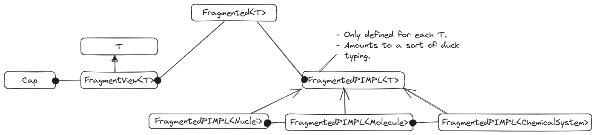

.. _designing_the_fragmenting_component:

###################################
Designing the Fragmenting Component
###################################

This page records the high-level design decisions which went into Chemist's
Fragmenting component.

**********************************
What is the Fragmenting Component?
**********************************

Most computational chemistry energy methods compute the energy of a target
:term:`chemical system`. Some methods do this by breaking the target chemical
system into pieces. Each piece, or ":term:`fragment`" is meant to simulate a
subset of the target system (the target system is often called the
"supersystem" to emphasize the sub-/super-set relationship of the two).
Chemist's Fragmenting component is charged with providing classes for
representing fragments.

***************************************
Why Do We Need a Fragmenting Component?
***************************************

In addition to fragment-based methods, i.e., methods which approximate the
target system's properties via the (generalized) many-body expansion, a number
of other methods also require the system to be fragmented. Two notable
examples are :term:`QM/MM` and :term:`ONIOM`. Chemist needs a Fragmenting
component in order to be able to represent how the user wants to decompose the
target chemical system.

**************************
Fragmenting Considerations
**************************

.. _fc_chemical_system_class:

chemical system class
   As mentioned above fragments stem from decomposing a :term:`chemical system`.
   In Chemist, chemical systems are modeled by the ``ChemicalSystem`` class
   and thus fragments should be defined with respect to a ``ChemicalSystem``
   object.

   - As a corollary, we also want fragments of a ``ChemicalSystem`` to be usable
     wherever ``ChemicalSystem`` objects are used.

.. _fc_chemical_system_hierarchy:

chemical system hierarchy
   The ``ChemicalSystem`` class is actually a hierarchy of classes. Conceptually
   the easiest way to fragment a ``ChemicalSystem`` object is to fragment it
   piece-by-piece, i.e., we expect users to first fragment the ``Nuclei``
   within the ``ChemicalSystem``, then assign electrons to those ``Nuclei``
   objects to make ``Molecule`` objects, and then assign external fields to
   the ``Molecule`` objects to create ``ChemicalSystem`` objects.

   - Similar to :ref:`fc_chemical_system_class` we want fragments of ``Nuclei``
     and ``Molecule`` objects to be usable wherever ``Nuclei`` and ``Molecule``
     objects are usable.

.. _fc_caps:

caps
   When the supersystem contains large covalently-bonded molecules, fragments
   will usually severe covalent bonds. One of the most common strategies for
   dealing with this is to "cap" the broken bond with a monovalent atom (or
   sometimes set of atoms).

  - When a fragment is passed to an algorithm meant for a traditional
    ``Nuclei``, ``Molecule``, or ``ChemicalSystem`` which elements come from
    caps and which come from the supersystem is irrelevant; however, this
    changes for algorithms needing to assemble the resulting properties.

.. _fc_non_disjoint:

non-disjoint fragments
   Historically fragments have resulted from partitioning the supersystem, i.e.,
   each nucleus appears in one, and only one, fragment. More recently methods
   which rely on non-disjoint fragments have been developed too. The
   Fragmenting component should avoid assuming that fragments are disjoint.

.. _fc_performance:

performance
   Classes must ultimately be designed in a performant manner, e.g., they should
   provide opportunities to avoid copies and should store information in a
   succinct manner. They also should be readily usable in parallel environments,
   e.g., avoid storing global state.

.. _fc_general_use:

general use
   As motivated above, a number of methods require fragmenting a
   ``ChemicalSystem`` object. The Fragmenting component should avoid assuming
   a particular method of fragmentation strategy.

Out of Scope
============

n-mers
   A lot of (generalized) many-body expansion methods distinguish between
   fragments and unions of fragments (an "n-mer" being the union of n
   fragments). In practice, if one views a set of n-mers as set of non-disjoint
   fragments, the "n-mer" distinction becomes somewhat immaterial. Thus,
   because of the :ref:`fc_non_disjoint` consideration we feel that the
   Fragmenting component does not need to distinguish between fragments and
   n-mers.

Expansion coefficients.
   Usually the properties of the fragments are combined as a linear combination.
   The weights of this linear expansion will be stored elsewhere. Part of the
   motivation for not including the weights here is that in many cases the
   weights depend on more than just the fragment/field, *e.g.*, they may also
   depend on the AO basis set (think basis set superposition error corrections)
   and/or level of theory (think :ref:`QM/MM` or other multi-layered theories).

******************
Fragmenting Design
******************

.. _fig_fragmenting_overview:

   Architecture summary of the Fragmenting component of Chemist.

:numref:`fig_fragmenting_overview` summarizes the architecture of the
Fragmenting component. The ``Fragmented<T>`` class template represents a
container of fragments. Each fragment is represented by a ``FragmentView<U>``
object. Caps are modeled by the ``Cap`` class.

Fragmented Class
================

Full discussion: :ref:`designing_fragmented_class`.

Together considerations :ref:`chemical_system_class` and
:ref:`fc_chemical_system_hierarchy` mean that the Fragmenting component needs
to be able support fragmenting not just ``ChemicalSystem`` objects, but several
other classes as well. This is addressed by templating the ``Fragmented<T>``
class on the type of object being fragmented.

FragmentView Class
==================

Full discussion: :ref:`designing_fragmented_view_class`.

Given the :ref:`fc_performance` consideration the state inside a
``Fragmented<T>`` object will NOT simply be akin to a ``std::vector<T>``.
In turn, actually returning fragments which behave like ``T`` objects will
minimally require returning ``U`` objects, where ``U`` is the view associated
with ``T``. Because of the :ref:`fc_caps` consideration, fragments will in
general contain additional state beyond that of a ``U`` object. We introduce
the ``FragmentView<U>`` class to manage the ``U`` object and the additional
state such as the caps.

Cap Class
=========

Full discussion: :ref:`designing_the_caps_class`.

The other key piece of the Fragmenting component is the ``Cap`` class, which
is introduced in response to the :ref:`fc_caps` consideration. We intentionally
store the ``Cap`` objects in a ``FragmentView<U>`` class, rather than say
adding additional ``Nucleus`` objects to a ``Nuclei`` object, so that
``FragmentView<U>`` is able to tell the caps from the objects stemming
from the supersystem. Algorithms which do not care about the cap distinction
can use ``FragmentView<U>`` object as a ``U`` object where no such distinction
is made.

.. _fragmenting_api:

***************
Fragmenting API
***************

Most fragmentation workflows start with an already created ``ChemicalSystem``
class and then fragment that. Below is the proposed workflow and APIs for
fragmenting a ``ChemicalSystem``.

.. code-block:: C++

   // Opaquely creates the system to fragment
   ChemicalSystem sys = get_chemical_system();

   // Step 1. We start by assigning nuclei to fragments.

   // This will be the sets of nuclei in each fragment
   Fragmented<Nuclei> frag_nuclei(sys.molecule().nuclei());

   // Usually assigning nuclei to fragments is much more complicated than this
   // but for illustrative purposes we just make each fragment a single nucleus
   for(auto i = 0; i < mol.nuclei().size(); ++i){
       frag_nuclei.insert({i});
   }

   // Step 2. In many cases fragmenting will break covalent bonds and we will
   // need to cap the nuclei.

   // For demonstrative purposes we assume that there was only a bond between
   // nuclei 0 and 1 that needs capped
   frag_nuclei.add_cap(0, 1, Nucleus{...}); // Cap attached to 0, replacing 1
   frag_nuclei.add_cap(1, 0, Nucleus{...}); // Cap attached to 1, replacing 0

   // Step 3. Need to assign electrons to the fragments

   // This will hold the "Molecule" piece of each fragment
   Fragmented<Molecule> frag_mol(sys.molecule());

   for(FragmentView<NucleiView> frag_i : frag_nuclei){
       // Adds nuclei (and caps) and declares it as a neutral singlet
       frag_mol.insert(frag_i, 0, 1);
   }

   // Step 4. Assign fields to each fragment

   // This will hold the final fragments (which are each a ChemicalSystem)
   Fragmented<ChemicalSystem> frag_sys(sys);

   for(FragmentView<Molecule> frag_i : frag_mol){
    // Adds molecule and its external field
    frag_sys.insert(frag_i, ...);
   }

*******
Summary
*******

:ref:`fc_chemical_system_class`
   Fragmenting a ``ChemicalSystem`` results in a container-like object of type
   ``Fragmented<ChemicalSystem>``, the elements of the resulting object are
   the fragments of the supersystem. Fragments are implicitly convertible to
   ``ChemicalSystem`` references in order to leverage existing algorithms.

:ref:`fc_chemical_system_hierarchy`
   This consideration is essentially a generalization of
   :ref:`fc_chemical_system_class` and is addressed by ``Fragmented<T>`` being
   templated on ``T``, the type of object being fragmented. Similarly the
   fragments are objects of type ``FragmentView<U>`` where ``U`` is a type
   implicitly convertible to a ``T`` reference.

:ref:`fc_caps`
   State of the ``FragmentView<U>`` object is partitioned into state stemming
   from the supersystem and state stemming from the caps. The caps are
   modeled by ``Cap`` objects. By deriving from ``U`` the partitioning of the
   state can be ignored by functions wanting to work with ``U`` objects.

:ref:`fc_non_disjoint`
   This consideration is ultimately a design consideration of the
   ``Fragmented<T>`` and ``FragmentView<U>`` class templates and addressed
   on the :ref:`designing_fragmented_class` page.

:ref:`fc_performance`
   Ultimately performance is a function-by-function consideration; however,
   the use of ``FragmentView<U>`` objects facilitates a decoupling of each
   fragment's state from how it is accessed.

:ref:`fc_general_use`
   The Fragmenting component is largely made up of a container-like object and
   objects supporting that container. The ``Fragmented<T>`` class template,
   and its members use generic language which is widely applicable across
   scenarios.

****************
Additional Notes
****************

This design discussion was started as part of
`Chemist PR#361 <https://github.com/NWChemEx-Project/Chemist/pull/361>`_.
