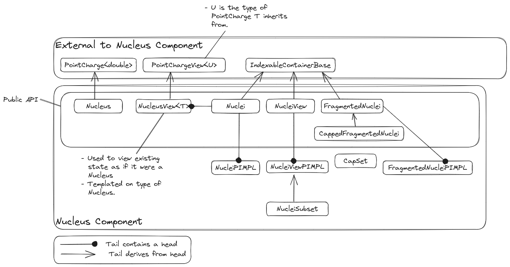

.. _designing_the_nucleus_component:

###############################
Designing the Nucleus Component
###############################

This section contains notes on the design of Chemist's nucleus component.

******************************
What is the Nucleus Component?
******************************

In the present context a nucleus is the core of an atom and is comprised of 
neutrons and protons. The nucleus component contains the abstractions needed
to represent a single nucleus as well as a set of nuclei.

***********************************
Why do we need a Nucleus Component?
***********************************

Anecdotally most quantum chemistry pacakges do not bother with classes for
describing the nucleus, so why should we? There's a couple reasons. First,
particularly when it comes to manipulating the chemical system we often treat
the nuclei indpendent of the electrons. Having separate classes for the nuclei
makes this easier. Second, while the nuclei are often treated as point charges,
they need not be. High accuracy work may take into account the finite size of 
the nucleus and even its quantum mechanical nature. These different descriptions
require different parameters (and therefore different classes). Our final
motivation for having a separate ``Nucleus`` class is that when it comes time
to take derivatives or define operators with respect to particles we can use
the ``Nucleus`` and ``Nuclei`` classes in the types of the derivative/operator.

**********************
Nucleus Considerations
**********************

.. _n_basic_parameters:

basic parameters
   Nuclei are assumed to be centered on a point, have a mass, an atomic number,
   an overall charge, and an atomic symbol. 

.. _n_atomic_number_v_charge:

atomic number vs. charge
   In atomic units the atomic number of a nucleus is the same as the charge.
   As such it is reasonable to not distinguish among the two; however, there
   are a couple reasons to separate them:

   - As alluded to, the two are only equal in atomic units. We intend to add
     unit support at a later time.
   - The atomic number is always an integer and is often used as the key in
     maps. While the charge is an integer in atomic units, it is sill often used
     in mathematical contexts where it needs to be a floating point type. While
     integers and floating-poing values can be converted somewhat easily, having
     separate functions helps avoid compiler warnings. 

.. _n_views:

Views
   Traditionally the molecular system has been stored as a structure of arrays.
   This is primarily for performance reasons. From a user-perspective an array
   of structures is easier to use. By introducing views we can have both. The
   view objects act like the values, but only alias their state.

   - We need views of ``Nucleus`` to be used as references into the ``Nuclei``
     container.
   - We need views of ``Nuclei`` to be used in containers like 
     ``FragmentedNuclei`` where the elements are meant to be ``Nuclei`` objects.
   - Views also enable external libraries to wrap their data in an API
     compatible with Chemist.

.. _n_fragmented_nuclei:

fragmented nuclei
   There are a number of methods which require us to divide the nuclei into
   sets. The resulting structure essentially behaves like a container of
   ``Nuclei``.

   - There are a number of additional considerations which went into the design 
     of the ``FragmentedNuclei`` class; they are discussed in
     :ref:`designing_fragmented_nuclei`.

Out of Scope
============

non-point charge like nuclei
   While we recognize that nuclei need not always be treated as point charges,
   given how often they are treated as point charges, we are focusing on
   point charge-like nuclei only for right now. Additional classes can be
   added to the hierarchy to handle more realistic approximations.

**************
Nucleus Design
**************

.. _fig_nucleus_component:

   Classes comprising the Nucleus component of Chemist.

FragmentedNuclei
================

Main discussion: :ref:`designing_fragmented_nuclei`.

Given a ``Nuclei`` object we sometimes want to only consider subsets of that
object. Each of those subsets is also a ``Nuclei`` object. The 
``FragmentedNuclei`` class is a container which holds the supersystem ``Nuclei``
object and each of the subsystem ``Nuclei`` objects.

*******
Summary
*******