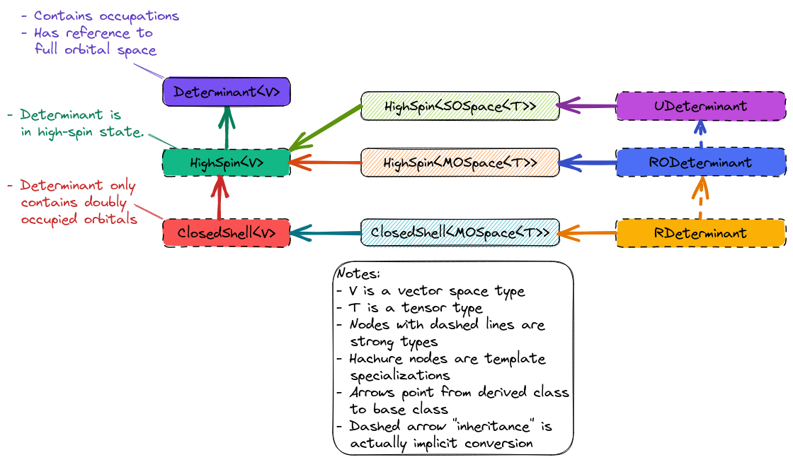

.. Copyright 2023 NWChemEx-Project
..
.. Licensed under the Apache License, Version 2.0 (the "License");
.. you may not use this file except in compliance with the License.
.. You may obtain a copy of the License at
..
.. http://www.apache.org/licenses/LICENSE-2.0
..
.. Unless required by applicable law or agreed to in writing, software
.. distributed under the License is distributed on an "AS IS" BASIS,
.. WITHOUT WARRANTIES OR CONDITIONS OF ANY KIND, either express or implied.
.. See the License for the specific language governing permissions and
.. limitations under the License.

.. _dd_design:

##################
Determinant Design
##################

This page describes the design of the determinant component of Chemist.

**********************
What is a Determinant?
**********************

.. |N| replace:: :math:`N`
.. |i| replace:: :math:`i`
.. |j| replace:: :math:`j`
.. |M| replace:: :math:`\mathbf{M}`
.. |Mij| replace:: :math:`M_{ij}`

Our present interest in determinants is purely from a quantum chemistry
perspective, not the general mathematical angle. In the context of
quantum chemistry determinants are basis functions for |N|-electron
wavefunctions. The name determinant comes from the fact that if you
create an |N| by |N| matrix, |M|, such that element |Mij| is the |i|-th
electron occupying the |j|-th orbital, then the determinant of |M| is a
properly antisymmetrized |N|-electron basis function.

.. note::
   One obtains the same result by instead defining |Mij| as
   the |j|-th electron in the |i|-th orbital, since
   :math:`det\left(\mathbf{M}\right)=det\left(\mathbf{M}^T\right)`.

****************************
Why Do We Need Determinants?
****************************

In quantum chemistry, determinants pair a one-electron basis set with an
occupation vector (for |N| orbitals, an |N|-element vector such that the
|i|-th element is the occupation of the |i|-the orbital). In turn, we use
determinants as a means of defining occupied/virtual orbitals and potentially
tracking non-standard occupations.

.. _dd_considerations:

**************************
Determinant Considerations
**************************

.. _dd_ov:

Occupied/Virtual
   As mentioned in the previous section the determinant class is primarily
   envisioned as a means of storing how we partitioned the orbitals into
   occupied and virtual orbitals. In practice, most methods implicitly create
   all determinants they will need by referring to the original partitioning.
   Hence we are primarily interested in using the determinant component to
   track the reference determinant.

.. _dd_occ_restrict:

Occupation Restriction
   Knowing whether each orbital is restricted to doubly occupied, or if there
   are some singly occupied orbitals, can lead to algorithm simplifications.
   The class hierarchy should make it possible to glean this information from
   the type alone.

*********************************
Overview of Determinant Component
*********************************

.. _fig_determinant:

   The fundamental classes comprising Chemist's determinant component.

:numref:`fig_determinant` shows the major pieces of Chemist's determinant
component. Compared to :ref:`vsd_design`, the determinant component is
relatively simple; a fact that stems from realizing that most of the variation
in modern electronic structure methods comes from how to choose the orbitals,
or how to approximate the many-electron wavefunction. In other words, there's
comparatively few ways to create |N|-electron basis functions from orbitals.

Determinant Class
=================

The base class of the determinant hierarchy is the ``Determinant<V>`` class
(here ``V`` is the type of a vector space representing the orbital space).
To address the :ref:`dd_ov` consideration, this class stores a reference to
the (full) orbital space the determinant is created from (*i.e.*, it is not
just the orbitals occupied in the determinant) and the orbital occupations.
Admittedly, in many cases, orbital occupations are somewhat trivial to
implicitly store developers of the ``Determinant<V>`` class may opt for
multiple backends depending on whether or not the occupations need to be
explicitly stored (usually only necessary for excited states or fractional
occupations).

High Spin Class
===============

A number of electronic structure methods assume that the determinant is in a
high-spin state (all unpaired electrons have the same spin). While we could
carry around the spins of each electron, and determine on-the-fly if we have
a high-spin state, we instead have created a strong type ``HighSpin<V>`` to
denote when a determinant is in a high-spin state. This is justified by the
fact that the user makes this decision (implicitly) based on what method they
select. Combined with the ``ClosedShell<V>`` class introduced below, the
``HighSpin<V>`` class addresses the :ref:`dd_occ_restrict` consideration.

Closed Shell Class
==================

A special (trivial) case of a high-spin determinant is one with no unpaired
electrons. Knowing that there are no unpaired electrons again leads to
simplifications in the resulting theories, which is why we opt to denote this
condition by the ``ClosedShell<V>`` strong type. Together with the
``HighSpin<V>`` class, ``ClosedShell<V>`` addresses the :ref:`dd_occ_restrict`
consideration.

Example Determinants
====================

The remainder of :numref:`fig_determinant` shows some template specializations
and strong types for those specializations. We have opted for strong types,
rather than typedefs, primarily to minimize the use of templates in user-facing
classes (which also has the advantage of cleaner compiler errors). Briefly,
the strong types we introduce are:

- ``UDeterminant<T>``. Class denoting that determinant is expressed in terms
  of spin orbitals, occupied in a high-spin state. These are the determinants
  considered in methods typically labeled as "unrestricted".
- ``RODeterminant<T>``. Same as ``UDeterminant<T>``, except that the orbitals
  are spatial orbitals (not spin). These are the determinants considered in
  methods typically labeled as "restricted open-shell".
- ``RDeterminant<T>``. Same as ``RODeterminant<T>``, except that we additionally
  know that there are no singly-occupied orbitals. These are the determinants
  considered in methods typically labeled as "restricted".

Also denoted in :numref:`fig_determinant` is that ``RDeterminant<T>`` should be
implicitly convertible to an object of type ``RODeterminant<T>``, which itself
should be implicitly convertible to an object of type ``UDeterminant<T>``.
The decision to use implicit conversions is to avoid multiple inheritance, but
still allow physically meaningful conversions (a ``RDeterminant<T>`` is just
a special case of an ``RODeterminant<T>``, which is just a special case of a
``UDeterminant<T>``).

**************************
Determinant Design Summary
**************************

The design of the determinant component satisfies the considerations raised in
section :ref:`dd_considerations` by:

:ref:`dd_ov`
   The ``Determinant<V>`` class stores a reference to the full orbital space
   and the occupation vector.

:ref:`dd_occ_restrict`
   The strong types ``HighSpin<V>`` and ``ClosedShell<V>`` add occupation
   restriction information to the type, facilitating type dispatching based
   on how the orbitals are occupied.
