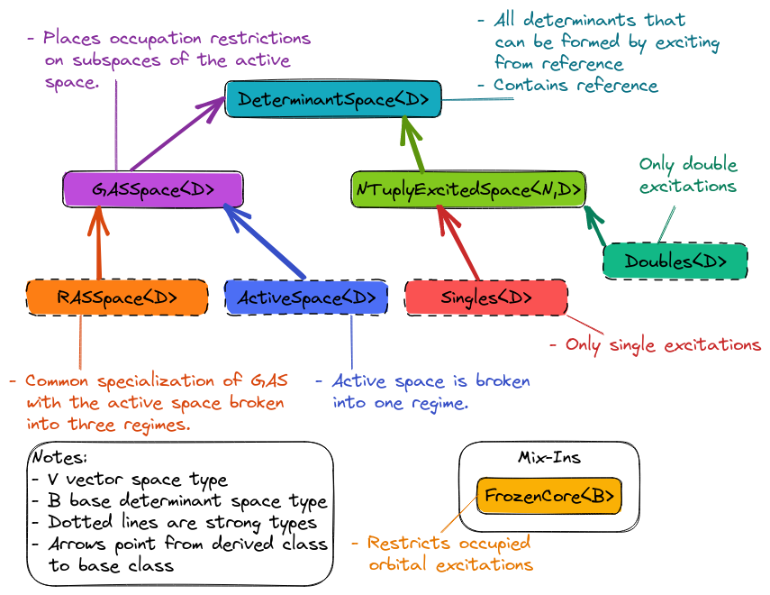

.. Copyright 2022 NWChemEx-Project
..
.. Licensed under the Apache License, Version 2.0 (the "License");
.. you may not use this file except in compliance with the License.
.. You may obtain a copy of the License at
..
.. http://www.apache.org/licenses/LICENSE-2.0
..
.. Unless required by applicable law or agreed to in writing, software
.. distributed under the License is distributed on an "AS IS" BASIS,
.. WITHOUT WARRANTIES OR CONDITIONS OF ANY KIND, either express or implied.
.. See the License for the specific language governing permissions and
.. limitations under the License.

########################
Determinant Space Design
########################

This page describes the design of the determinant space component of Chemist.

****************************
What is a Determinant Space?
****************************

.. |N| replace:: :math:`N`

***********************************
Why Do We Need a Determinant Space?
***********************************

In quantum chemistry we rarely are interested in systems with 1 electron.
Therefore we need to be able to create |N|-electron wavefunctions, and in turn
we must be able to generate |N|-electron basis functions.

********************************
Determinant Space Considerations
********************************

In designing the determinant space component of Chemist we considered the
following

.. _ds_occupations:

Occupations
   Thinking in second quantization, determinants are usually specified by
   which orbitals are occupied. We thus need two things to specify any
   particular determinant: the set of orbitals and their occupations.

.. _ds_occ_restrict:

Occupation restrictions
   Knowing whether the spatial orbitals one is working with are exclusively
   doubly occupied, or a mix of doubly and singly occupied, can be used to
   optimize the algorithm.

.. _ds_excite_restrict:

Excitation restrictions
   For most systems, the full number of determinants which can be formed is
   a staggering amount. A number of quantum chemistry methods only consider
   determinants from a subspace of the full determinant space. These
   restrictions are usually expressed in terms of which excitations are and
   are not allowed. Examples:

   - Frozen core. No excitations involving core electrons are allowed.
   - Complete active space. Excitations are only allowed among a specified
     set of electrons and orbitals.
   - Restricted active space. Decomposes the active space into three regimes,
     each with a maximum/minimum electron occupancy

.. _ds_type_dispatch:

Type dispatch
   The determinant space classes will be used to construct property types.
   Having determinant space types for different assumptions and approximations
   allows us to ensure that module we call is aware of those assumptions and
   approximations.

**************************
Determinant Space Overview
**************************

The determinant space component is envisioned as a class hierarchy designed in
such a way that the base class represents all possible determinants which can
be formed from a particular set of orbitals, and derived classes represent
specific restrictions on which determinants are included in the space.

.. _fig_determinant_spaces:

   Pieces of Chemist's determinant space component.

Determinant Space Class
=======================

The ``DeterminantSpace<V>`` class is the base of the hierarchy and is largely
envisioned as code factorization for the derived classes. The main state
contained in a ``DeterminantSpace<V>`` instance is the full orbital space
(which is of type ``V``) and which of those orbitals are initially occupied.
The ``DeterminantSpace<V>`` class addresses the :ref:`ds_occupations`
consideration.

.. note::

   While the idea of which orbitals are occupied is less clear cut once one
   starts going down the active space leg of the class hierarchy. Nevertheless,
   the active spaces can be thought of as excitations from some particular
   determinant. The occupations returned by the base represent this initial
   occupation.

High Spin Space Class
=====================

The ``HighSpinSpace<V>`` class is a strong type representing the fact that the
orbitals occupied in a particular determinant are either doubly or singly
occupied. It also guarantees that any singly occupied orbitals are of
the same spin type.  Together with the ``ClosedShell<V>`` class,
``HighSpinSpace<V>`` addresses :ref:`ds_occ_restrict`.

Closed Shell Class
==================

The ``ClosedShell<V>`` class is a strong type representing the fact that all
of the occupied orbitals are doubly occupied. Checking that a particular
determinant space is actually a ``ClosedShell<V>`` determinant space can thus
be used to dispatch to restricted versions of a theory, *e.g.*, restricted
self-consistent field (SCF) theory vs. unrestricted SCF. Combined with
``HighSpin<V>``, ``ClosedShell<V>`` addresses the :ref:`ds_occ_restrict`
consideration.

Generalized Active Space (GAS) Space Class
==========================================

The ``GASSpace<V>`` class restricts the determinant space by defining an active
space (a specified number of electrons and a specified set of orbitals in
which those electrons may reside). Generally speaking, the active space is
partitioned into subspaces such that each subspace has a minimum and maximum
occupancy. Relative to ``DeterminantSpace<V>``, ``GASSpace<V>`` contains a list
of which orbitals are in which partitioning and the minimum/maximum number of
electrons allowed in each partition. ``GASSpace<V>`` addresses the
:ref:`ds_excite_restrict` consideration.

Active Space Class
==================

The ``ActiveSpace<V>`` is a strong type signifying that the base
``GASSpace<V>`` class has a single partitioning and the minimum/maximum number
of electrons in this space is equal to the number of active electrons. The
``ActiveSpace<V>`` class is designed primarily to address
:ref:`ds_type_dispatch`.

.. note::

   It is not uncommon to think of GAS as a simplification of CAS, which in
   turn suggests ``GASSpace<V>`` should derive from ``ActiveSpace<V>``.
   However, by defining an ``ActiveSpace<V>`` as we have (GAS with one
   partitioning, minimum/maximum occupations equal to the number of electrons)
   it should be possible to pass an ``ActiveSpace<V>`` object to a code
   expecting a ``GASSpace<V>`` object; whereas attempting the reverse (*i.e.*,
   passing a ``GASSpace<V>`` object to a code expecting an ``ActiveSpace<V>``
   object) will in general not work.

Restricted Active Space (RAS) Space Class
=========================================

.. |Nh| replace:: :math:`N_h`
.. |Ne| replace:: :math:`N_e`

The ``RASSpace<V>`` is a strong type signifying that the base ``GASSpace<V>``
has an active space with three partitions. The minimum and maximum occupancies
of each partition are controlled by two parameters: |Nh|, the maximum number of
holes allowed to be in the first partition, and |Ne|, the maximum number of
electrons allowed to be in the third partition (partitions are assumed to be
ordered by the energies of the orbitals in them). The ``RASSpace<V>`` class is
designed primarily to address :ref:`ds_type_dispatch`.

Frozen Core Class
=================

The ``FrozenCore<B>`` class represents that the occupied orbitals are
partitioned into two regimes, a regime from which no excitations are allowed
(*i.e.*, the core) an a regime from which excitations are allowed. The class is
a mix-in that is templated on the determinant space it derives from. For
example ``FrozenCore<ClosedShell<V>>`` denotes the determinant space possible
given a set of restricted orbitals, but not allowing core excitations.

Determinant Spaces Examples
===========================

So far all of the determinant spaces we have listed have been class templates.
In practice, we expect that users will somewhat rarely deal with the templates
and will instead usually deal with explicit specializations. Some examples are
given below (``T`` is a tensor type):

- ``HighSpin<CMOSpace<T>>``. The type of the determinant space which can be
  formed from (restricted) canonical molecular orbitals (CMOs) when occupations
  are restricted to a high-spin state. This is the orbital space for
  restricted open-shell methods.
- ``ClosedShell<CMOSpace<T>>``. The type of the determinant space which can
  be formed from CMOs whose occupancies are restricted to being doubly occupied.
  This is the determinant space for most traditional restricted methods.
- ``HighSpin<CSOSpace<T>>``. The type of the determinant space which can be
  formed from canonical molecular spin orbitals (CSOs). Each occupied orbital
  is either singly or doubly occupied. Singly occupied orbitals all have the
  same spin. This is the determinant space for unrestricted methods.

*************************
Determinant Space Summary
*************************

To summarize how our current design addresses the concerns in

:ref:`ds_occupations`
   The base ``DeterminantSpace<V>`` class holds the occupations of the
   reference determinant.

:ref:`ds_occ_restrict`
   The ``HighSpinSpace<V>`` and the ``ClosedShell<V>`` class describe the
   occupation restrictions which occur in single-reference methods. Occupation
   restrictions in multi-reference capabilities are described by the
   ``GASSpace<V>`` class (and its subclasses).

:ref:`ds_excite_restrict`
   ``FrozenCore<B>`` was designed to signal that core excitations are not
    allowed. More fine-grained restrictions fall to the ``GASSpace<V>`` (and
    its subclasses).

:ref:`ds_type_dispatch`
   The hierarchy contains a number of strong types which can be used to
   distinguish between assumptions used to construct the spaces.
