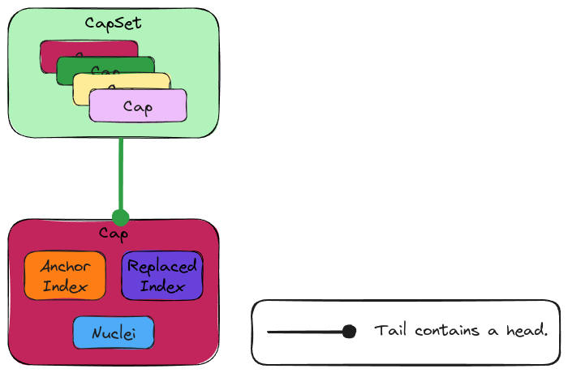

.. Copyright 2024 NWChemEx-Project
..
.. Licensed under the Apache License, Version 2.0 (the "License");
.. you may not use this file except in compliance with the License.
.. You may obtain a copy of the License at
..
.. http://www.apache.org/licenses/LICENSE-2.0
..
.. Unless required by applicable law or agreed to in writing, software
.. distributed under the License is distributed on an "AS IS" BASIS,
.. WITHOUT WARRANTIES OR CONDITIONS OF ANY KIND, either express or implied.
.. See the License for the specific language governing permissions and
.. limitations under the License.

####################
Capping Architecture
####################

In :ref:`designing_the_fragmenting_component` consideration :ref:`fc_caps`
gave rise to the need to represent caps.

.. _ca_what_is_a_cap:

**************
What is a Cap?
**************

.. |A| replace:: :math:`A`
.. |B| replace:: :math:`B`
.. |AB| replace:: :math:`A-B`

.. _fig_caps_design:

.. figure:: assets/cap_overview.png
   :align: center

   Overview of capping and the terminology used.

:numref:`fig_caps_design` illustrates how caps arise when large covalently
bonded systems are fragmented. More specifically, if there is a bond between
atoms |A| and |B|, and there is a fragment which contains |A|, but not |B|, then
we say we have broken the |AB| bond. When a cap is added to the fragment, it
is attached to |A|, which is termed the "anchor atom", and the cap replaces |B|,
thus |B| is known as the "replaced atom".

********************
Why Do We Need Caps?
********************

If we assume that we split the electrons in a bond evenly between the anchor
and replaced atoms, then any fragment containing a broken bond would be a
radical. Since the point of fragmenting a system is usually to simulate part of
the larger system, we wish to avoid treating the fragment (otherwise the
electronic structure of the fragment would be substantially different). The
solution is to approximate the severed bond as existing the replaced atom and
an added monovalent atom (usually hydrogen).

**********************
Capping Considerations
**********************

.. _ca_new_state:

new state
   Caps have state beyond that of a ``Nucleus`` object, e.g., they need to know
   what nucleus they replace.

.. _ca_container:

container
   The ``CapSet`` class should be container-like with the elements being the
   individual caps. It is assumed that each cap is only added once (thus it
   is set-like), but is also indexable. A container is needed to hide
   optimizations related to

************
Architecture
************

.. _fig_ca_architecture:

   Architecture of the capping component.

:numref:`fig_ca_architecture` shows the architecture of the capping component
and how the classes are related. The classes are summarized below.

Cap
===

Main page: :ref:`designing_the_cap_class`

Introduced to address the :ref:`ca_new_state` consideration, the ``Cap`` class
holds the nucleus or nuclei used to complete the severed bond.

CapSet
======

Main page: :ref:`designing_the_cap_set_class`

Introduced to address the :ref:`ca_container` consideration, the ``CapSet``
class models a set of ``Cap`` objects.

*******
Summary
*******

:ref:`ca_new_state`
   Addressed by creating the ``Cap`` class.

:ref:`ca_container`
   Addressed by creating the ``CapSet`` class.
