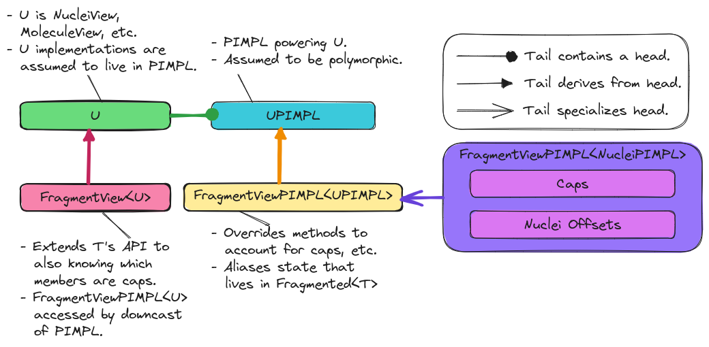

.. Copyright 2023 NWChemEx-Project
..
.. Licensed under the Apache License, Version 2.0 (the "License");
.. you may not use this file except in compliance with the License.
.. You may obtain a copy of the License at
..
.. http://www.apache.org/licenses/LICENSE-2.0
..
.. Unless required by applicable law or agreed to in writing, software
.. distributed under the License is distributed on an "AS IS" BASIS,
.. WITHOUT WARRANTIES OR CONDITIONS OF ANY KIND, either express or implied.
.. See the License for the specific language governing permissions and
.. limitations under the License.

.. _designing_the_fragment_view_class:

################################
Designing the FragmentView Class
################################

The point of this page is to document the design decisions which went into
the ``FragmentView<U>`` class template and the classes associated with it.

*******************************
What is the FragmentView Class?
*******************************

Fragments are stored in ``Fragmented<T>`` objects. Each ``FragmentView<U>``
object acts as a reference to a fragment in a ``Fragmented<T>`` object.

************************************
Why Do We Need a FragmentView Class?
************************************

For performance reasons ``Fragmented<T>`` will not just be a
``std::vector<T>``. In turn, obtaining an object which acts like a reference to
an object of type ``T`` is not as easy as accessing an array. Instead we need
to create the reference on-the-fly. Let ``U`` be a type which acts like a
reference to a ``T`` object, then the ``FragmentView<U>`` class will alias the
state inside a ``Fragmented<T>`` object in a manner which allows the state to
be accessed as if it were in a ``U`` object. The need for ``FragmentView<U>``
instead of just a ``U`` object is because fragments in general have additional
state beyond that of the ``U``, e.g., a user may want to know what nuclei, caps
in the fragment replace.

***************************
FragmentView Considerations
***************************

.. _fv_alias_fragmented_state:

alias ``Fragmented<T>`` state
   The primary need for the ``FragmentView<U>`` class is to alias the state in
   a ``Fragmented<T>`` object (actually the ``FragmentedPIMPL<T>`` object
   powering it).

.. _fv_additional_state:

additional state
   The other motivation for the ``FragmentView<U>`` class is to be able to
   delineate additional fragment state (e.g., caps) from state which is a
   subset of the supersystem.

.. _fv_unified_api:

unified API
   Most fragment methods rely on the fact that existing machinery (that built
   for ``T`` and ``U`` objects) can be reused for the fragments. For this to
   work ``FragmentView<U>`` objects need to be usable wherever ``U`` objects
   are AND when used as a ``U`` object the additional state needs to be
   accounted for (e.g., when a ``FragmentView<NucleiView>`` is used as
   a ``NucleiView`` the total number of nuclei must include not only the
   nuclei from the supersystem, but from the caps as well).

*******************
FragmentView Design
*******************

.. _fig_fragmentview_class:

   Classes related to implementing ``FragmentView<U>``.

Each class we intend to fragment (i.e., ``Nuclei``, ``Molecule``, etc.) has
an associated view class. Let ``U`` be the view class associated with ``T``.
We assume that ``U`` is actually implemented via the PIMPL idiom, and the
class implementing ``U`` is ``UPIMPL``. Furthermore we assume that ``UPIMPL`` is
polymorphic and allows us to derive a class ``FragmentViewPIMPL<UPIMPL>`` which
overrides ``UPIMPL`` so that, as required by :ref:`fv_alias_fragmented_state`, 
the ``U`` instance is powered by aliasing state from a ``Fragmented<T>``. 
This is shown in :numref:`fig_fragmentview_class`.

For this figure we assume that ``UPIMPL`` will be ``NucleiViewPIMPL``,
``MoleculeViewPIMPL``, and ``ChemicalSystemViewPIMPL`` for
``FragmentView<Nuclei>``, ``FragmentView<Molecule>``, and
``FragmentView<ChemicalSystem>`` respectively. With this assumption we only need
to specialize  ``FragmentViewPIMPL<U>`` for ``NucleiViewPIMPL``. Specialization 
is needed to address :ref:`fv_additional_state` and :ref:`fv_unified_api`. More
specifically, ``FragmentViewPIMPL<NucleiViewPIMPL>`` needs to store caps and
override methods in ``NucleiViewPIMPL`` to account for the caps. The remaining
``FragmentViewPIMPL<UPIMPL>`` objects contain no additional fragment state and
only need to feed ``UPIMPL`` objects pointers from the ``FragmentedPIMPL<T>`` 
object.

*****************
FragmentView APIs
*****************

``FragmentView<U>`` objects will typically be created by ``Fragmented<T>`` 
objects, so it suffices to assume that the ``Fragmented<T>`` object can
create a ``FragmentViewPIMPL<UPIMPL>`` object and use that to initialize
the ``FragmentView<U>``, i.e.,

.. code-block:: C++

   // Get an initialized PIMPL
   pimpl_pointer ppimpl = get_initialized_pimpl();

   FragmentView<U> view(std::move(ppimpl));

The more interesting construction APIs are for the PIMPLs. 

.. code-block:: C++

   // We actually store FragmentView<NucleiView> objects in the
   // FragmentedPIMPL<Nuclei> object
   auto psupersystem = get_pointer_to_supersystem_from_fragmented_object();
   auto pcap0        = get_pointer_to_the_first_cap();
   auto pcap1        = get_pointer_to_the_second_cap();
   auto pnuclei      = get_pointer_to_nuclei_set(); // Fragment contains nuclei 0, 1, and 2
   FragmentViewPIMPL<NucleiViewPIMPL> nuclei_pimpl(psupersystem, 
                                                   pnuclei, 
                                                   {pcap0, pcap1});

   // We could have also built the same object using member functions
   nuclei_pimpl.set_supersystem(get_supersystem_from_fragmented_object());
   nuclei_pimpl.nuclei_data() = pnuclei; // Assign pointer
   nuclei_pimpl.insert_cap(pcap0);
   nuclei_pimpl.insert_cap(pcap1);

   auto pcharge = get_pointer_to_charge();
   auto pmult   = get_pointer_to_multiplicity();

   // In practice nuclei_pimpl will actually need to be a pointer, but for
   // illustrative purposes:
   FragmentView<NucleiView> nuclei_view(nuclei_pimpl);
   FragmentViewPIMPL<MoleculeViewPIMPL> mol_pimpl(nuclei_view,
                                                  pcharge,
                                                  pmult);

   // Again could have use member functions
   mol_pimpl.charge_data()       = pcharge;
   mol_pimpl.multiplicity_data() = pmult;

   auto pfield0 = get_pointer_to_first_field();
   auto pfield1 = get_pointer_to_second_field();

   // Similar to above, mol_pimpl will actually need to be a pointer
   FragmentView<MoleculeView> mol_view(mol_pimpl);
   FragmentViewPIMPL<ChemicalSystemPIMPL> sys_pimpl(mol_view, {pfield0});

   // And can add fields via member functions
   sys_pimpl.insert_field(pfield1);

*******
Summary
*******

:ref:`fv_alias_fragmented_state`
   The ``FragmentViewPIMPL<UPIMPL>`` class template is implemented by aliasing
   state which actually lives in a ``Fragmented<T>`` object.

:ref:`fv_additional_state`
   Given a ``FragmentView<U>`` object, users can use the :term:`API` of the
   ``FragmentView<U>`` to access fragment-specific state.

:ref:`fv_unified_api`
   ``FragmentViewPIMPL<UPIPML>`` objects will override methods of the ``UPIMPL``
   to ensure that additional fragment state is accounted for when going through
   the base APIs.