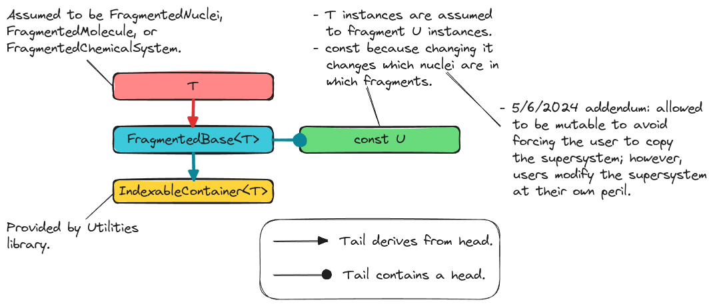

.. Copyright 2023 NWChemEx-Project
..
.. Licensed under the Apache License, Version 2.0 (the "License");
.. you may not use this file except in compliance with the License.
.. You may obtain a copy of the License at
..
.. http://www.apache.org/licenses/LICENSE-2.0
..
.. Unless required by applicable law or agreed to in writing, software
.. distributed under the License is distributed on an "AS IS" BASIS,
.. WITHOUT WARRANTIES OR CONDITIONS OF ANY KIND, either express or implied.
.. See the License for the specific language governing permissions and
.. limitations under the License.

.. _designing_fragmented_base_class:

##################################
Designing the FragmentedBase Class
##################################

This page describes the design of the ``FragmentedBase<T>`` class template.

**************************************
Why Do We Need a FragmentedBase Class?
**************************************

As motivated in :ref:`designing_the_fragmenting_component`, the
``FragmentedBase<T>`` class template is introduced to factor shared
functionality from ``FragmentedNuclei``, ``FragmentedMolecule``, and
``FragmentedChemicalSystem``.

*****************************
FragmentedBase Considerations
*****************************

.. _fc_container:

container
   All ``FragmentedBase<T>`` objects should satisfy the concept of

.. _fc_supersystem:

supersystem
   ``FragmentedNuclei``, ``FragmentedMolecule``, etc. have in common that they
   contain subsets of a superset. The ``FragmentedBase<T>`` factors out the
   infrastructure for holding the superset and interacting with it.

.. _fc_immutable_superset:

immutable superset
   For the purposes of the super-/sub-set relation we assume that the
   superset has been fully initialized and will not change.

   - If the superset changes it will invalidate the elements of the
     entire class hierarchy, which is difficult to recover from.
   - 5/6/2024 addendum. This consideration has been relaxed. Since the
     ``FragmentedBase<T>`` object will own the supersystem it is fragmenting it
     is conceivable that the user may want to update that supersystem directly
     rather than needing to copy it out, modify it, and then create a new
     ``FragmentedBase<T>`` (actually a ``T``) object with the new supersystem.
     This still has the potential to invalidate the class hierarchy, but if the
     user knows what they're doing it can still be okay...

.. _fc_null_and_empty_states:

null and empty states
   The state of ``FragmentedBase<T>`` is defined in reference to a supersystem.
   This raises a conundrum, how can we tell a ``FragmentedBase<T>`` with no
   supersystem (and also no fragments) from one with a supersystem, but no
   fragments? We opt for distinguishing between null and empty. Null meaning
   there is no supersystem and empty meaning there is a supersystem, but no
   fragments.

******************
FragmentedBase API
******************

.. note::

   While the examples shown here should work, we do not expect users to create
   ``FragmentedBase<T>`` objects directly. Rather, users will typically create
   objects of type ``T`` which inherit from ``FragmentedBase<T>``.

To construct a ``FragmentedBase<T>`` object:

.. code-block:: C++

   // Assumed to be a Nuclei, Molecule, or instance ChemicalSystem

   auto supersys = get_supersystem();

   // T will respectively be FragmentedNuclei, FragmentedMolecule, or
   // FragmentedChemicalSystem if supersys is a Nuclei, Molecule, or
   // ChemicalSystem. This creates an empty object, NOT null

   FragmentedBase<T> fragments(supersys);

   // Default construction is null, NOT empty
   Fragmented<T> null;

Following from consideration :ref:`fc_null_and_empty_states`, ``fragments`` will
be an empty set of fragments whereas ``null`` will be a null object. Actually
adding fragments to the object will occur via the derived class. The remainder
of the ``FragmentedBase<T>`` API:

.. code-block:: C++

   // Access the supersystem
   assert(fragments.supersystem() == supersys);

   // Is the object null?
   assert(!fragments.is_null());
   assert(null.is_null());

*********************
FragmentedBase Design
*********************

.. _fig_fragmented_base_class:

   Classes related to the implementation of the ``FragmentedBase<T>`` class.

:numref:`fig_fragmented_base_class` shows the classes involved in implementing
``FragmentedBase<T>``. To satisfy :ref:`fc_container`, ``FragmentedBase<T>``
inherits from  ``utilities::IndexableContainer<T>`` class. In accordance with
:ref:`fc_supersystem`, ``FragmentedBase<T>`` contains an object of type ``U``
such that ``U`` is the class from the chemical system component ``T`` fragments.

*******
Summary
*******

:ref:`fc_container`
   ``FragmentedBase<T>`` inherits from ``utilities::IndexableContainer<T>`` to
   satisfy this consideration.

:ref:`fc_supersystem`
   ``FragmentedBase<T>`` manages a supersystem object.

:ref:`fc_immutable_superset`
   Addressed by storing the superset as a read-only object.

:ref:`fc_null_and_empty_states`
   The default constructor will create a null object, whereas the constructor
   which takes a superset creates an empty object.
