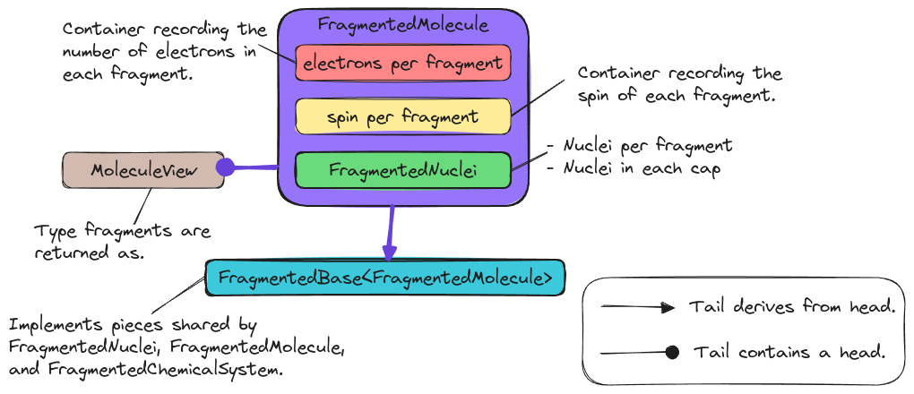

.. Copyright 2023 NWChemEx-Project
..
.. Licensed under the Apache License, Version 2.0 (the "License");
.. you may not use this file except in compliance with the License.
.. You may obtain a copy of the License at
..
.. http://www.apache.org/licenses/LICENSE-2.0
..
.. Unless required by applicable law or agreed to in writing, software
.. distributed under the License is distributed on an "AS IS" BASIS,
.. WITHOUT WARRANTIES OR CONDITIONS OF ANY KIND, either express or implied.
.. See the License for the specific language governing permissions and
.. limitations under the License.

.. _designing_the_fragmented_molecule_class:

######################################
Designing the FragmentedMolecule Class
######################################

The point of this page is to document the design decisions which went into
the ``FragmentedMolecule`` class.

******************************************
Why Do We Need a FragmentedMolecule Class?
******************************************

The need for the ``FragmentedMolecule`` class was motivated by the
:ref:`fc_chemical_system_hierarchy` consideration of
:ref:`designing_the_fragmenting_component`. In short, each layer of the
``ChemicalSystem`` class will require a corresponding container for holding
fragments. This is because each layer of the ``ChemicalSystem`` introduces new
state.

*********************************
FragmentedMolecule Considerations
*********************************

***********************
FragmentedMolecule APIs
***********************

*******************
FragmentView Design
*******************

.. _fig_fragmented_molecule_class:

   State of the ``FragmentedMolecule`` class and its relationship to related
   classes.

*******
Summary
*******
