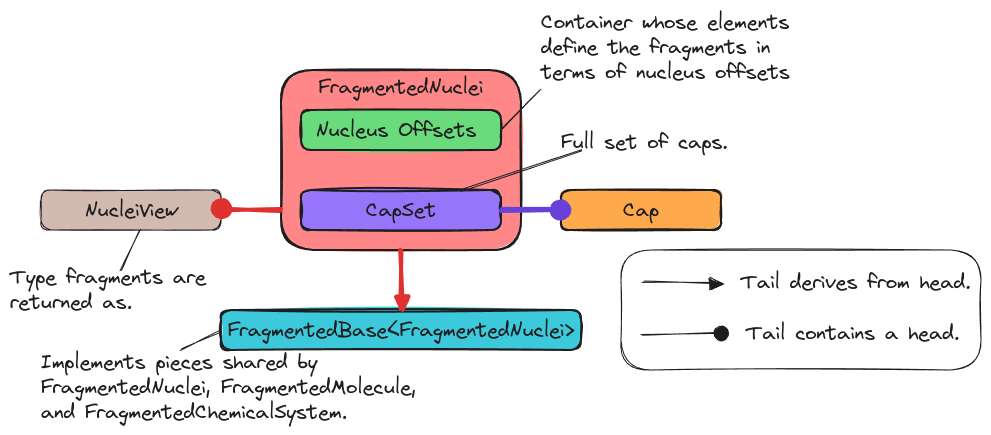

.. Copyright 2024 NWChemEx-Project
..
.. Licensed under the Apache License, Version 2.0 (the "License");
.. you may not use this file except in compliance with the License.
.. You may obtain a copy of the License at
..
.. http://www.apache.org/licenses/LICENSE-2.0
..
.. Unless required by applicable law or agreed to in writing, software
.. distributed under the License is distributed on an "AS IS" BASIS,
.. WITHOUT WARRANTIES OR CONDITIONS OF ANY KIND, either express or implied.
.. See the License for the specific language governing permissions and
.. limitations under the License.

.. _designing_fragmented_nuclei_class:

####################################
Designing the FragmentedNuclei Class
####################################

This page describes the design of the ``FragmentedNuclei`` class.

******************************************
Why Do We Need the FragmentedNuclei Class?
******************************************

The need for the ``FragmentedNuclei`` class was motivated by the
:ref:`fc_chemical_system_hierarchy` consideration of
:ref:`designing_the_fragmenting_component`. In short, each layer of the
``ChemicalSystem`` class will require a corresponding container for holding
fragments. This is because each layer of the ``ChemicalSystem`` introduces new
state.

*******************************
FragmentedNuclei Considerations
*******************************

.. _fn_nuclei_to_fragment_map:

nuclei to fragment map
   The ``FragmentedNuclei`` must track which nuclei are in which fragments.

.. _fn_caps:

caps
   Responsibility for satisfying the :ref:`fc_caps` consideration from
   :ref:`designing_the_fragmenting_component` was given to the
   ``FragmentedNuclei`` class.

   - The same cap may appear multiple times in a set of fragments. The
     ``FragmentedNuclei`` object should store a single set of caps and map
     each fragment to the caps it needs.

.. _fn_non_disjoint:

non-disjoint
   The :ref:`fc_non_disjoint` consideration from
   :ref:`designing_the_fragmenting_component` is ultimately the responsibility
   of the ``FragmentedNuclei`` object.

.. _fn_usable_as_nuclei:

fragments can be used as Nuclei objects
   Once a ``FragmentedNuclei`` object has been created users will likely want
   to call routines expecting ``Nuclei`` objects in a loop. This is facilitated
   by ensuring that the fragments can be implicitly converted to ``Nuclei``
   objects.

********************
FragmentedNuclei API
********************

To construct a ``FragmentedNuclei``:

.. code-block:: C++

   // It's assumed that users already have a Nuclei object
   Nuclei some_nuclei = make_a_nuclei_object();

   FragmentedNuclei null; // See FragmentedBase for more details
   FragmentedNuclei empty(some_nuclei); // Empty

   // Two fragments, first contains nuclei 0, 1, and 2, the second contains
   // nuclei 3, 4, and 5
   auto nuclei_to_frag_map =  {{0, 1, 2}, {3, 4, 5}};
   FragmentedNuclei has_frags(some_nuclei, nuclei_to_frag_map);

   // If the user already has caps they're in a CapSet
   CapSet caps = make_a_cap_set_object();

   // Same as "has_frags", but also has caps
   FragmentedNuclei has_frags_and_caps(some_nuclei, nuclei_to_frag_map, caps);

A couple of notes on the above:

- ``make_an_nuclei_object`` and ``make_cap_a_cap_set_object`` are opaque
  functions meant to respectively encapsulate the process of creating a
  ``Nuclei`` and ``CapSet`` object. The state of the ``Nuclei`` and ``CapSet``
  objects are largely irrelevant for our present purposes.
- We think most users will create an empty ``FragmentedNuclei`` object and then
  fill it as part of an algorithm versus having all the state already
  available at construction. By analogy think of filling ``std::vector`` via
  ``push_back`` vs. the initializer-list or range constructor.
- It is not necessary for the user to tell the ``FragmentedNuclei`` object
  which fragments have which caps. This is because the ``FragmentedNuclei``
  object can determine this mapping from ``nuclei_to_frag_map`` and the
  ``CapSet`` object.

Following from the second note, users will need to be able to add fragments and
caps to the ``FragmentedNuclei`` object. To that end we propose the following
APIs:

.. code-block:: C++

   // Create a fragment which contains nuclei with offsets 0, 1, and 2
   empty.insert({0, 1, 2});

   // Can also be added as a range, and the user can use the actual nucleus
   // objects (n.b., mapping to indices will involve floating point values so it
   // is best to use the ``some_nuclei`` directly)
   auto itr = some_nuclei.begin()
   empty.insert(itr, itr + 3);

   // Adds a Cap
   some_nuclei.add_cap(Cap(0, 1, Nucleus{...}));

   // Short-hand for...
   some_nuclei.cap_set().push_back(Cap(0, 1, Nucleus{...}));

Accessing the state:

.. code-block:: C++

   // Range-based for loop over fragments
   for(NucleiView frag_i : fragments){
       // fragments are interchangeable with Nuclei
       function_expecting_nuclei_object(frag_i);
   }

   // Offset access
   NucleiView frag_0 = fragments[0];

Note that accessing fragments as ``NucleiView`` objects means that the user will
get an object which is the union of actual nuclei and the nuclei from the caps.
This is what is needed to satisfy the :ref:`fn_usable_as_nuclei` consideration.
As shown above, if the user needs to determine which nuclei in the
``NucleiView`` are real vs. from a cap the user can directly access the
``CapSet``.

***********************
FragmentedNuclei Design
***********************

.. _fig_fragmented_nuclei_design:

   The state of the ``FragmentedNuclei`` class and its relation to other
   classes.

:numref:`fig_fragmented_nuclei_design` shows the design of the
``FragmentedNuclei`` class and how the ``FragmentedNuclei`` class relates to
other classes. Internally ``FragmentedNuclei`` stores each fragment's members
by offset, which saves memory and satisfies :ref:`fn_nuclei_to_fragment_map`.
When a user requests a fragment they get back a ``NucleiView`` object (the
:ref:`fn_usable_as_nuclei` consideration). The remaining piece of state in the
``FragmentedNuclei`` object is a ``CapSet`` object (stems from the
:ref:`fn_caps` consideration).

************************
FragmentedNuclei Summary
************************

:ref:`fn_nuclei_to_fragment_map`
   Internally the ``FragmentedNuclei`` class tracks the nuclei in each fragment
   via their offset in the supersystem.

:ref:`fn_caps`
   Each ``FragmentedNuclei`` object will contain a ``CapSet`` object. The
   ``CapSet`` object is responsible for managing the caps a ``FragmentedNuclei``
   object needs.

:ref:`fn_non_disjoint`
   The ``FragmentedNuclei`` class makes no assumptions about whether or not the
   fragments are disjoint.

:ref:`fn_usable_as_nuclei`
    Fragments are returned as ``NucleiView`` objects. ``NucleiView`` objects
    are implicitly convertible to ``Nuclei`` objects.
