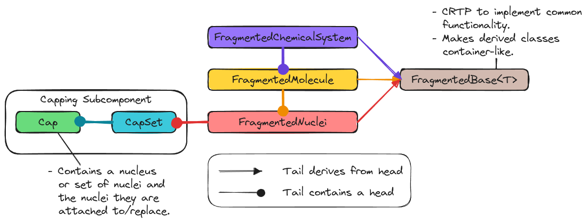

.. Copyright 2023 NWChemEx-Project
..
.. Licensed under the Apache License, Version 2.0 (the "License");
.. you may not use this file except in compliance with the License.
.. You may obtain a copy of the License at
..
.. http://www.apache.org/licenses/LICENSE-2.0
..
.. Unless required by applicable law or agreed to in writing, software
.. distributed under the License is distributed on an "AS IS" BASIS,
.. WITHOUT WARRANTIES OR CONDITIONS OF ANY KIND, either express or implied.
.. See the License for the specific language governing permissions and
.. limitations under the License.

.. _designing_the_fragmenting_component:

###################################
Designing the Fragmenting Component
###################################

This page records the high-level design decisions which went into Chemist's
Fragmenting component.

**********************************
What is the Fragmenting Component?
**********************************

Most computational chemistry energy methods compute the energy of a target
:term:`chemical system`. Some methods do this by breaking the target chemical
system into pieces. Each piece, or ":term:`fragment`" is meant to simulate a
subset of the target system (the target system is often called the
"supersystem" to emphasize the sub-/super-set relationship of the two).
Chemist's Fragmenting component is charged with providing classes for
representing fragments.

***************************************
Why Do We Need a Fragmenting Component?
***************************************

In addition to fragment-based methods, i.e., methods which approximate the
target system's properties via the (generalized) many-body expansion, methods
such as :term:`QM/MM` and :term:`ONIOM` also rely on sub-/super-set
relationships. We thus will have a need to represent these sub-/super-set
relationships in the inputs/outputs to algorithms. The fragmenting component is
charged with providing the user with the classes needed to express these
relationships.

For many people the next question may be "why do we need a whole component for
this vs. say just using ``std::vector<Molecule>`` objects?" The answer is
performance. Particularly for large supersystems the number of subsets can be
very large (n.b., the number of terms in the full :term:`MBE` grows
exponentially in the number of subsets). Storing all of those subsets as
individual objects requires a large amount of memory and leads to inefficient
operations, e.g., using ``Molecule::operator==`` will compare the full state,
but since the subsets contain atoms from the same superset, we can get by with
determining if say atom 1 is in both sets. Ultimately, as described in the
next section, the fragmenting component will need to parallel the chemical
system component (and potentially other Chemist components) and we have thus
opted to decuple fragmenting from the component(s) being fragmented.

**************************
Fragmenting Considerations
**************************

.. _fc_chemical_system_class:

chemical system class
   Most fragments stem from decomposing a :term:`chemical system`. In Chemist,
   chemical systems are modeled by the ``ChemicalSystem`` class and thus
   fragments should be defined with respect to a ``ChemicalSystem`` object.

   - As a corollary, we also want fragments of a ``ChemicalSystem`` to be usable
     wherever ``ChemicalSystem`` objects are used.

.. _fc_chemical_system_hierarchy:

chemical system hierarchy
   The ``ChemicalSystem`` class is actually a hierarchy of classes. Conceptually
   the easiest way to fragment a ``ChemicalSystem`` object is to fragment it
   piece-by-piece, i.e., we expect users to first fragment the ``Nuclei``
   within the ``ChemicalSystem``, then assign electrons to those ``Nuclei``
   objects to make ``Molecule`` objects, and then assign external fields to
   the ``Molecule`` objects to create ``ChemicalSystem`` objects.

   - Similar to :ref:`fc_chemical_system_class` we want fragments of ``Nuclei``
     and ``Molecule`` objects to be usable wherever ``Nuclei`` and ``Molecule``
     objects are usable.

.. _fc_caps:

caps
   When the supersystem contains large covalently-bonded molecules, fragments
   will usually severe covalent bonds. One of the most common strategies for
   dealing with this is to "cap" the broken bond with a monovalent atom (or
   sometimes set of atoms).

  - When a fragment is passed to an algorithm meant for a traditional
    ``Nuclei``, ``Molecule``, or ``ChemicalSystem`` which elements come from
    caps and which come from the supersystem is irrelevant; however, this
    changes for algorithms needing to assemble the resulting properties.

.. _fc_non_disjoint:

non-disjoint fragments
   Historically fragments have resulted from partitioning the supersystem, i.e.,
   each nucleus appears in one, and only one, fragment. More recently methods
   which rely on non-disjoint fragments have been developed too. The
   Fragmenting component should avoid assuming that fragments are disjoint.

.. _fc_general_use:

general use
   As motivated above, a number of methods require fragmenting a
   ``ChemicalSystem`` object. The Fragmenting component should avoid assuming
   a particular method of fragmentation strategy.

Out of Scope
============

n-mers
   A lot of (generalized) many-body expansion methods distinguish between
   fragments and unions of fragments (an "n-mer" being the union of n
   fragments). In practice, if one views a set of n-mers as set of non-disjoint
   fragments, the "n-mer" distinction becomes somewhat immaterial. Thus,
   because of the :ref:`fc_non_disjoint` consideration we feel that the
   Fragmenting component does not need to distinguish between fragments and
   n-mers.

Expansion coefficients.
   Usually the properties of the fragments are combined as a linear combination.
   The weights of this linear expansion will be stored elsewhere. Part of the
   motivation for not including the weights here is that in many cases the
   weights depend on more than just the fragment/field, *e.g.*, they may also
   depend on the AO basis set (think basis set superposition error corrections)
   and/or level of theory (think :term:`QM/MM` or other multi-layered theories).

.. _fragmenting_api:

***************
Fragmenting API
***************

Most fragmentation workflows start with an already created ``ChemicalSystem``
class and then fragment that. Below is the proposed workflow and APIs for
fragmenting a ``ChemicalSystem``.

.. code-block:: C++

   // Opaquely creates the system to fragment
   ChemicalSystem sys = get_chemical_system();

   // Step 1. We start by assigning nuclei to fragments.

   // This will be the sets of nuclei in each fragment
   FragmentedNuclei frag_nuclei(sys.molecule().nuclei());

   // Usually assigning nuclei to fragments is much more complicated than this
   // but for illustrative purposes we just make each fragment a single nucleus
   for(auto i = 0; i < mol.nuclei().size(); ++i){
       frag_nuclei.insert({i});
   }

   // Step 2. In many cases fragmenting will break covalent bonds and we will
   // need to cap the nuclei.

   // For demonstrative purposes we assume that there was only a bond between
   // nuclei 0 and 1 that needs capped
   frag_nuclei.add_cap(0, 1, Nucleus{...}); // Cap attached to 0, replacing 1
   frag_nuclei.add_cap(1, 0, Nucleus{...}); // Cap attached to 1, replacing 0

   // Step 3. Need to assign electrons to the fragments

   // This will hold the "Molecule" piece of each fragment
   Fragmented<Molecule> frag_mol(sys.molecule());

   for(FragmentView<NucleiView> frag_i : frag_nuclei){
       // Adds nuclei (and caps) and declares it as a neutral singlet
       frag_mol.insert(frag_i, 0, 1);
   }

   // Step 4. Assign fields to each fragment

   // This will hold the final fragments (which are each a ChemicalSystem)
   Fragmented<ChemicalSystem> frag_sys(sys);

   for(FragmentView<Molecule> frag_i : frag_mol){
    // Adds molecule and its external field
    frag_sys.insert(frag_i, ...);
   }

******************
Fragmenting Design
******************

The :ref:`fc_chemical_system_hierarchy` consideration
means that our architecture will need to mirror the chemical system hierarchy.
There's at least two ways to do this:

- ``FragmentedNuclei``, ``FragmentedMolecule``, etc. or
- ``Fragmented<Nuclei>``, ``Fragmented<Molecule>``, etc.

Which brings us to the question "To template or not to template?"

A class template like ``Fragmented<T>`` works best if the same definition works
for most valid choices of ``T``. If however ``Fragmented<T>`` would need to be
specialized for most valid choices of ``T`` there is little to gain over the
non-templated option. To this end we note the types differ in that:

- Fragmented ``Nuclei`` must worry about caps.
- Fragmented ``Molecule`` must worry about the electrons per fragment.
- Fragmented ``ChemicalSystem`` must worry about the fields per fragment.

That said there's also common aspects like:

- ``Fragmented<T>`` objects all store ``T`` objects.
- ``Fragmented<T>`` is container-like (i.e., needs ``at``, ``size``, etc.)

.. _fig_fragmenting_overview:

   Architecture summary of the Fragmenting component of Chemist.

Ultimately we have opted for the architecture shown in
:numref:`fig_fragmenting_overview`. The major pieces are summarized below.

FragmentedBase Class
====================

Full discussion: :ref:`designing_fragmented_base_class`

As we briefly touched on when debating whether to have a class template or not,
the containers of ``FragmentedNuclei``, ``FragmentedMolecule``, and
``FragmentedChemicalSystem`` have some common functionality, like accessing the
superset. The ``FragmentedBase<T>`` class template is introduced to factor out
common functionality. Here the template type parameter ``T`` is the class which
derives from ``FragmentedBase<T>`` and is used to implement
``FragmentedBase<T>`` via the curiously recurring template pattern (CRTP). The
use of CRTP makes slicing unlikely.

FragmentedNuclei Class
======================

Full discussion: :ref:`designing_fragmented_nuclei_class`.

:ref:`fc_caps`

FragmentedMolecule Class
========================

Full discussion: :ref:`designing_fragmented_molecule_class`.

FragmentedChemicalSystem Class
==============================

Full discussion: :ref:`designing_fragmented_chemical_system_class`.

Capping Component
=================

Full discussion: :ref:`capping_design`.

The last key piece of the Fragmenting component is the capping subcomponent
and its major classes: ``Cap`` and ``CapSet``. Capping is introduced in response
to the :ref:`fc_caps` consideration. The use of a separate ``CapSet`` class, as
opposed to just adding the caps to a ``Nuclei`` object, facilitates telling the
caps from the "real" nuclei. Furthermore the caps have additional state beyond
that of a nucleus (or set of nuclei) including what nuclei they replace and what
nuclei they are attached to.

*******
Summary
*******

:ref:`fc_chemical_system_class`
   Fragmenting a ``ChemicalSystem`` results in a container-like object of type
   ``Fragmented<ChemicalSystem>``, the elements of the resulting object are
   the fragments of the supersystem. Fragments are implicitly convertible to
   ``ChemicalSystem`` references in order to leverage existing algorithms.

:ref:`fc_chemical_system_hierarchy`
   This consideration is essentially a generalization of
   :ref:`fc_chemical_system_class` and is addressed by ``Fragmented<T>`` being
   templated on ``T``, the type of object being fragmented. Similarly the
   fragments are objects of type ``FragmentView<U>`` where ``U`` is a type
   implicitly convertible to a ``T`` reference.

:ref:`fc_caps`
   State of the ``FragmentView<U>`` object is partitioned into state stemming
   from the supersystem and state stemming from the caps. The caps are
   modeled by ``Cap`` objects. By deriving from ``U`` the partitioning of the
   state can be ignored by functions wanting to work with ``U`` objects.

:ref:`fc_non_disjoint`
   This consideration is ultimately a design consideration of the
   ``Fragmented<T>`` and ``FragmentView<U>`` class templates and addressed
   on the :ref:`designing_fragmented_class` page.

:ref:`fc_general_use`
   The Fragmenting component is largely made up of a container-like object and
   objects supporting that container. The ``Fragmented<T>`` class template,
   and its members use generic language which is widely applicable across
   scenarios.

****************
Additional Notes
****************

This design discussion was started as part of
`Chemist PR#361 <https://github.com/NWChemEx/Chemist/pull/361>`_.
