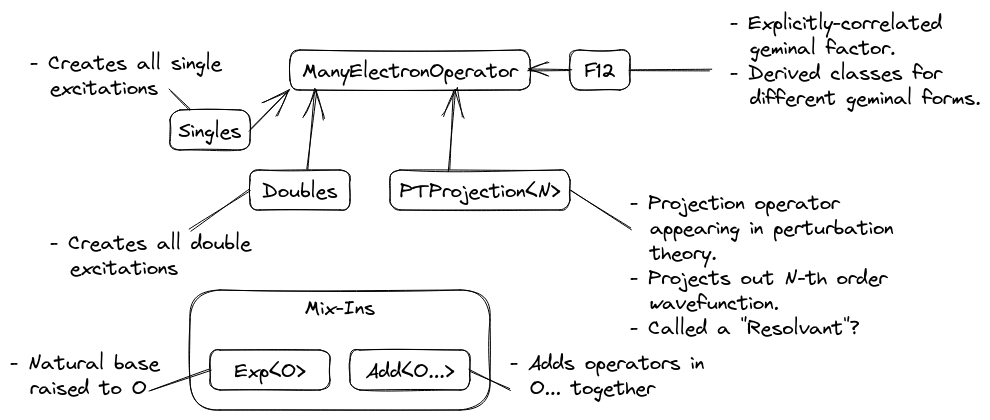

#########################
Operator Component Design
#########################

TODO: Flesh out in another PR.

.. _fig_many_electron_operators:

   Class hierarchy and relationships among many-electron operators commonly
   occurring in electronic structure theory.
