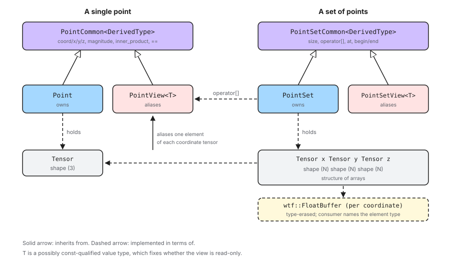

.. Copyright 2026 NWChemEx-Project
..
.. Licensed under the Apache License, Version 2.0 (the "License");
.. you may not use this file except in compliance with the License.
.. You may obtain a copy of the License at
..
.. http://www.apache.org/licenses/LICENSE-2.0
..
.. Unless required by applicable law or agreed to in writing, software
.. distributed under the License is distributed on an "AS IS" BASIS,
.. WITHOUT WARRANTIES OR CONDITIONS OF ANY KIND, either express or implied.
.. See the License for the specific language governing permissions and
.. limitations under the License.

.. _designing_the_point_component:

#############################
Designing the Point Component
#############################

This section contains notes on the design of Chemist's point component.

****************************
What is the Point Component?
****************************

A point is a location in three-dimensional Cartesian space. The point
component contains the abstractions needed to represent a single point as
well as an ordered set of points.

Points are one of the most widely reused abstractions in Chemist. Nuclei,
point charges, the centers of Gaussian primitives, and the abscissae of
numerical integration grids are all, at their core, a location in space
paired with some additional state. Whatever represents that location is
therefore replicated throughout the library, and its performance and
interoperability characteristics are inherited by every component built on
top of it.

*******************************
Why do we need a separate type?
*******************************

Three reasons motivate a dedicated abstraction rather than, say, passing
three loose floating-point values around.

First, a point is a single conceptual entity. Functions which take a location
should take one argument, not three, and should not have to document which
ordering of the three they expect.

Second, points are almost never encountered alone. They are encountered in
sets, and the layout of that set --- not the layout of any individual point
--- is what determines whether downstream code can be vectorized or handed
directly to an external library. A dedicated ``PointSet`` abstraction lets us
optimize the layout of the members while still presenting an API which behaves
like a container of points.

Third, the numerical state of a point should participate in the same tensor
algebra as the rest of Chemist. Distances, displacements, and inner products
involving points appear throughout the library, and expressing them in terms
of the same tensor abstraction used elsewhere avoids a parallel, hand-rolled
set of numerical routines.

.. _point_considerations:

********************
Point Considerations
********************

Topics in this section were considered in designing the point component of
Chemist and ultimately were addressed by the design.

.. _p_tensor_backed:

Tensor-backed storage
   The numerical state of a point should be stored in a
   ``tensorwrapper::Tensor`` object rather than in raw C++ containers.

   - Tensor is Chemist's standard numerical container. Storing coordinates in
     one means points compose directly with the density, grid, and operator
     components without a conversion layer.
   - Tensor is responsible for its own element type, memory allocation, and
     distribution. Delegating to it keeps those concerns out of the point
     component entirely, and means points gain any future capability Tensor
     acquires (distributed storage, new element types) without a change here.
   - Arithmetic involving points can then be expressed with Tensor's own
     operations rather than reimplemented over loose scalars.

.. _p_performance:

Performance and layout
   Sets of points are consumed by performance-critical code, including
   external integral libraries which expect coordinates in a specific memory
   layout.

   - A set of :math:`N` points should store its :math:`x`, :math:`y`, and
     :math:`z` coordinates each contiguously, *i.e.*, a structure of arrays,
     rather than interleaving them per point.
   - This is the layout integral libraries generally expect, so it can be
     handed to them without a repacking step.
   - It is also the layout which vectorizes: an operation applied to every
     :math:`x` coordinate walks contiguous memory.

.. _p_array_of_structures_api:

Array-of-structures API
   The layout in :ref:`p_performance` is at odds with how users want to write
   code. Users think of a set of points as a container of points, and want to
   ask a set for "the :math:`i`-th point" and then ask that point for its
   :math:`x` coordinate.

   - The API must therefore behave like an array of structures while the
     implementation remains a structure of arrays.
   - Asking a set for one of its points must not copy that point's
     coordinates out of the set, and writing through the result must modify
     the set.

.. _p_value_vs_view:

Value vs. view semantics
   Following from :ref:`p_array_of_structures_api`, there are two distinct
   memory-ownership semantics a point can have: it can own its coordinates,
   or it can alias coordinates owned by something else.

   - Both need the same API. Code which computes a distance should not care
     whether it was handed an owning point or a point aliasing a set.
   - The aliasing form must be const-correct: a point aliasing read-only
     state must not permit writing through it.

.. _p_code_factorization:

Code factorization
   Following from :ref:`p_value_vs_view`, an owning class and an aliasing
   class with identical APIs invite duplication. Historically each such pair
   in Chemist has declared, documented, and implemented its API twice.

   - The shared API should be written once and inherited by both.
   - The factorization must not cost a virtual call. Points are used in the
     innermost loops of the library, so the shared implementation must be
     resolved at compile time.

.. _p_raw_data_access:

Raw data access
   Some consumers cannot accept any C++ abstraction and require a pointer to
   contiguous coordinates.

   - A set of points must be able to expose a type-erased WTF buffer for each
     of its three coordinate arrays. Consumers who need an actual pointer
     recover one from that buffer themselves.
   - Doing so keeps the floating-point type out of the point component's API.
     The consumer already knows which type it wants, and it is the consumer,
     not the point component, which is obliged to name it.
   - This is an escape hatch for interoperability, not the primary API.

Out of Scope
============

Topics in this section were considered, but do not play a role in the current
design.

Non-Cartesian coordinates
   Points are Cartesian. Spherical, cylindrical, and internal coordinate
   systems are not represented.

   - Conversions to and from other coordinate systems are the responsibility
     of whichever component needs them.

Units
   A point does not carry units. All of Chemist assumes atomic units, and a
   point is not the right place to start deviating from that.

Dimensions other than three
   A point is three-dimensional. Chemist has no present need for points in
   other dimensionalities, and generalizing the class over its dimension
   would complicate the common case for a hypothetical one.

*************
Point Design
*************

.. _fig_point_design:

   Classes comprising the point component of Chemist. Dashed arrows denote
   "is implemented in terms of"; solid arrows denote inheritance.

:numref:`fig_point_design` shows the classes comprising the point component.

Storage
=======

``Point`` holds a single ``tensorwrapper::Tensor`` of shape :math:`(3)`,
addressing :ref:`p_tensor_backed`. The three elements of that tensor are the
:math:`x`, :math:`y`, and :math:`z` coordinates, in that order.

``PointSet`` holds three ``tensorwrapper::Tensor`` objects, each of shape
:math:`(N)`, holding respectively the :math:`x`, :math:`y`, and :math:`z`
coordinates of the :math:`N` points in the set. This is the structure of
arrays called for by :ref:`p_performance`. Note that ``PointSet`` is
deliberately *not* implemented as a container of ``Point`` objects, nor as a
single tensor of shape :math:`(N, 3)`: either would interleave the
coordinates and defeat the layout requirement.

Consequently a ``PointSet`` does not contain ``Point`` objects to hand out,
which is what motivates the view classes below.

Factoring the API
=================

Per :ref:`p_code_factorization`, the API shared by the owning and aliasing
classes is written once in a common base class which is templated on the
derived class, *i.e.*, the curiously recurring template pattern (CRTP). The
base class implements the API by asking the derived class for access to its
coordinates; because the derived class is a template parameter, that request
is resolved at compile time and no virtual dispatch is involved.

``PointCommon<DerivedType>`` implements everything which can be expressed in
terms of "give me coordinate :math:`q`":

- ``coord(q)``, ``x()``, ``y()``, ``z()`` and their read-only overloads,
- ``magnitude()``, ``inner_product(rhs)``, and the comparison operators.

``Point`` and ``PointView`` each derive from ``PointCommon`` and supply only
what differs between them: how the coordinates are stored or reached, and the
constructors. ``Point`` owns a tensor; ``PointView`` aliases coordinates
belonging to something else.

The same factorization applies to the set classes, with
``PointSetCommon<DerivedType>`` implementing the container API shared by
``PointSet`` and ``PointSetView``.

Views
=====

``PointView<PointType>`` addresses :ref:`p_value_vs_view`. It is templated on
a possibly ``const``-qualified point type, so that ``PointView<Point>``
aliases mutable coordinates and ``PointView<const Point>`` aliases read-only
ones. The const-correctness of the resulting references is derived from that
template parameter using the traits machinery described in
:doc:`/developer/the_traits_component`, following the conventions laid out in
:doc:`/developer/writing_views`.

``PointView`` is what makes the array-of-structures API of
:ref:`p_array_of_structures_api` possible on top of a structure-of-arrays
implementation. Indexing a ``PointSet`` returns a ``PointView`` which aliases
one element of each of the set's three coordinate tensors. The view behaves
like a point --- it has the same API, inherited from the same
``PointCommon`` --- but writing through it writes into the set.

A ``PointView`` can be converted to an owning ``Point`` when a copy really is
wanted, and a mutable view converts implicitly to a read-only view.

Mathematical operations
=======================

Operations on points are implemented by delegating to the tensor which backs
them, per :ref:`p_tensor_backed`.

``inner_product`` is a full contraction of the two coordinate tensors,
expressed with Tensor's index-based domain-specific language. ``magnitude``
is the square root of a point's inner product with itself. Displacements are
tensor subtraction. In each case the point component describes *what* to
compute and Tensor decides *how*, including which floating-point type the
arithmetic is actually carried out in.

Raw data access
===============

``PointSet`` exposes a WTF buffer for each of its three coordinate arrays,
addressing :ref:`p_raw_data_access`. These buffers are the same type-erased
buffers the backing tensors already store their elements in, so exposing one
is a matter of handing out a reference, not of converting or repacking
anything.

The buffer is type-erased: it knows which floating-point type it holds, but
that type is not part of its C++ type. A consumer which genuinely needs a
pointer names the element type at that point, either by asking the buffer to
be cast to a span of a concrete type, or by visiting it with a callable which
is instantiated for whichever type the buffer turned out to hold. The latter
is preferable when the consumer can be written generically, since it cannot
guess wrong.

Two consequences are worth noting. First, the point component itself never
names a floating-point type; the obligation to do so belongs to the consumer
which has the requirement. Second, a pointer obtained this way is only valid
while the set's storage is unchanged, and only when the underlying buffer is
actually contiguous --- which the buffer can be asked about.

*******
Summary
*******

:ref:`p_tensor_backed`
   ``Point`` stores a shape :math:`(3)` tensor and ``PointSet`` stores three
   shape :math:`(N)` tensors, so all numerical state lives in Tensor and all
   arithmetic is delegated to it.

:ref:`p_performance`
   ``PointSet`` stores each Cartesian direction in its own contiguous tensor,
   giving a structure-of-arrays layout.

:ref:`p_array_of_structures_api`
   Indexing a ``PointSet`` yields a ``PointView`` aliasing one element of
   each coordinate tensor, so the container behaves like an array of
   structures.

:ref:`p_value_vs_view`
   The ``Point``/``PointView`` and ``PointSet``/``PointSetView`` pairs supply
   owning and aliasing semantics respectively, with the view classes
   templated on a possibly ``const``-qualified type to control mutability.

:ref:`p_code_factorization`
   ``PointCommon`` and ``PointSetCommon`` implement the shared APIs once
   using CRTP, so the owning and aliasing classes do not duplicate them and
   no virtual dispatch is introduced.

:ref:`p_raw_data_access`
   ``PointSet`` hands out the type-erased WTF buffer backing each of its three
   coordinate arrays. Consumers needing a raw pointer recover one from that
   buffer, which keeps the floating-point type out of the point component's
   API entirely.
