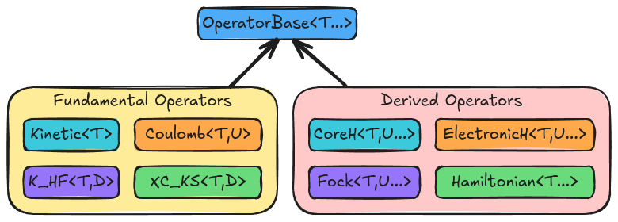

.. Copyright 2024 NWChemEx-Project
..
.. Licensed under the Apache License, Version 2.0 (the "License");
.. you may not use this file except in compliance with the License.
.. You may obtain a copy of the License at
..
.. http://www.apache.org/licenses/LICENSE-2.0
..
.. Unless required by applicable law or agreed to in writing, software
.. distributed under the License is distributed on an "AS IS" BASIS,
.. WITHOUT WARRANTIES OR CONDITIONS OF ANY KIND, either express or implied.
.. See the License for the specific language governing permissions and
.. limitations under the License.

.. _architecture_of_operator:

##################################
Architecture of Operator Component
##################################

The need for the Operator component stemmed from discussions on the
 :ref:`architecture_of_the_quantum_mechanics_component`.

TODO: Write me!!!

**********************
Operator Consideration
**********************

determinate vs. indeterminate
   Most operators have a determinate form (i.e. a form that contains a set, well
   defined number of particles) and an indeterminate form (i.e., a form written
   in terms of a variable number of particles). Usually we refer to the
   indeterminate form as the "many-particle operator" and the determinate form
   as the "one-electron" (or "two-electron") operator. Generally the
   indeterminate form is written as an indeterminate summation over determinate
   operators.

care with template types
   In composing operators we want to be able to write something like ``2J - K``
   and have that result in the same type as ``-K + 2J``.

*****************
Example Use Cases
*****************

The following pseudocode snippet is designed to show some high level examples
of how we envision the operator component to be used. This snippet is used to
motivate the design and may not actually represent the final version in Chemist.

.. code-block:: c++

    // Operators in QM are defined in terms of particles. We start by making
    // some particles. First for the one and two particle operators then for the
    // many-particle operators. Creation of particles is the responsibility of
    // the chemical system component

    Electron e; // Electrons are indistinguishable, no need to make more.
    Nucleus n0 = get_a_nucleus_object();
    Nucleus n1 = get_a_different_nucleus_object();

    ManyElectrons electrons(n_electrons);
    Nuclei nuclei = get_many_nucleus_objects();

    // Creates zero-electron operators
    Kinetic<Nucleus> t_n(n0); // Born-Oppenheimer electronic structure won't use
    Coulomb<Nucleus, Nucleus> v_nn(n0, n1);

    // Create one-electron operators
    Kinetic<Electron> t_e(e);
    Coulomb<Electron, Nucleus> v_enucleus(e, n); // A piece of the next operator
    Coulomb<Electron, Nuclei> v_en(e, nuclei);

    // Create two-electron operator
    // N.b. using the same particle is fine when the particles are wave-like,
    // i.e., they don't have a set position
    Coulomb<Electron, Electron> v_ee(e, e);

    // The above operators allow us to go tensor element by tensor element.
    // That's inefficient, but sometimes desired. In practice, we usually
    // create many-particle operators

    // N.b. for many particles providing the same object twice is allowed and
    // the i != j restriction is understood.
    Coulomb<Nuclei, Nuclei> V_nn(nuclei, nuclei);
    Kinetic<ManyElectron> T_e(electrons);
    Coulomb<ManyElectron, Nuclei> V_en(electrons, nuclei);
    Coulomb<ManyElectron, ManyElectron> V_ee(electrons, electrons);

    // Make the Hamiltonian for the entire system
    Hamiltonian<ManyElectron, Nuclei> H(T_e + V_en + V_ee + V_nn);

    // Extract pieces
    CoreH<ManyElectron, Nuclei> Hcore = H.core();
    ElectronicH<ManyElectron, Nuclei> Helec = H.electronic();

    // Build (restricted) many-electron Fock operator
    Density<ManyElectron> rho = get_one_electron_density();
    Coulomb<ManyElectron, Density<ManyElectron>> J(electrons, rho);
    K_HF<ManyElectron, Density<ManyElectron>> K(electrons, rho);
    Fock<ManyElectron, Nuclei> F(Hcore + 2.0 * J - K);

    // DFT
    XC_KS<ManyElectron> XC(electrons, rho, /* enum defining the functional*/);

    // Non-hybrid DFT
    Fock<ManyElectron, Nuclei> K(Hcore + 2.0 * J + XC);

    // Hybrid DFT (0.5 should be replaced with the appropriate fraction of
    // exact exchange)
    Fock<ManyElectron, Nuclei> K_hybrid(HCore + 2.0 * J - 0.5 *K + XC);

    // Coulombic interaction with point charges
    ChargeSet charges = get_some_point_charges();
    Coulomb<ManyElectron, ChargeSet> V_eq(electrons, charges);

********************************
Design of the Operator Component
********************************

.. note::
   Many operators are templated on ``T`` the type of particle contributing to
   the operator. If ``T`` is the type of a class for a single particle (e.g.,
   ``Electron`` or ``Nucleus``) then the operator is a single-particle
   operator. If ``T`` is the type of a class for an indeterminate number of
   particles (e.g., ``ManyElectron`` or ``Nuclei``) then the operator is a
   many-particle operator. For operators involving more than one type of
   particle the same logic applies to the other template parameters.

   Classes comprising the operator component of Chemist.

- ``OperatorBase<T...>``. This class is used to factor out common functionality,
  like holding/accessing objects of type ``T``, and also to store scale factors.

Fundamental Operators
=====================

Operators in this sub component are comprised of single interaction (though it
may be over an indefinite number of particles).

- ``Kinetic<T>``. Describes the kinetic energy of a type of particle.
- ``Coulomb<T,U>``. Describes the charge-charge interaction between particles.
  The particles may have the same type (``T == U``) or they may be different
  (``T != U``).
- ``K_HF<T,D>``. Hartree-Fock exchange of a particle of type ``T`` with a
  density of type ``D``.
- ``XC_KS<T,D>``. Kohn-Sham exchange-correlation operator for a particle of type
  ``T`` with a density of type ``D``.

Other potential operators include Dirac delta function, identity operator, and
multipole moment operator.

Derived Operators
=================

.. note::

   The operator and wavefunction component will leverage the same set of classes
   for denoting operations.

Operators in this component are obtained by combining fundamental operators or
other derived operators.

- ``Hamiltonian<T...>``. Represents the total Hamiltonian for the system. Can
  be decomposed into its various pieces.
- ``Fock<T, U...>``. Represents an effective one-particle potential for a
  particle of type ``T`` that interacts with objects of type ``U...``. For
  Hartree-Fock this is the true Fock operator, for density functional theory
  this is the Kohn-Sham operator.
- ``ElectronicH<T, U...>``. Pieces of the Hamiltonian that depend explicitly on
  electrons of type ``T`` (assumed to be either ``Electron`` or
  ``ManyElectron``) interacting with objects of type ``U...``. Primarily a
  strong type to distinguish from the full Hamiltonian.
- ``CoreH<T,U,...>``. Represents the exact Hamiltonian for a particle of type
  ``T`` interacting with objects of type ``U...``.
