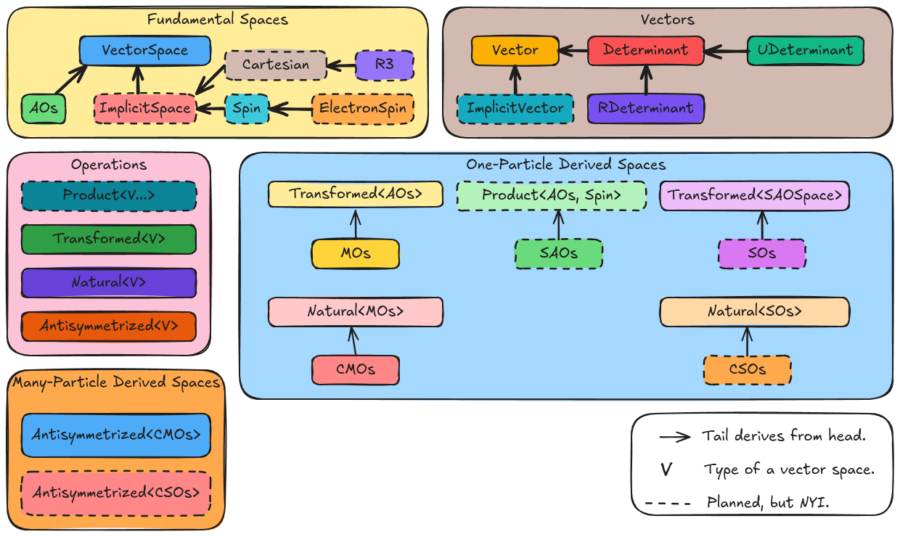

.. Copyright 2024 NWChemEx-Project
..
.. Licensed under the Apache License, Version 2.0 (the "License");
.. you may not use this file except in compliance with the License.
.. You may obtain a copy of the License at
..
.. http://www.apache.org/licenses/LICENSE-2.0
..
.. Unless required by applicable law or agreed to in writing, software
.. distributed under the License is distributed on an "AS IS" BASIS,
.. WITHOUT WARRANTIES OR CONDITIONS OF ANY KIND, either express or implied.
.. See the License for the specific language governing permissions and
.. limitations under the License.

.. _architecture_of_wavefunction:

######################################
Architecture of Wavefunction Component
######################################

The need for a wavefunction component was motivated in
:ref:`architecture_of_the_quantum_mechanics_component`.

***********************************
What is the Wavefunction Component?
***********************************

In the traditional view of quantum chemistry, the wavefunction represents the
(possibly time-dependent) state of the system. Properties of the system are
computed as tensor elements involving wavefunctions and operators. The
Wavefunction component contains classes which facilitate the creation and
manipulation of a chemical system's wavefunction.

****************************************
Why do we need a Wavefunction Component?
****************************************

The wavefunction component is needed to express the state of the bra and ket
and transfer that state to routines which evaluate tensor elements involving
those bras and kets. It is also needed to facilitate the programmatic
dispatching among electronic structure methods.

***************************
Wavefunction Considerations
***************************

.. _wf_orbitals:

orbitals
   Orbitals are the building blocks of many-particle wavefunctions. We need to
   be able to represent the set of orbitals from which the many-particle
   wavefunction is built.

.. _wf_determinants_and_permanents:

determinants and permanents
   Determinants/permanents are the many-particle wavefunctions with the right
   spin symmetry for fermions/bosons respectively.

.. _wf_basis_function_vs_basis_set:

basis function vs basis set
   While the intermediates used to compute a property are often expressed as
   tensors, the property we want is often a single element of a larger tensor.
   We thus need a way to specify "compute the entire tensor representation" vs
   "compute the 0,0-th element".

.. _wf_implicit_vs_explicit:

implicit vs explicit
   Some basis functions are typically explicit (e.g., atomic orbitals,
   molecular orbitals) meaning they have state which must be explicitly
   specified. Other basis functions are considered implicit (e.g., spin,
   Cartesian axis).

.. _wf_method_dispatching:

method dispatching
   One use of the wavefunction is to dispatch to different methods. For example,
   having different types for restricted vs unrestricted self-consistent field
   theory wavefunctions makes it easier to dispatch to RSCF/USCF respectively.

.. _wf_bra_ket_state:

bra/ket state
   Aside from indicating the computation to do, the wavefunction will also be
   used to pass the parameters needed to describe the state of the bra or ket.
   Examples include:

      - AO basis set parameters.
      - molecular orbital coefficients
      - orbital occupations

*****************
Example Use Cases
*****************

The following pseudocode snippet is designed to show some high level examples of
using the wavefunction component. It is not meant to be true to the final
Chemist library (e.g., many of the typedefs exist as strong types for user
ease), but simply motivational.

.. code-block:: c++

   AOSpace aos(get_ao_parameters());
   Spin spins(std::ratio(1, 2)); // Takes total spin of particle

   // Can "slice" spaces to make subspaces
   Spin alpha = spins.subspace(0, 1); // Spins count down
   Spin beta  = spins.subspace(1, 2);

   // Spatial molecular orbitals (MOs) are formed by transforming AOs.
   using MOSpace = Transformed<AOSpace>;

   // Input is the transformation and the "from" space
   MOSpace mos(c, aos);

   // Spin atomic orbitals (SAOs) are products of AOs and spin
   using SAOSpace = Product<AOSpace, Spin>;

   // Input are the spaces to take the tensor product of
   SAOSpace saos_alpha(aos, alpha);
   SAOSpace saos_beta(aos, beta);
   SAOSpace saos(aos, spins); //Union of saos_alpha and saos_beta

   // Could have also obtained saos_alpha/saos_beta by slicing saos
   // Could have also obtained saos by taking union of saos_alpha and saos_beta

   // Transforming SAOs in general leads to spinors. Spin (molecular) orbitals
   // (SOs) arise when coefficients can't mix spins
   using SOSpace = Transformed<SAOSpace>;

   SOSpace spinors(c_spinors, saos);
   SOSpace so_alpha(c_alpha, saos_alpha);
   SOSpace so_beta(c_beta, saos_beta);
   SOSpace sos = so_alpha + so_beta; // Can treat the SMOs as a unified space

   // Natural spaces diagonalize a quantity. Canonical means they diagonalize
   // the Fock matrix
   using CanonicalMOSpace = Natural<MOSpace>;
   using CanonicalSOSpace = Natural<SOSpace>;

   // Input is the diagonal elements and the orbitals
   CanonicalMOSpace cmos(orbital_energies, mos);
   CanonicalSOSpace csos(spin_orbital_energies, sos);

   // For an n-particle system, orbital products of n orbitals are then
   // antisymmetrized/symmetrized (for fermions/bosons respectively) to form
   // n-particle basis functions
   using RestrictedDeterminants = Antisymmetrized<CanonicalMOSpace>;
   using UnrestrictedDeterminants = Antisymmetrized<CanonicalSOSpace>;
   RestrictedDeterminants rdeterminant(n, cmos);
   UnrestrictedDeterminants udeterminant(n, csos);

   // By default the first n orbitals are used to form the reference state
   // Can change the reference. This call for example sets the reference to
   // orbitals 1 through n inclusive.
   udeterminant.set_reference(1, 2, 3, ..., n);

   // We rarely want the full space of determinants. We can limit our
   // excitations by slicing the determinant space. Here we limit it to
   // single and double excitations
   auto singles = rdeterminant.excitation_subspace<1>();
   auto doubles = rdeterminant.excitation_subspace<2>();

   // More general slices can be accomplished by defining one or more active
   // spaces. The argument is the orbitals involved in the active space (the
   // class already knows whether those orbitals are occupied or not).
   auto as = rdeterminant.active_space({10, 11, 12});

************************************
Design of the Wavefunction Component
************************************

.. note::

   The design presently only includes classes which we plan to implement in
   version 1.0 of the wavefunction component.

   Classes comprising the wavefunction component of Chemist. See documentation
   for class descriptions.

Fundamental Spaces
==================

.. note::

   We have opted to use the term "vector space" instead of "basis set" to avoid
   confusion with the more common practice of using "basis set" to refer to
   the parameters defining the atomic orbitals.

The classes in this sub-component of the wavefunction component represent the
building blocks used to create the derived spaces via fundamental operations.
Included in the fundamental spaces component are:

- ``VectorSpace``. Base class signifying that something is a set of ``Vector``
  objects. Provides code-factorization for derived classes.
- ``AOSpace``. Wrapper around an ``AOBasisSet`` object. In order to conform to
  expectations, we made the ``AOBasisSet`` object behave somewhat like the
  basis set objects found in other quantum chemistry programs. The ``AOSpace``
  class is needed to make it interoperable with the wavefunction component.
- ``Implicit``. Code factorization for implementing a ``VectorSpace`` object
  whose elements are implicit. Derived classes just need to define labels.
- ``Cartesian``. Class defining an :math:`n` dimensional Cartesian space. Code
  factorization for traditional :math:`\mathcal{R}^3` as well as other spaces
  like :math:`\mathcal{R}^6` (space where the unique quadrupole moment
  components live).
- ``Spin``. Class defining the spin states for a particle given the particle's
  total spin.
- ``R3``. Specializes ``Cartesian`` to familiar "x", "y", "z" space.
- ``ElectronSpin``. Specializes ``Spin`` to the case of an electron's spin,
  i.e., calls the spins :math:`\alpha` and :math:`beta` in accordance with
  usual practice.

Vectors
=======

This sub-component of the wavefunction component contains classes defining
classes that represent objects that span a vector space. In practice these
objects are used to request a single element of a tensor via Dirac notation
whereas ``VectorSpace`` objects are used to request the entire tensor.

- ``Vector``. Base class signifying that something is an element of a
  ``VectorSpace`` object. N.B. lives in the ``wavefunction`` namespace and
  thus unlikely to conflict with ``std::vector`` or other tensor-like classes.
- ``ImplicitVector``. Code factorization for representing a vector belonging to

Other potential classes could include strong types for specific implicit vectors
(e.g., an ``Alpha`` class) or explicit vectors that we don't immediately need
individual tensor elements of at the moment (e.g., ``AO`` class)

Operations
==========

- ``Transformed``. Indicates that the vector space :math:`V` is obtained from a
  (usually) different vector space :math:`V'` via a linear transformation.

*******
Summary
*******

:ref:`wf_orbitals`
   The wavefunction component contains classes for expressing atomic orbitals
   (usually the most fundamental set of orbitals) as well as the myriad of
   orbitals that can be derived from them.

:ref:`wf_determinants_and_permanents`
   Addressed by the ``Antisymmetrize`` and ``Symmetrize`` classes.

:ref:`wf_basis_function_vs_basis_set`
   Addressed with the ``Vector`` and ``VectorSpace`` classes, where the former
   is an element of the latter.

:ref:`wf_implicit_vs_explicit`
   The ``ImplicitSpace`` and ``ImplicitVector`` classes are introduced to
   respectively implement basis sets and basis functions that are typically
   only distinguished from one another by names (e.g., "x" and "y" axes).

:ref:`wf_method_dispatching`
   The use of strong types allows tensor elements to have different types
   depending on the wavefunctions the user provides. This in turn facilitates
   dispatching based on function overloading.

:ref:`wf_bra_ket_state`
   Addressed by having the various classes in the wavefunction component possess
   state.
