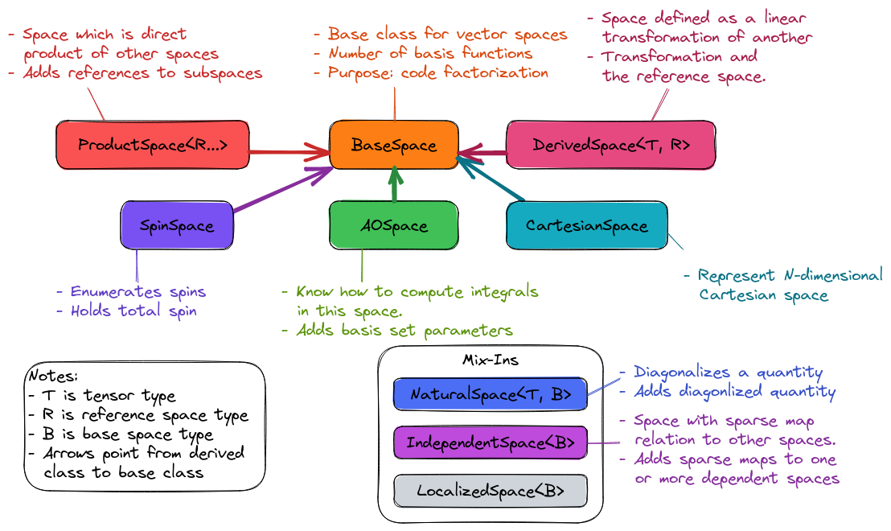
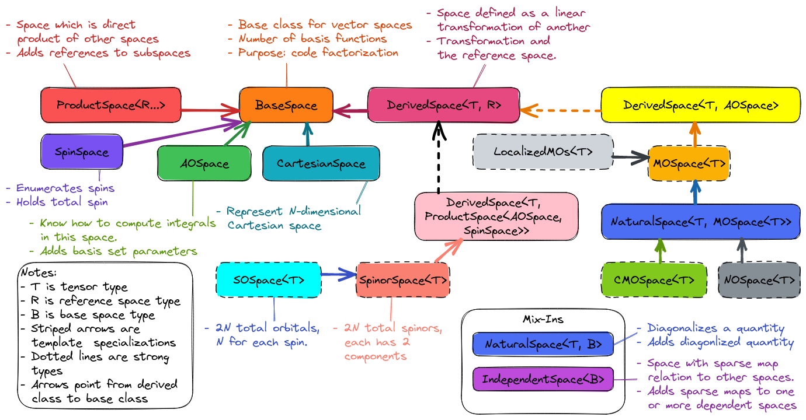

.. Copyright 2023 NWChemEx-Project
..
.. Licensed under the Apache License, Version 2.0 (the "License");
.. you may not use this file except in compliance with the License.
.. You may obtain a copy of the License at
..
.. http://www.apache.org/licenses/LICENSE-2.0
..
.. Unless required by applicable law or agreed to in writing, software
.. distributed under the License is distributed on an "AS IS" BASIS,
.. WITHOUT WARRANTIES OR CONDITIONS OF ANY KIND, either express or implied.
.. See the License for the specific language governing permissions and
.. limitations under the License.

.. _vsd_design:

###################
Vector Space Design
###################

This page documents the design of the vector space component of Chemist. In
practice this component really focuses in on the basis spanning a general 
vector space; however, in quantum chemistry the term "basis set" is usually 
associated specifically with mathematical function collections like `6-31G*` 
and we wish to emphasize that "basis" in this section carries more general
meaning.

************************
What are vector spaces?
************************

One can find mathematical descriptions of a vector space
`here <https://en.wikipedia.org/wiki/Vector_space>`__. For our purposes, what
we really care about is that in order to practically represent vectors in a
given vector space one needs to define a basis set.

*****************************
Why do we need vector spaces?
*****************************

Quantum chemistry equations are tensorial in nature (please see 
`here <en.wikipedia.org/wiki/Tensor>`__ for the definition of a tensor. To 
actually compute quantities we need tensor representations (*i.e.*, arrays 
of numbers). Forming a tensor representation requires us to pick a basis set 
(in the general sense, *i.e.*, we are not limiting ourselves to things like 
`6-31G*`). For a given vector space there are usually an infinite number of 
basis sets, and unfortunately each (in general) results in a different tensor 
representation. The point being, in order to programatically express which 
basis set we are using, we need a class (or series of classes) to convey this 
information.


.. _vsd_considerations:

***************************
Vector Space Considerations
***************************

The following lists the considerations which went into designing the vector
space component of Chemist:

.. _vsd_basis_set:

Basis Set
   In practice, we're really designing basis sets (all of which can be used
   to define vector spaces, but that's not really what we care about). The
   vector space component needs to support arbitrary basis functions, not just
   basis functions to represent the spatial orbitals of particles. Notable 
   examples for non-orbital functions are:

   - Cartesian axes
   - Spin

.. _vsd_parameters:

Parameters
   Basis sets have different basis functions, we need a means of telling the
   basis functions a part. Typically this is done by referring to the
   parameter values for a particular basis function. Parameters come in a
   variety of types:

   - Implicit. Usually defined by conventional labels, *e.g*, the "x"-axis of a
     Cartesian basis set, or the :math:`\alpha` spin function.
   - Explicit. Many basis functions are defined by explicit numeric parameters,
     *e.g.*, primitive Gaussian functions, or plane waves.
   - Mix of implicit and explicit. These are basis functions which are defined
     in terms of both implicit and explicit parameters, *e.g.*, spin orbitals,
     or the basis set for dipole moment integrals.
   - Transformation from another basis set, *e.g.*,
     contracted Gaussian type orbitals, or molecular orbitals.

.. _vsd_properties:

Properties
   Basis sets are usually not chosen at random. Rather, one typically chooses a
   basis set which satisfies a particular property. Notable examples
   include:

   - Canonical molecular orbitals, which diagonalize the Fock matrix.
   - Natural molecular orbitals, which  diagonalize the one-electron density
     matrix.
   - Independent/dependent orbitals which have a sparse map relationship.

.. _vsd_type_dispatch:

Type Dispatch
   Programatically the vector spaces will be used to construct property types.
   The types for the vector space should aim for generality, while still
   containing sufficient information to ensure that a property type can only
   be called with the vector spaces possessing the correct properties. Examples:

   - If an algorithm assumes that the provided orbitals are canonical
     molecular orbitals, we in general do not want to call such an algorithm
     with localized orbitals.

.. _vsd_generalization:

Generalization Reflected in Inheritance
   We have also striven to ensure that the class hierarchy is defined in such
   a way that derived classes can be used with algorithms designed for base
   classes. For example:

   - In theory, it is possible to use restricted molecular orbitals with an
     unrestricted algorithm (the spins just have the same orbitals). While this
     has performance consequences (you're doing the same operation multiple
     times). It can be useful if, for example, a restricted algorithm has not
     yet been implemented

********************
Vector Space Design
********************

The design of the vector space component is based primarily on the
considerations listed in section :ref:`vsd_considerations`. The vector space
component of Chemist contains a lot of classes, this is necessary to
satisfy the :ref:`vsd_type_dispatch` consideration. That said, terminology
already existed prior to our design for the distinctions, suggesting that the
distinctions among the classes are physical in nature.

Fundamental Classes
===================

.. _fig_fundamental_spaces:



   The fundamental classes comprising Chemist's vector space component. The
   vector space component is envisioned as having many classes, but the heavy
   lifting is done by these "fundamental" classes.

:numref:`fig_fundamental_spaces` shows the design of classes fundamental to the
vector space component of Chemist. The fundamental classes try to distill the
fundamental properties of the various spaces down to "properties". The spaces
we know and love then become more-or-less strong types to distinguish among the
more esoteric differences.

Base Class
----------

At the base of the class hierarchy is the ``BaseSpace`` class. This class is
primarily meant to provide code factorization for the derived classes. It is
also useful in a few places where we try to write very generic algorithms
(*e.g.*, for transforming tensors).

Cartesian Space
---------------

.. |N| replace:: :math:`N`

The ``CartesianSpace`` class is meant to represent |N|-dimensional
Cartesian space, *i.e.*, :math:`\mathbb{R}^N`. The need for ``CartesianSpace``
stems from Consideration :ref:`vsd_basis_set`.In practice, this class's 
state is the value of |N| and the labels of the coordinate axes. For example,
To represent a dipole one needs the ``CartesianSpace`` :math:`\mathbb{R}^3` 
with the coordinate axes usually labelled as "x", "y" and "z". For a quadrupole 
or polarizability tensor, a ``CartesianSpace`` :math:`\mathbb{R}^6` with the
coordinate possible axes such as "xx", "yy", "zz", "xy", "yz", "zx" is 
necessary. The user should have the freedom to label the axes in their own 
ways.

Spin Space
----------

Conceptually similar to ``CartesianSpace``, the ``SpinSpace`` class represents
the space spanned by a series of spin functions with a series of spin values. 
The need for this class also stems from consideration :ref:`vsd_basis_set`.
In the most common scenario, an instance of ``SpinSpace`` represents the spins 
of an electron and thus contains two spin functions. State of the 
``SpinSpace`` class is the multiplicity (:math:`2S+1`, dimension) of the space,
from which the total spin :math:`S` of the system can be determined. 

Atomic Orbitals (AOs)
---------------------

The ``AOSpace`` represents the space spanned by the atomic orbitals which can
be generated from the molecular basis set (here basis set is used in the
computational chemistry sense). The ``AOSpace`` is a very important space for
most calculations because it represents a sort of "most fundamental space"
from which all other orbital spaces are usually derived. The need for the
``AOSpace`` class primarily stems from consideration :ref:`vsd_parameters`.

It is worth noting that in practice what we call AOs are often transformed,
contracted Gaussian type orbitals. In theory we could better consolidate the
``AOBasisSet`` class (which describes the parameters associated with those
orbitals) with the various vector space classes by defining:

- ``PrimitiveGaussianSpace`` holds the centers, angular momenta, and exponents
  for each primitive (Cartesian) Gaussian function.
- ``CGTOSpace=TransformedSpace<T, PrimitiveGaussianSpace>`` stores the
  contraction coefficients for going from primitive Gaussians to contracted
  (Cartesian) Gaussian type orbitals.
- ``SphericalGTOSpace = TransformedSpace<T, CGTOSpace>`` holds the spherical
  transform for going from contracted (Cartesian) Gaussian type orbitals to
  spherical Gaussian type orbitals.

That said, most electronic structure packages have a class/concept similar to
our ``AOBasisSet`` class and thus inter-package interoperability is facilitated
by having an ``AOBasisSet`` class. Nonetheless, there are still use cases which
could benefit from deviating from the standard ``AOBasisSet`` concepts, *e.g.*,
relativistic calculations which typically un-contract the contracted Gaussians.
It may be worth revisiting the design of the ``AOBasisSet`` class if one is
interested in use cases which use more fundamental orbitals than the ones
represented by the ``AOSpace``.

Derived Space
-------------

Many of the spaces we are interested in are defined as linear transformations
of one another. The ``DerivedSpace<T,R>`` class represents a space obtained by
transforming a space of type ``R`` (``R`` is typically ``AOSpace``) by a
transformation of type ``T`` (``T`` is a tensor-like type). Usually the
transformation is a rotation (meaning it preserves lengths and angles of the 
vectors in the space being transformed), but we don't strictly enforce this 
(one could). In practice, the ``DerivedSpace<T, R>`` class primarily serves as
code factorization for the variety of spaces which are defined as linear
transformations; by introducing ``DerivedSpace<T, R>``, many of those spaces
are simply strong types. For example, ``MOSpace`` can be thought as a
``DerivedSpace`` from ``AOSpace`` (see :numref:`fig_fundamental_spaces`).

Product Space
-------------

There are several important vector spaces which are obtained by taking 
`tensor products <en.wikipedia.org/wiki/Tensor_product>`__ of other spaces.
(Yu: or we can also use 
`Cartesian product <en.wikipedia.org/wiki/Cartesian_product>`__?)
The ``ProductSpace<R...>`` class represents a space resulting from the tensor 
product of the spaces ``R...`` (assumed to be two or more other spaces). In the
``ProductSpace<R...>`` the basis is the prodcut of the basis of all the spaces
which form the product. Like ``DerivedSpace<T, R>``, ``ProductSpace<R...>``` 
is introduced as a means of code factorization so that the derived classes 
become strong types.

Natural Space
-------------

There are a number of orbital spaces where the transformation is defined by
requiring the resulting orbitals to diagonalize a particular tensor. In these
cases the resulting orbitals are often said to be the "natural" basis set on
account of the fact that they simplify equations involving the diagonalized
quantity. Compared to a ``DerivedSpace<T, R>`` object, the additional state
contained in a ``NaturalSpace<T, B>`` is the diagonalized tensor (which is
assumed to be stored in a tensor of type ``T``). Rather than deriving directly
from ``DerivedSpace<T,R>`` we allow the user to specify the base class to
derive from, this allows it to be used with a variety of the orbital space
classes defined below. The need for this space  stems from the
:ref:`vsd_properties` consideration.

Localized Space
---------------

``LocalizedSpace<B>`` is a strong type used to denote that the orbitals have
been spatially localized according to some metric. At present we do not
discern what that metric is. 
(Yu: should this metric included in the class of a ``LocalizedSpace<B>``?) 
Like ``NaturalSpace<T,B>``, ``LocalizedSpace<B>``
is templated on the class it derives from so that it can be used with any of
the orbital space classes below.

Independent Spaces
------------------

In theories exploiting (usually spatial) sparsity, members of one basis
set usually only have non-zero tensor elements with some of the members of
another basis set. This defines a "sparse map" where each member of the first
basis set is associated with a "domain" of the second set. The first set
is termed the "independent space" and the second basis set is termed the
"dependent space". The ``IndependentSpace<B>`` class serves as
code-factorization for implementing vector spaces for which we have sparse
maps. Relative to the base class ``B`` it inherits from,
``IndependentSpace<B>`` includes a sparse map.


Orbital Space Classes
=====================

While the fundamental classes represent the quintessential properties vector
spaces may have from a program stand point, chemists are more used to
thinking in terms of named spaces like molecular orbitals, or localized
molecular orbitals. The various orbital space classes described in this section
represent those named spaces.

.. _fig_orbital_spaces:



   The named orbital spaces residing in Chemist's vector space component.


Atomic Spin Orbital (ASO) Space
-------------------------------

The ``ASOSpace`` is a strong type for the product space formed from combining
AOs and spin functions. AFAIU, ASOs are the starting point for most theory
formulations assuming atom-centered basis functions. The actual ``ASOSpace``
class is envisioned to be more of an actionable typedef than anything else.
(Yu: I have a question about this definition of ``ASOSpace``. As stated
above, the basis of a ``ASOSpace`` should be the products of spatial and spin
functions, and a general vector in a ``ASOSpace`` would be a linear combination
such spatial-spin function products. However, in common cases, orbitals with
different spins do not mix up except in spin-orbit coupling calculations. 
Suppose we have |N| AOs in a ``AOSpace``, and the ``SpinSpace`` has a dimension
of 2 (spin up and down). In the end we will have a ``ASOSpace`` with a 
dimension of :math:`N\times 2`. In most of the cases we only use half of the 
space for spin-pure orbitals. Is there a better definition for ``ASOSpace`` to
efficiently address the common cases in quantum chemistry?)

Spinor Space
------------

.. |alpha| replace:: :math:`\alpha`
.. |beta| replace:: :math:`\beta`
.. |2N| replace:: :math:`2N`

The ``SpinorSpace<T>`` class is a strong type of a derived space whose
reference state is comprised of ASOs. For |N| AOs this means we have |2N| ASOs,
which get transformed into |2N| spinors (Yu: I would still say |N| instead of 
|2N| spinors, as a spinor is of dimension 2 in nature. Maybe never mind in 
practical calculations). In turn the we have a |2N| by |2N| transformation 
matrix. (Yu: with this definition, how can one distinguish a spinor from a
spin-mixed orbital in SOC calculations? In my opinion, a ``SpinorSpace`` is 
just a tensor product of a ``AOSpace`` with a Cartesian product of the 
:math:`\alpha` and :math:`\beta` componenets of a simple ``SpinSpace`` for one
electron.) 


Molecular Spin Orbitals (MSOs)
------------------------------

The ``MSOSpace<T>`` differs from the ``SpinorSpace<T>`` in that the orbital
transformation is restricted so that the |alpha| ASOs are only mixed with
other |alpha| ASOs and the |beta| ASOs are only mixed with other |beta| ASOs`.
In turn, each of the resulting |2N| MSOs are defined in terms of |N|
coefficients and our transformation is |N| by |2N|, not |2N| by |2N| like
``SpinorSpace<T>``. The inheritance of MSOs from spinors satisfies the
:ref:`vsd_generalization` consideration, since MSOs are just spinors with
zeroed out mixed spin blocks. (Yu: I will see ``MSOSpace`` as a 
``DerivedSpace`` from ``ASOSpace``, not from ``SpinorSpace``. I'm also confused
that if a spinor has non-zero mixed spin blocks. Please help me to clarify.)


Molecular Orbitals (MOs)
-------------------------

Restricting the ``MSOSpace<T>`` transformation coefficients so that the |alpha|
and |beta| MSOs have the same coefficients leads to an |N| by |N|
transformation matrix. The assumption is captured by defining the ``MOSpace<T>``
strong type. Inheritance here is consistent with the fact that MOs can be
used with MSO algorithms by using the same transformation coefficients for both
the |alpha| and |beta| MSOs.


Canonical Molecular Orbitals (CMOs)
-----------------------------------

In conventional electronic structure theory, the CMOs, *i.e.*,  the orbitals
which diagonalize the Fock matrix, are one of the most important natural
spaces on account of the fact that they simplify the derivation of
correlated methods. The ``CMOSpace<T>`` class is a strong type to denote
that the additional tensor contained in the base
``NaturalSpace<T, MOSpace<T>>`` object contains the orbital energies and that
the orbitals diagonalize the Fock matrix.

Natural Orbitals (NOs)
----------------------

NOs diagonalize the one-electron density matrix and the ``NOSpace<T>`` class
denotes this property by being a strong type derived from
``NaturalSpace<T, MOSpace<T>>``. The additional tensor residing in the
``NaturalSpace<T, MOSpace<T>>`` object holds the orbital occupation values.

Notes on "Side Casts"
---------------------

The design of the class hierarchy relies on single inheritance. This raises
some conceptual problems, for example, ``MOSpace<T>`` is also a type of
``DerivedSpace<T, AOSpace>`` (note it is ``AOSpace`` NOT ``ASOSpace``) and
therefore it should be possible to pass an ``MOSpace<T>`` object to a function
expecting a ``DerivedSpace<T, AOSpace>`` object (consistent with the
:ref:`vsd_generalization` consideration). There are at least two possible
solutions: introduce multiple inheritance (*i.e.*, also derive ``MOSpace<T>``
from ``DerivedSpace<T, AOSpace>``) or rely on implicit conversions. Owing to
the complexities of writing class hierarchies with multiple inheritance we
have opted for the latter.

********************
Vector Space Summary
********************

Over the years, electronic structure theorists have used a lot of basis sets.
Each basis set has different properties, which in turn can influence the
approximations and assumptions algorithms consuming the basis sets can make.
The vector space component was introduced to represent those basis set in the
simplest manner possible. The vector space component was designed adhering to
the considerations listed in :ref:`vsd_considerations`. The responsiveness of
our design to those considerations is summarized below.

:ref:`vsd_basis_set`
   The design includes a number of non-orbital vector spaces and the
   ``BaseSpace`` class does not assume that classes which derives from it
   actually contain orbitals. (Yu: Is it necessary to derive both the orbital
   and non-orbital vector spaces from the same ``BaseSpace``?)

:ref:`vsd_parameters`
   The class hierarchy derives a new class anytime the definition of the
   basis set depends on a new set of parameters.

:ref:`vsd_properties`
   Classes representing generic (and specific) basis set properties are found
   throughout the hierarchy. Functions are encouraged to use the lowest level
   (*i.e.*, closest to ``BaseSpace``) necessary in order to implement their
   algorithm.

:ref:`vsd_type_dispatch`
   Ultimately similar to :ref:`vsd_properties`, by establishing a series of
   strong types throughout the hierarchy it is possible to distinguish between,
   say canonical molecular orbitals and natural orbitals by type alone. In
   turn, if a module, for example, wants to assume it has been provided CMOs,
   it can do so by relying on C++'s type system.

:ref:`vsd_generalization`
   The inheritance of the orbital spaces was designed to reflect how the
   various electronic structure theories generalize with respect to spin.
   Developers of the classes are encouraged to implement whatever implicit
   conversions make sense in order to simulate a multiple-inheritance
   hierarchy.

*********************
Future Considerations
*********************

- The ``IndependentSpace<B>`` class is envisioned as being used by a whole
  host of additional spaces. The design should be fleshed out to accommodate
  those spaces when the time comes.
