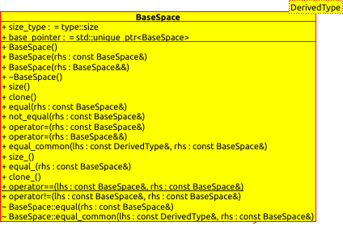

.. Copyright 2023 NWChemEx-Project
..
.. Licensed under the Apache License, Version 2.0 (the "License");
.. you may not use this file except in compliance with the License.
.. You may obtain a copy of the License at
..
.. http://www.apache.org/licenses/LICENSE-2.0
..
.. Unless required by applicable law or agreed to in writing, software
.. distributed under the License is distributed on an "AS IS" BASIS,
.. WITHOUT WARRANTIES OR CONDITIONS OF ANY KIND, either express or implied.
.. See the License for the specific language governing permissions and
.. limitations under the License.

.. _vsd_design:

######################
Base Space Design
######################

The ``BaseSpace`` class is defined in the namespace of 
``chemist::vector_space``. In the class, ``size_type`` (the type addressing
the size of the space) and ``base_pointer`` (pointer pointing to the 
``BaseSpace``) is defined publically. In addition to those, the default 
destructor, the ``size()`` method (to obtain the no. of the basis functions of 
the space),  the ``clone()`` method (to clone the current object), the 
``equal()`` and ``not_equal()`` methods are also public and virtual. They would
be implemented polymorphically in the derived classes.

The default and copy constructors, the copy and move assignment operators are
protected. The ``==`` and ``!=`` operators and the ``equal_common()`` method 
are also implemented for the comparison of two ``BaseSpace`` instances or a 
derived space (``DerivedType`` is the template parameter for the derived space) 
and a ``BaseSpace``. The UML diagram of this class can be seen as below.

.. _umldiagram_base_space:

   The UML diagram of the BaseSpace class.
