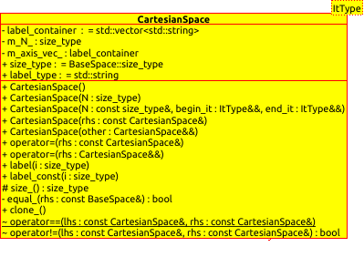

.. Copyright 2023 NWChemEx-Project
..
.. Licensed under the Apache License, Version 2.0 (the "License");
.. you may not use this file except in compliance with the License.
.. You may obtain a copy of the License at
..
.. http://www.apache.org/licenses/LICENSE-2.0
..
.. Unless required by applicable law or agreed to in writing, software
.. distributed under the License is distributed on an "AS IS" BASIS,
.. WITHOUT WARRANTIES OR CONDITIONS OF ANY KIND, either express or implied.
.. See the License for the specific language governing permissions and
.. limitations under the License.

.. _cartesianspace_design:

######################
Cartesian Space Design
######################

Structure
=========

In ``CartesianSpace``, ``label_container`` (the type of the container for 
Cartesian axes labels), ``m_N_`` (no. of basis functions) and ``m_axis_vec_``
(vector of axis labels) are declared as private. ``size_type`` from 
``BaseSpace`` and ``label_type`` (string) are public. Public methods include 
the following:

* The default constructor; 
* A constructor setting up an N-dimensional ``CartesianSpace`` with all null 
  axis labels; 
* A specific constructor to create an N-dimensional ``CartesianSpace`` with 
  the axis labels set up with user-input iterators (``ItType`` is the template 
  parameter of the iterators);
* The copy and move constructors;
* The copy and move assignment operators;
* The ``label()`` method to access one of the axis labels;

Protected methods include

* The polymorphic form of the ``size()`` method which returns the no. of basis
  functions in the ``CartesianSpace``;
* The polymorphic form of the ``equal_()`` method which compares two 
  ``CartesianSpace`` instances;
* The polymorphic form of the ``clone_()`` method which clone the current
  ``CartesianSpace`` instance.

The comparison operators ``==`` and ``!=`` are also implemented.

The UML diagram of this class can be seen as below.

.. _umldiagram_base_space:

   The UML diagram of the CartesianSpace class.

Usage
=====

``CartesianSpace`` objects contain the information of Cartesian coordinate 
axes, so they can be used to evaluate vector or tensor properties, for example,
dipole (vector with :math:`x, y, z` components), quadrupole or polarizability 
(tensor with :math:`xx, yy, zz, xy, yz, zx` components) and energy gradient of 
an N-atom molecule (vector with :math:`3N` components possibly labelled as 
:math:`x1, y1, z1, x2, y2, z2,...,xN, yN, zN`).

For example, to create a ``CartesianSpace`` with user-specified axis labels, one can simply
run

..  code-block:: c++

    // create a label vector
    std::vector<std::string> val{"xx", "yy", "zz", "xy", "yz", "zx"}; 
    // create a Cartesian space with labels set up with the label vector iterators
    auto s = CartesianSpace(6, val.begin(), val.end()); 

The dimension of the created ``CartesianSpace`` can be checked with the method
``size()``, and the i-th axis label can be accessed through the method 
``label(i)``:

..  code-block:: c++

    assert(s.size() == 6);
    sssert(s.label(0) == "xx");
    sssert(s.label(1) == "yy");
    ...

In order to evaluate tensor properties such as quadrupole, one may use a 
``CartesianSpace`` object as the following:

..  code-block:: c++

    std::vector<std::string> val{"xx", "yy", "zz", "xy", "yz", "zx"}; 
    // Create a CartesianSpace holding the tensor indices
    auto s = CartesianSpace(6, val.begin(), val.end());

    AOSpace aos = get_aos(); // Get the AO basis functions
    // Suppose we have implemented the quadrupole operator
    Quadrupole<Electron> qq; 
    // module for calculating quadrupole integrals
    auto mod = module_quadrupole_integrals(); 
    auto q_xmn = tensor_representation(mod, s, aos, qq, aos);

The pseudocodes above create and calculate the quadrupole tensor with the 
coordinate axis indices in mode 0, and the AO dimensions are in mode 1 and 2.
