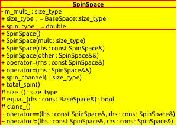

.. Copyright 2023 NWChemEx-Project
..
.. Licensed under the Apache License, Version 2.0 (the "License");
.. you may not use this file except in compliance with the License.
.. You may obtain a copy of the License at
..
.. http://www.apache.org/licenses/LICENSE-2.0
..
.. Unless required by applicable law or agreed to in writing, software
.. distributed under the License is distributed on an "AS IS" BASIS,
.. WITHOUT WARRANTIES OR CONDITIONS OF ANY KIND, either express or implied.
.. See the License for the specific language governing permissions and
.. limitations under the License.

.. _spinspace_design:

######################
Spin Space Design
######################

The ``SpinSpace`` class has the all attributes and methods defined in 
``BaseSpace``. In addition, it has a private attribute ``m_mult_``, which 
describes the multiplicity of the spin system (:math:`2S+1`). It also has a 
public attribute `spin_type` (set as `double`), which represents the type of
spin values. Since half integers could be found in spin values, here we set the
spin type as `double`. One should always keep the floating-point error in mind
in calculations involving the spin values.

Two methods specific to `SpinSpace` have been implemented. One is 
`spin_channel(i)`, which return the spin value of the i-th spin channel in the
`SpinSpace`. The other is `total_spin()`, which produces the total spin of the
spin system.

We want to note in the current design of `SpinSpace`, we simply list all spin 
channels with the same total spin. We are not addressing all spin 
eigenfunctions belong to the same total spin (e. g., the three different spin
eigenfunctions of a triplet state of a 2-eletron system are 
:math:`\alpha(1)\alpha(2)`, :math:`\alpha(1)\beta(2)+\beta(1)\alpha(2)` and
:math:`\beta(1)\beta(2)`). The method to generate such spin eigenfunctions 
could be implemented in the future.

Although in most of the quantum chemistry calculations we are dealing with
electronic systems, but `SpinSpace` here is not restricted to describe a spin
systems consists of electrons, spin systems with other particles such as bosons
can also be represented.

The UML diagram of this class can be seen as below.

.. _umldiagram_spin_space:

   The UML diagram of the SpinSpace class.
