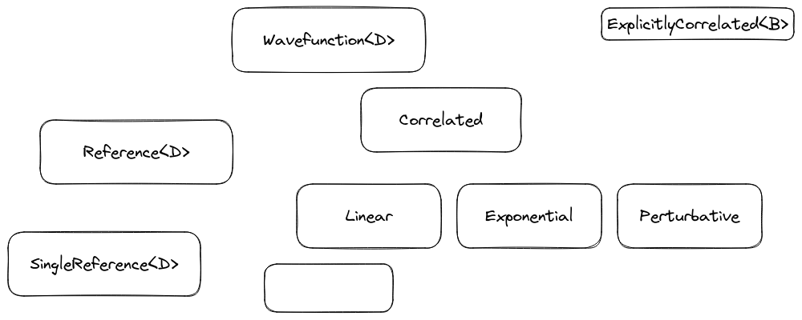

.. Copyright 2023 NWChemEx-Project
..
.. Licensed under the Apache License, Version 2.0 (the "License");
.. you may not use this file except in compliance with the License.
.. You may obtain a copy of the License at
..
.. http://www.apache.org/licenses/LICENSE-2.0
..
.. Unless required by applicable law or agreed to in writing, software
.. distributed under the License is distributed on an "AS IS" BASIS,
.. WITHOUT WARRANTIES OR CONDITIONS OF ANY KIND, either express or implied.
.. See the License for the specific language governing permissions and
.. limitations under the License.

###################
Wavefunction Design
###################

***********************
What is a Wavefunction?
***********************

******************************
Why Do We Need a Wavefunction?
******************************

.. _wd_considerations:

***************************
Wavefunction Considerations
***************************

This section lists the considerations which went into the design of Chemist's
wavefunction component.

.. |0ket| replace:: :math:`\left| 0\right\rangle`

.. _wd_initial:

Initial Wavefunction
   In electronic structure theory, most correlated wavefunctions are
   mathematically specified by describing the transformation to go from some
   many-electron initial wavefunction, |0ket|, to the correlated
   wavefunction. This necessitates classes to describe the initial wavefunction.
   Initial wavefunctions are usually expressed in terms of determinants, or
   references, giving rise to the sub-considerations:

   - Is the initial wavefunction formed from a single determinant or not?
   - If there are multiple determinants, how are the determinants determined?

.. _wd_correlation:

Correlated Wavefunction
   As brought up by :ref:`wd_initial`, most correlated wavefunctions are
   mathematically specified by transforming an initial wavefunction. Thus,
   in addition to :ref:`wd_initial`, we need a way to express the
   transformations.

   - The distinction between the initial wavefunction and the correlated
     wavefunction often defines the (dynamic) correlation energy.

.. _wd_easily_extended:

Easily Extended.
   Having to define a wavefunction for every possible electronic structure
   theory method is cumbersome. The design should facilitate defining new
   wavefunctions, ideally without having to create new classes.

.. _wd_type_dispatch:

Type Dispatch.
   Wavefunctions are going to be used in property types. The class hierarchy
   must support defining property types for entire classes of wavefunctions
   as well as for specific wavefunctions. For example, think dispatching
   between a correlated method driver and the CCSD correlation energy.

**************************************
Overview of the Wavefunction Component
**************************************

This section summarizes the design of Chemist's Wavefunction component, in
particular noting how the design addresses the considerations brought up by
:ref:`wd_considerations`.

.. _fig_wavefunction:

   The classes forming the core of Chemist's wavefunction component.

The fundamental classes of Chemist's wavefunction component are shown in
:numref:`fig_wavefunction`.

Wavefunction Base Class
=======================

The ``Wavefunction<D>`` class is envisioned as a common base class for all
wavefunctions, its primary purpose is code factorization. It also serves as a
programatic means of dispatching between wavefunctions which are meant to
serve as initial wavefunctions for correlated methods, and the resulting
correlated wavefunctions.

Initial Wavefunctions
=====================

The wavefunction class hierarchy has two branches: the initial wavefunction and
the correlated wavefunction branches.

Multi-Reference Wavefunction Class
----------------------------------

All wavefunctions which are used as initial wavefunctions contain one or more
references. The ``MultiReference<D>`` class expands on the ``Wavefunction<D>``
class by introducing two additional pieces of state: a series of active spaces
and the total number of references. The ``MultiReference<D>`` class
addresses the :ref:`wd_initial` consideration.

It is worth noting that, multi-reference wavefunctions are still usually defined
with respect to a single reference determinant. This creates a sort of
ambiguity, which in the future could be expressed by also expressing the
``MultiReference<D>`` class in terms of a ``Transformed<O, R>`` class. Note,
that true multi-reference wavefunctions do contain (static) correlation and
thus the reuse of the ``Transformed<O, R>`` class is thus justified.

Single Reference Wavefunction Class
-----------------------------------

A common scenario is that the initial wavefunction contains a single reference.
This leads to a number of simplifications. The ``SingleReference<D>`` class is
a strong type denoting this common scenario.

General Active Space (GAS) Wavefunction
---------------------------------------

Just as it's important to know when the initial state is a single reference, it
is important to know when the wavefunction is guaranteed to have at least one
active space. The ``GAS<D>`` strong type indicates that the initial wavefunction
has at least one active space.

Restricted Active Space (RAS) Wavefunction
------------------------------------------

A common active space partitioning defines three active spaces. The first
active space has a limit on how many holes it may have, the second has a
restriction on how many particles it may have, and the third is allowed to have
any number of holes and particles, so long as one does not violate the
restrictions on the first two active spaces. This active space choice is
typically known as RAS, and the strong type denoting this scenario is
thus ``RAS<D>``.

Complete Active Space (CAS) Wavefunction
-----------------------------------------

Another common active space partitioning is to define a single active space
and consider all possible excitations within that active space. This defines
the CAS method for defining an active space and the corresponding strong type
is denoted ``CAS<D>``.

Example Initial Wavefunctions
-----------------------------

.. _fig_initial_wavefunctions:

.. figure:: assets/reference_wavefunctions.png
   :align: center

   How common initial reference wavefunctions are defined using Chemist's
   wavefunction component.

:numref:`fig_initial_wavefunctions` shows types for common reference
wavefunctions fit into Chemist's wavefunction component.

Correlated Wavefunctions
========================

For our purposes correlated wavefunctions are those which are defined relative
to some reference wavefunction.

Correlated Base Class
---------------------

From consideration :ref:`wd_correlation` we need a means of distinguishing
when a wavefunction is correlated or not. To that end, we introduce the
``Correlated<R>`` class, which is templated on the type of the initial
wavefunction being correlated. Compared to the ``Wavefunction<D>`` base,
the additional state is the initial wavefunction.

Transformed Wavefunction
------------------------

Most (all?) correlated wavefunctions are expressed as transformations of the
initial wavefunction. The ``Transformed<O, R>`` class extends the
``Correlated<R>`` class by additionally storing the operator used to
transform the initial wavefunction. By templating ``Transformed<O,R>`` on the
operator it should be relatively easy to extend the wavefunction hierarchy
without deriving new wavefunction types, in accordance with the
:ref:`wd_easily_extended` consideration.

Example Correlated Wavefunctions
--------------------------------

For the purposes of defining example wavefunctions, we assume the operators
shown in :numref:`fig_many_electron_operators` have already been defined.

.. _fig_correlated_wavefunctions:

.. figure:: assets/correlated_wavefunctions.png
   :align: center

   Common wavefunction approximations within electronic structure theory and
   how they are releated to the classes in Chemist's wavefunction component.

:numref:`fig_correlated_wavefunctions` shows some of the wavefunctions
commonly occurring in quantum chemistry and how they are related to classes
in Chemist's wavefunction and operator components.

***************************
Wavefunction Design Summary
***************************

To briefly summarize how our current design addresses the considerations raised
in :ref:`wd_considerations`:

:ref:`wd_initial`
   The ``MultipleReference<D>`` and the ``SingleReference<D>`` classes provide
   relatively generic base classes for distinguishing reference wavefunctions
   from correlated wavefunctions.

:ref:`wd_correlation`
   The ``Correlated<R>`` class allows one to easily denote that a wavefunction
   is correlated.

:ref:`wd_easily_extended`
   The ``Transformed<O, R>`` class provides a straightforward mechanism for
   creating new wavefunctions by applying operators to existing types.
   Admittedly the types get nasty, and we have suggested a number of strong
   types to simplify the types and to better make contact with existing
   terminology widely used in the field.

:ref:`wd_type_dispatch`
   The various strong types, and generalizations throughout the class hierarchy
   should allow for general algorithms, as well as theory-specific ones.

*********************
Future Considerations
*********************

- As mentioned, the various multiple reference strong types could concievably
  be specified as transformed wavefunctions. If one wants to go that route,
  then it makes sense for ``Transformed<O, R>`` to be a mix-in (replace ``R``
  with a template type ``B``, which is the type of the base class).
