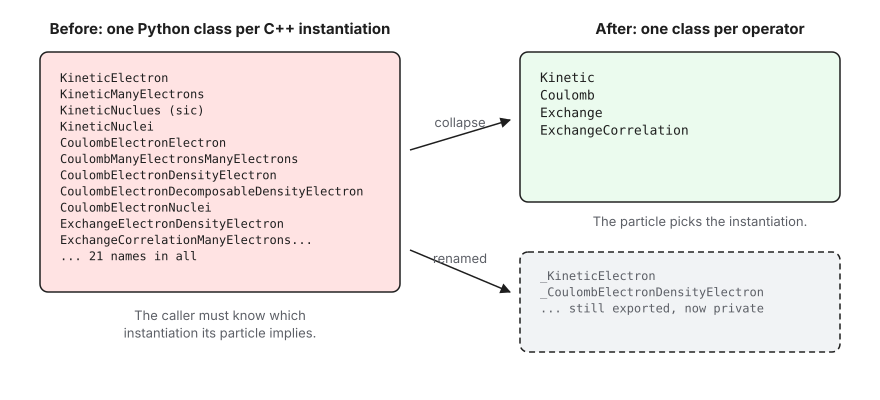
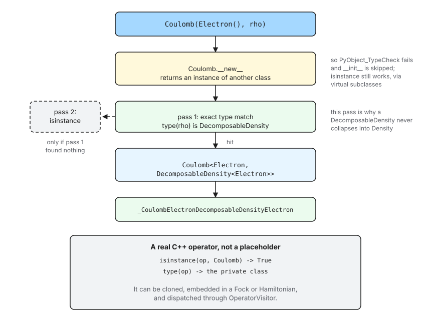
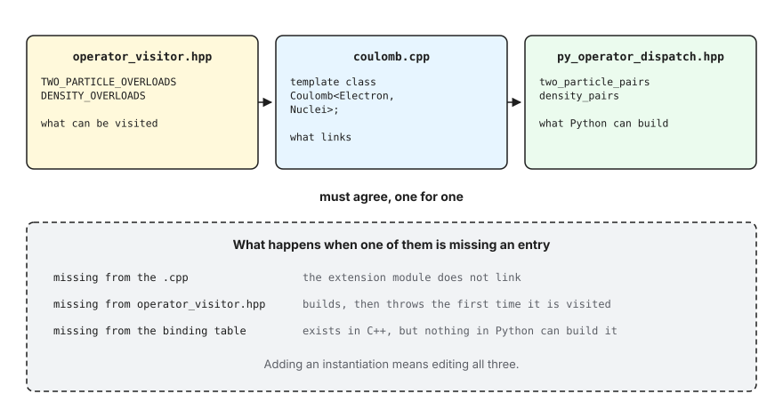

.. Copyright 2026 NWChemEx-Project
..
.. Licensed under the Apache License, Version 2.0 (the "License");
.. you may not use this file except in compliance with the License.
.. You may obtain a copy of the License at
..
.. http://www.apache.org/licenses/LICENSE-2.0
..
.. Unless required by applicable law or agreed to in writing, software
.. distributed under the License is distributed on an "AS IS" BASIS,
.. WITHOUT WARRANTIES OR CONDITIONS OF ANY KIND, either express or implied.
.. See the License for the specific language governing permissions and
.. limitations under the License.

.. _exposing_operators:

############################
Exposing Operators to Python
############################

Most of Chemist's operators are class templates, e.g.,
``Kinetic<ParticleType>``, ``Coulomb<LHSParticle, RHSParticle>``, and so on.
The APIs are designed so that C++ callers never think about this because the
template arguments are deduced by the compiler, e.g.,

.. code-block:: c++

   Kinetic t_e(Electron());       // -> Kinetic<Electron>
   Kinetic T_e(ManyElectrons(4)); // -> Kinetic<ManyElectrons>

Python has no such luxury because pybind11 can only export a concrete class
(i.e., the fully specified type), so a templated operator has to be exported
once per instantiation. This page explains the workaround we use, to get an
API that mirrors the C++ and how the bindings in
``src/chemist/quantum_mechanics/operator/operator/`` work.

***********
The Problem
***********

Exporting one Python class per instantiation means the instantiation's template
arguments end up in its Python name. The naive approach looks like:

.. code-block:: c++

   py::class_<Kinetic<Electron>>(m, "KineticElectron");
   py::class_<Kinetic<ManyElectrons>>(m, "KineticManyElectrons");
   py::class_<Coulomb<Electron, Electron>>(m, "CoulombElectronElectron");
   py::class_<Coulomb<ManyElectrons, Nuclei>>(m, "CoulombManyElectronsNuclei");

which produces a Python API that looks like:

.. code-block:: python

   from chemist import Electron, ManyElectrons, Nuclei
   from chemist.qm_operator import *

   t_e = KineticElectron()
   T_e = KineticManyElect(ManyElectrons(4))

.. _fig_operator_dispatch_names:

   Naively, every C++ instantiation surfaces as its own Python name. Now the
   instantiations are still exported, under underscore-prefixed names, that the
   Python user never sees. Python users only see the name of the operator.

The problems with this API are:

#. Ergonomics. A type like ``CoulombManyElectronsDecomposableDensityElectron``
   is not user-friendly.

#. Maintenance. The list grows grows combinatorially with the number of
   particles and relies on developers maintaining consistency between several
   source files.

********
Solution
********

.. _fig_operator_dispatch_flow:

   One construction call, from Python syntax to a concrete C++ object.

Our solution uses two pieces of standard Python machinery, ``__new__`` and
abstract base class registration. The basic idea is:

#. The operator "classes" that the users see, e.g., ``Kinetic``, ``Coulomb``,
   and so on, are built from C++ using ``abc.ABCMeta``. Their ``__new__`` is
   the dispatch function, so calling one returns an instance of a *different*
   class.

#. The dispatch logic is simply a lookup table that maps the particle types to
   the exposed C++ type. For example, ``Kinetic(Electron())`` causes the
   dispatch to return an instance of the Python type corresponding to the C++
   type ``Kinetic<Electron>``.

#. Each instantiation is registered as a virtual subclass of the operator
   class. That is what keeps ``isinstance(Kinetic(Electron()), Kinetic)``
   true, even though the object's actual type is ``_KineticElectron``.

The key pieces of the implementation are:

- ``export_instantiations`` automates the process of exposing names like
  ``_KineticElectron`` and ``_CoulombElectronElectron`` to Python.
- ``make_two_particle_dispatch`` builds a function which maps the two particles
  it is given to the correct instantiation. That function is what becomes
  ``__new__``. ``Kinetic``, being the only one-particle operator, spells the
  equivalent out inline rather than through a helper used once.
- ``Kinetic``, ``Coulomb``, etc. are created, given their ``__new__``, and
  registered in the ``export_dispatching_class`` function.

How Construction Is Redirected
==============================

Ultimately, each C++ instantiation must be exported to Python as a separate
class, so ``Kinetic(Electron())`` has to hand back an object whose type is
*not* ``Kinetic``. Python lets a class do exactly that: ``__new__`` may return
anything at all.

The part worth knowing is what happens next. ``type.__call__`` is, in essence:

.. code-block:: c

   obj = type->tp_new(type, args, kwds);           /* i.e. cls.__new__ */
   if (!PyObject_TypeCheck(obj, type))
       return obj;                                 /* __init__ is skipped */
   Py_TYPE(obj)->tp_init(obj, args, kwds);

``PyObject_TypeCheck`` is ``Py_IS_TYPE(...) || PyType_IsSubtype(...)``, a real
subtype test against the MRO. It is **not** ``isinstance()``, and it never
consults ``__instancecheck__``. Since ``_KineticElectron`` is not a subclass of
``Kinetic``, the check fails and ``__init__`` is skipped. This matters: the
object ``__new__`` returned is already fully constructed, and running
pybind11's ``__init__`` on it a second time would re-run the C++ constructor
over a live object.

That the check ignores ``isinstance`` is also what lets us have both halves at
once. Registering the instantiations with ``ABCMeta.register`` changes what
``isinstance`` and ``issubclass`` answer without touching the MRO, so we get:

.. code-block:: python

   op = Kinetic(Electron())
   isinstance(op, Kinetic)       # True   (registered)
   isinstance(op, OperatorBase)  # True   (real base class)
   issubclass(type(op), Kinetic) # True   (registered)
   type(op).__name__             # '_KineticElectron'

Note the last line. ``isinstance`` works, but the object's *type* is the
private class, because it is a real ``Kinetic<Electron>``. Code that compares
types exactly rather than using ``isinstance`` will see the private name.

.. warning::

   The instantiations must stay *virtual* subclasses. If one is ever made a
   real subclass of its operator class, ``PyObject_TypeCheck`` starts
   succeeding and pybind11's ``__init__`` runs a second time on an
   already-constructed object.
   ``test_instantiations_are_registered_not_derived``
   pins this down by asserting ``Kinetic not in type(Kinetic()).__mro__``.

The Alternative We Did Not Take
-------------------------------

A custom metaclass overriding ``__call__`` also works, and was what this code
did originally. ``__call__`` on the metaclass replaces the construction
protocol outright, so nothing depends on the subtype rule above, and
``__instancecheck__`` can read the same table the dispatch uses instead of a
separate registration step.

It is the more explicit of the two, and if the ``__init__``-skipping rule ever
feels too subtle to rely on, it is the thing to go back to. We chose
``__new__`` because it reaches the same place using machinery the standard
library already provides, rather than hand-building a metaclass from C++.

Be careful reasoning about the metaclass version, though. It is tempting to
justify it by claiming ``__new__`` *cannot* work here, on the grounds that
making ``isinstance`` succeed would drag ``__init__`` back in. That is wrong,
for the reason above: the construction path checks the MRO, not ``isinstance``.

Selecting the Instantiation
===========================

``select_pair`` walks the operator's table of instantiations and builds the
first one whose particle types match. It walks the table **twice**: once
requiring an exact type match, and only then once allowing derived types.

The two passes exist because ``DecomposableDensity<Electron>`` derives from
``Density<Electron>``, in C++ and in the bindings. A single ``isinstance``
pass would match whichever of the two is listed first, so a decomposable
density handed to ``Coulomb`` could silently produce the plain-density
instantiation, and the mistake would not surface until something looked at the
operator's type. The exact pass removes the ordering dependence entirely; the
second pass is what still lets a Python subclass of a particle work.

***********************************
The Tables, and Keeping Them Honest
***********************************

The instantiations an operator is exported for live in one place,
``py_operator_dispatch.hpp``, as tables named after the ``OperatorVisitor``
macros they mirror:

.. code-block:: c++

   using one_particle_types = /* Electron, ManyElectrons, Nucleus, Nuclei */;
   using two_particle_pairs = /* mirrors TWO_PARTICLE_OVERLOADS */;
   using density_pairs      = /* mirrors DENSITY_OVERLOADS */;

An operator covered by more than one macro joins them. ``Coulomb`` is the only
one today:

.. code-block:: c++

   using table = join_tables<two_particle_pairs, density_pairs>;

These tables are the third of three lists that describe the same set of
instantiations, and all three have to agree.

.. _fig_operator_dispatch_tables:

   The same set of instantiations is written down three times. Each omission
   fails in a different way, and only one of them fails at build time.

The failure modes are worth internalising, because only the first is loud:

* Missing from the operator's ``.cpp``: the extension module does not link.
* Missing from ``operator_visitor.hpp``: everything builds, and the operator
  throws the first time a visitor sees it.
* Missing from the table here: the instantiation exists in C++ and links fine,
  but no Python code can construct it.

**********************
What You Have to Write
**********************

Because the naming, registration, matching, and error messages are all derived
from the table, exporting a two-particle operator is now three lines plus a
docstring. The whole body of ``export_exchange.cpp`` is:

.. code-block:: c++

   using table        = density_pairs;
   using default_pair = type_pair<Electron, chemist::Density<Electron>>;

   auto impls    = export_instantiations<Exchange, table>(m, "Exchange");
   auto dispatch = make_two_particle_dispatch<Exchange, table, default_pair>(
     "Exchange", "takes two particles");

   export_dispatching_class(m, "Exchange", impls, dispatch, /* docstring */);

``export_instantiations`` exports one class per table entry, naming each by
appending the particles' suffixes to the operator's name, so ``Exchange`` plus
``Electron`` plus ``DensityElectron`` gives
``_ExchangeElectronDensityElectron``. The suffixes come from
``particle_traits``, which also carries the particle's Python class name for
use in error messages; the two differ only for the densities, whose Python
classes are not templated.

``make_two_particle_dispatch`` builds the dispatch function. Its template
parameters are the only things that vary between operators: the table, the
instantiation a no-argument call builds, and, optionally, the ctor arguments
that precede the particles. ``ExchangeCorrelation`` is the only operator that
needs the last one, because its functional comes first:

.. code-block:: c++

   using leading_args = std::tuple<xc_functional>;

   auto dispatch =
     make_two_particle_dispatch<ExchangeCorrelation, table, default_pair,
                                leading_args>(
       "ExchangeCorrelation", "takes a functional and two particles");

The error messages are generated from the table too, so they cannot drift from
what the operator actually supports:

.. code-block:: text

   >>> Exchange(Electron(), Nuclei())
   TypeError: Exchange can not describe the interaction of a Electron with a
   Nuclei. Supported combinations are: (Electron, Density),
   (ManyElectrons, Density), (Electron, DecomposableDensity),
   (ManyElectrons, DecomposableDensity).

Customizing an Operator
=======================

``export_instantiations`` adds what every operator has: a default ctor,
comparisons, and a property per particle. Anything else is the job of the
customization object, which defaults to ``default_customize`` and just adds the
ctor taking the particles by value. ``ExchangeCorrelation`` supplies its own
because it has a different value ctor and a ``functional_name`` property. If
you add an operator that is shaped like the others, you do not write one at
all.

Adding an Instantiation
=======================

Add it to the table, to ``operator_visitor.hpp``, and to the operator's
``.cpp``. Nothing else, and no new name string. Then add a Python test that
asserts the dispatch picks it, following the ``TestKineticDispatch`` pattern in
``tests/python/unit_tests/quantum_mechanics/operators/``.

If the new instantiation's particle type derives from one already in the table,
also add a test that it selects its own instantiation rather than its base's.
That is the ``DecomposableDensity`` case above, and it is the one bug in this
machinery that a passing build will happily hide.

*******************
Editing the Figures
*******************

The figures on this page are Excalidraw scenes. Each ``.svg`` in ``assets/``
has an ``.excalidraw`` file beside it holding the same drawing; open that file
at https://excalidraw.com to edit it, then export the result over the
``.svg``.
